<!--
author:   Hervé Leclerc

email:    herve.leclerc@alterway.fr

version:  0.0.1

language: fr

narrator: FR French Male

comment:  Labs k8s

logo: https://assets.alterway.fr/2021/01/strong-mind.png


-->

# Lab Kubernetes


## Création d'un cluster Kubernetes

### Installation avec Kubeadm

<hr>
Machines : **master**, **worker-0**, **worker-1**
<hr>

Mettre à jour le fichier /etc/hosts en renseignant les IP des trois VM. **Prenez soin de remplacer les adresses IP par celles de vos VM.**

exemple :

```bash +.
# /etc/hosts file
10.10.4.80 master
10.10.4.81 worker-0
10.10.4.82 worker-1
```

1. kubeadm

Nous allons utiliser **Kubeadm** pour initialiser un cluster Kubernetes avec le noeud master.


1.1 (Préparation de l'environnement) Installation de la completion pour kubectl

```bash +.

echo 'source <(kubectl completion bash)' >>~/.bashrc
echo 'alias k=kubectl' >>~/.bashrc
echo 'complete -o default -F __start_kubectl k' >>~/.bashrc

source ~/.bashrc

# test 
k version --short

```

1.2 Installation du cluster kubernetes 

Machine : **master**


```bash +.
sudo kubeadm init 
```

```bash +.
...
Your Kubernetes control-plane has initialized successfully!

To start using your cluster, you need to run the following as a regular user:
...

```

Un token sera généré à l'issue du processus d'initialisation. Il est important de le sauvegarder car il servira à connecter les worker nodes au cluster

> Notez la commande de join :

```bash +.

 kubeadm join 10.10.3.243:6443 --token m03nzv.vtfeaij5yu876u7z --discovery-token-ca-cert-hash sha256:2da9df40f55f901d221d30cf0574264bcd4c62b7c38200498e99e2797a55753f

```


2. Nous avons donc installé un premier noeud master Kubernetes. Nous allons maintenant configurer la CLI kubectl pour pouvoir l’utiliser depuis le master:

```bash +.
mkdir -p $HOME/.kube

sudo cp -i /etc/kubernetes/admin.conf $HOME/.kube/config

sudo chown $(id -u):$(id -g) $HOME/.kube/config
```

3. Nous allons maintenant installer un add-on réseaux pour nos pods sur le master. Il existe plusieurs plugins répondant à ce besoin : Calico, Canal, Weave, Flannel etc. Pour cette exercice, nous allons installer le plugin weave, de la façon suivante :

```bash +.
kubectl apply -f https://github.com/weaveworks/weave/releases/download/v2.8.1/weave-daemonset-k8s.yaml

```

Vérification :

```bash +.

ubuntu@master:~$ k get nodes
NAME     STATUS     ROLES           AGE     VERSION
master   NotReady   control-plane   3m34s   v1.27.9
ubuntu@master:~$ k get nodes
NAME     STATUS   ROLES           AGE     VERSION
master   Ready    control-plane   4m18s   v1.27.9

```

> Note : Si on souhaite utiliser les network policies (que nous explorerons plus tard), il faut utiliser un plugin supportant cette fonctionnalité. (Il faut éviter flannel notamment)


Machines : **worker-0**, **worker-1**

4. Nous allons maintenant ajouter les deux noeuds worker à notre cluster. Pour ce faire, nous allons utiliser la commande suivante sur les noeuds worker worker-0 et worker-1:

```bash +.
sudo kubeadm join INTERNAL_MASTER_IP:6443 --token TOKEN --discovery-token-ca-cert-hash DISC_TOKEN
```

```bash +.

This node has joined the cluster:
* Certificate signing request was sent to apiserver and a response was received.
* The Kubelet was informed of the new secure connection details.

Run 'kubectl get nodes' on the control-plane to see this node join the cluster.
```

7. Nous pouvons lister les noeuds de la façon suivante afin de nous assurer que les noeuds worker ont bien rejoint le cluster (les noeuds worker sont NotReady pour quelques secondes) :

```bash +.
kubectl get nodes
```

```bash +.
NAME     STATUS   ROLES    AGE     VERSION
master   Ready    master   25m     v1.27.9
worker-0   Ready    <none>   2m24s   v1.27.9
worker-1   Ready    <none>   1m24s   v1.27.9
```


8. Nous allons déployer un pod redis pour tester l’installation de notre cluster :

```bash +.
kubectl run --image redis test-pod
```

```bash +.
pod/test-pod created
```


9. Une petite liste des pods en cours d’exécution pour s’assurer que tout fonctionne bien :

```bash +.
kubectl get pods
```


```bash +.
NAME       READY   STATUS    RESTARTS   AGE
test-pod   1/1     Running   0          34s

```

10. Supprimons maintenant notre pod :

```bash +.
kubectl delete pod test-pod
```

<hr>

### Quizz kubeadm

Qu'est-ce que kubeadm ?

  [( )] Un outil pour automatiser le déploiement de conteneurs
  [(X)] Un outil pour gérer le cycle de vie des clusters Kubernetes
  [( )] Un système d'exploitation pour les conteneurs
  [( )] Une distribution de Kubernetes


Quelle commande utilise-t-on pour initialiser un cluster avec kubeadm ?

  [( )] kubeadm start
  [(X)] kubeadm init
  [( )] kubeadm create
  [( )] kubeadm up

Quel est le rôle principal de kubeadm ?
  [( )] Créer des conteneurs
  [( )] Ordonnancer des tâches
  [(X)] Démarrer un cluster Kubernetes minimum, viable et conforme aux meilleures pratiques
  [( )] Construire des images Docker


<hr>


## Les Bases

<hr>

Machine : **master**

<hr>


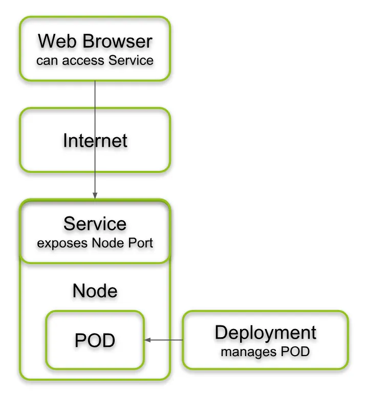


### Création de namespace

**Namespaces**

Aide à résoudre la complexité de l'organisation des objets au sein d'un cluster. Les namespaces permettent de regrouper des objets afin que vous puissiez les filtrer et les contrôler comme une unité. Qu'il s'agisse d'appliquer des politiques de contrôle d'accès personnalisées ou de séparer tous les composants d'un environnement de test, les namespaces sont un concept puissant et flexible pour gérer les objets en tant que groupe.

En ligne de commande

```bash +.
mkdir basics
cd basics
kubectl create namespace basics
```

Autre méthode

1. Créons un manifeste de namespace avec le contenu yaml suivant :

```bash +.
touch lab-ns.yaml
vi lab-ns.yaml
```

Copier-Coller dans le fichier le yaml suivant

```yaml
apiVersion: v1
kind: Namespace
metadata:
  name: lab
```

1. Appliquons le fichier pour créer le namespace :

```bash +.
kubectl apply -f lab-ns.yaml
```

3. Vérifions que le namespace lab a bien été créé :

```bash +.
kubectl get namespace
```

<hr>

### Lancement du premier pod

**Pod**

Unité d'exécution de base d'une application Kubernetes. Il constitue la plus petite et la plus simple unité dans le modèle d'objets de Kubernetes pouvant être  créer ou déployer. Un Pod représente des process en cours d'exécution dans un cluster.

Pod
Unité d'exécution de base d'une application Kubernetes. Il constitue la plus petite et la plus simple unité dans le modèle d'objets de Kubernetes pouvant être créer ou déployer. Un Pod représente des process en cours d'exécution dans un cluster.

1. Créons un manifeste d'un pod avec le contenu yaml suivant :

```bash +.
touch lab-pod.yaml
vi lab-pod.yaml
```

Copier-Coller dans le fichier le yaml suivant :

```yaml
apiVersion: v1
kind: Pod
metadata:
  name: lab-pod
  namespace: lab  
  labels:
    app: web
spec:
  containers:
  - image: nginx
    name: nginx
```

1. Appliquons le fichier pour créer le pod :

```bash +.
kubectl apply -f lab-pod.yaml
```

3. Vérifions que le pod lab-pod a bien été créé :

```bash +.
kubectl -n lab get pods
```

### Création d'un déploiement

**Deployment**

Un déploiement Kubernetes est un objet Kubernetes qui fournit des mises à jour déclaratives aux applications. Un déploiement permet de décrire le cycle de vie d'une application, comme les images à utiliser, le nombre de pods qu'il devrait y avoir et la manière dont ils doivent être mis à jour. 

1. Créons un déploiement avec le contenu yaml suivant :

```bash +.
touch lab-deployment.yaml
vi lab-deployment.yaml
```

Copier-Coller dans le fichier le yaml suivant :


```yaml
apiVersion: apps/v1
kind: Deployment
metadata:
  name: lab-deployment
  namespace: lab
  labels:
    app: httpd
spec:
  replicas: 2
  selector:
    matchLabels:
      app: httpd
  template:
    metadata:
      labels:
        app: httpd
    spec:
      containers:
      - name: httpd
        image: httpd:2.4.43
        ports:
        - containerPort: 80
```

1. Appliquons le fichier pour créer le déploiement :

```bash +.
kubectl apply -f lab-deployment.yaml
```

3. Vérifions que le déploiement lab-deployment a bien été créé :

```bash +.
kubectl -n lab get deployment
```

Autres manières de déployer les applications :

A part le type **Deployment**, il existe aussi les **Statefulsets** et les **Daemonsets**. 

Les objets StatefulSet sont conçus pour déployer des applications avec état et des applications en cluster qui enregistrent des données sur un espace de stockage persistant . 

Les DaemonSets sont utilisés pour garantir que tous vos nœuds exécutent une copie d'un pod, ce qui vous permet d'exécuter l'application sur chaque nœud. Lorsque vous ajoutez un nouveau nœud au cluster, un pod est créé automatiquement sur le nœud.


### Quizz deployment


Quel est le type d'objet Kubernetes décrit dans ce manifeste ?

[( )] Pod
[(X)] Deployment
[( )] Service
[( )] ConfigMap

Dans quel espace de noms se trouve ce déploiement ?

[(X)] lab
[( )] default
[( )] kube-system
[( )] monitoring

Combien de répliques (pods) seront créées par ce déploiement ?

[( )] 1
[(X)] 2
[( )] 3
[( )] 4

Quelle est l'étiquette (label) utilisée pour sélectionner les pods de ce déploiement ?

[( )] name=httpd
[(X)] app=httpd
[( )] component=web
[( )] tier=frontend

Quel conteneur est spécifié dans ce déploiement ?

[(X)] httpd
[( )] nginx
[( )] apache
[( )] web

Quelle est la version de l'image Docker utilisée pour le conteneur ?

[( )] latest
[(X)] 2.4.43
[( )] 1.14.2
[( )] 7.9.0

Sur quel port écoute le conteneur httpd ?

[(X)] 80
[( )] 8080
[( )] 443
[( )] 22

Y a-t-il un volume monté dans ce déploiement ?

[( )] Oui
[(X)] Non
[( )] Impossible à déterminer
[( )] Pas de réponse


### Création d'un service

Dans Kubernetes, un service est une abstraction qui définit un ensemble logique de pods et une politique permettant d'y accéder (parfois ce modèle est appelé un micro-service). L'ensemble des pods ciblés par un service est généralement déterminé par un "Selector".

1. Créons un manifeste d'un pod avec le contenu yaml suivant :

```bash +.
touch lab-svc.yaml
vi lab-svc.yaml
```

Copier-Coller dans le fichier le yaml suivant :


```yaml
apiVersion: v1
kind: Service
metadata:
  name: app-service
  namespace: lab
spec:
  type: NodePort
  selector:
    app: web
  ports:
    - protocol: TCP
      port: 80
      targetPort: 80

```

2. Appliquons le fichier pour créer le service :

```bash +.
kubectl apply -f lab-svc.yaml
```

3. Vérifions que le service app-service a bien été créé :

```bash +.
kubectl -n lab get svc
```

<hr>


### Quizz Service


Quel type de service est défini ici ?

[( )] ClusterIP
[(X)] NodePort
[( )] LoadBalancer
[( )] ExternalName

Quelle étiquette (label) est utilisée pour sélectionner les pods associés à ce service ?

[(X)] app=web
[( )] name=app-service
[( )] component=frontend
[( )] tier=web

Sur quel port le service écoute-t-il ?

[(X)] 80
[( )] 8080
[( )] 443
[( )] 22

Quel protocole est utilisé par ce service ?

[( )] UDP
[(X)] TCP
[( )] SCTP
[( )] Tous les protocoles

Vers quel port les requêtes entrantes sont-elles acheminées sur les pods ?

[(X)] 80
[( )] 8080
[( )] 443
[( )] 22

### Clean Up

lancer les commandes suivantes :

```bash +.
kubectl delete -f lab-pod.yaml
kubectl delete -f lab-deployment.yaml
kubectl delete -f lab-svc.yaml
kubectl delete -f lab-ns.yaml
kubectl delete ns basics

```


## Stockage


<hr>
Machine : **master**
<hr>

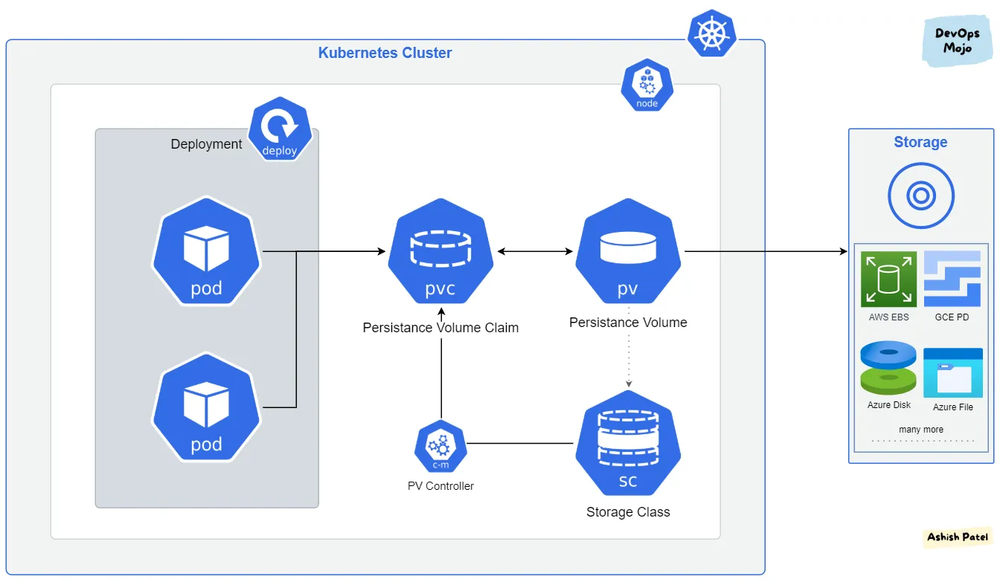


### Environnement

```bash +.
mkdir storage
cd storage
kubectl create namespace storage
```

### PersistentVolume et PersistentVolumeClaim

1. Commençons par définir un **PersistentVolume** :

```bash +.
touch postgres-pv.yaml
vi postgres-pv.yaml
```

Avec le contenu yaml suivant :

```yaml
apiVersion: v1
kind: PersistentVolume
metadata:
  name: postgres-pv
  namespace: storage
  labels:
    type: local
spec:
  storageClassName: manual
  capacity:
    storage: 10Gi
  accessModes:
    - ReadWriteOnce
  hostPath:
    path: "/mnt/data"
```

2. Nous allons donc créer ce pv :

```bash +.
kubectl apply -f postgres-pv.yaml
```

*persistentvolume/postgres-pv created*

3. Nous pouvons récupérer des informations sur ce pv de la façon suivante :

```bash +.
kubectl describe pv -n storage postgres-pv

```

```bash +.
Name:            postgres-pv
Labels:          type=local
Annotations:     <none>
Finalizers:      [kubernetes.io/pv-protection]
StorageClass:    manual
Status:          Available
Claim:           
Reclaim Policy:  Retain
Access Modes:    RWO
VolumeMode:      Filesystem
Capacity:        10Gi
Node Affinity:   <none>
Message:         
Source:
    Type:          HostPath (bare host directory volume)
    Path:          /mnt/data
    HostPathType:  
Events:            <none>
```

4. Nous allons maintenant définir un **PersistentVolumeClaim** :

```bash +.
touch postgres-pvc.yaml
```

Avec le contenu yaml suivant :

```yaml
apiVersion: v1
kind: PersistentVolumeClaim
metadata:
  name: postgres-pvc
  namespace: storage
spec:
  storageClassName: manual
  accessModes:
    - ReadWriteOnce
  resources:
    requests:
      storage: 3Gi
```

5. Nous allons créer ce pvc :

```bash +.
kubectl apply -f postgres-pvc.yaml

```

*persistentvolumeclaim/postgres-pvc created*

6. Nous pouvons maintenant inspecter ce pvc :

```bash +.
kubectl get pvc -n storage postgres-pvc
```

```bash +.
NAME           STATUS   VOLUME        CAPACITY   ACCESS MODES   STORAGECLASS   AGE
postgres-pvc   Bound    postgres-pv   10Gi       RWO            manual         14s
```

Notre pvc est maintenant **bound** a notre pv.

7. Nous allons maintenant définir un pod utilisant ce pvc :

```bash +.
touch postgres-with-pvc-pod.yaml
vi postgres-with-pvc-pod.yaml
```

Avec le contenu yaml suivant :

```yaml
apiVersion: v1
kind: Pod
metadata:
  name: postgres-with-pvc-pod
  namespace: storage
spec:
  volumes:
    - name: postgres-volume
      persistentVolumeClaim:
        claimName: postgres-pvc
  containers:
    - name: postgres-with-pvc
      image: postgres
      env:
      - name: POSTGRES_PASSWORD
        value: password
      volumeMounts:
        - mountPath: "/var/lib/postgresql/data"
          name: postgres-volume
          subPath: pgdata
```

8. Créons donc ce pod :

```bash +.
kubectl apply -f postgres-with-pvc-pod.yaml
```

*pod/postgres-with-pvc-pod created*

9. Inspectons ce pod, nous devrions voir qu'il utilise bien notre pvc :

```bash +.
kubectl describe pods -n storage postgres-with-pvc-pod
```

```bash +.
...
Volumes:
  postgres-volume:
    Type:       PersistentVolumeClaim (a reference to a PersistentVolumeClaim in the same namespace)
    ClaimName:  postgres-pvc
    ReadOnly:   false
...
```


<hr>

### Longhorn (rancher)

<hr>


1. Nous allons commencer par installer longhorn :

```bash +.
helm repo add longhorn https://charts.longhorn.io
helm repo update
helm install longhorn longhorn/longhorn --namespace longhorn-system --create-namespace
```

```bash +.
NAME: longhorn
LAST DEPLOYED: Fri Jul  1 11:45:19 2022
NAMESPACE: longhorn-system
STATUS: deployed
REVISION: 1
TEST SUITE: None
NOTES:
Longhorn is now installed on the cluster!

Please wait a few minutes for other Longhorn components such as CSI deployments, Engine Images, and Instance Managers to be initialized.

Visit our documentation at https://longhorn.io/docs/

...
```

2. Par défaut, lonhorn une classe de stockage (storageclasses) , que nous pouvons voir de la façon suivante :

```bash +.
kubectl describe storageclass longhorn
```


```bash +.
Name:            longhorn
IsDefaultClass:  Yes
Annotations:     longhorn.io/last-applied-configmap=kind: StorageClass
apiVersion: storage.k8s.io/v1
metadata:
  name: longhorn
  annotations:
    storageclass.kubernetes.io/is-default-class: "true"
provisioner: driver.longhorn.io
allowVolumeExpansion: true
reclaimPolicy: "Delete"
volumeBindingMode: Immediate
parameters:
  numberOfReplicas: "3"
  staleReplicaTimeout: "30"
  fromBackup: ""
  fsType: "ext4"
  dataLocality: "disabled"
,storageclass.kubernetes.io/is-default-class=true
Provisioner:           driver.longhorn.io
Parameters:            dataLocality=disabled,fromBackup=,fsType=ext4,numberOfReplicas=3,staleReplicaTimeout=30
AllowVolumeExpansion:  True
MountOptions:          <none>
ReclaimPolicy:         Delete
VolumeBindingMode:     Immediate
Events:                <none>
```


3. Nous allons maintenant définir un pvc utilisant la storageclass longhorn :

```bash +.
touch postgres-longhorn-pvc.yaml
```

Avec le contenu yaml suivant :

```yaml
apiVersion: v1
kind: PersistentVolumeClaim
metadata:
  name: postgres-longhorn-pvc
  namespace: storage
spec:
  storageClassName: longhorn
  accessModes:
    - ReadWriteOnce
  resources:
    requests:
      storage: 3Gi
```

4. Créons donc ce pvc :

```bash +.
kubectl apply -f postgres-longhorn-pvc.yaml

```

*persistentvolumeclaim/postgres-openebs-pvc created*

5. Que nous pouvons inspecter de la façon suivante :

```bash +.
kubectl get pvc -n storage postgres-longhorn-pvc
```

```bash +.
NAME                   STATUS   VOLUME                                     CAPACITY   ACCESS MODES   STORAGECLASS        AGE
postgres-longhorn-pvc   Bound    pvc-69b06a24-90e3-4ad9-8a25-5d7f4d216616   3Gi        RWO            longhorn       32s
```

6. Nous pouvons également voir qu'un pv a été généré de façon automatique :

```bash +.
kubectl get pv -n storage
```

```bash +.
NAME                                       CAPACITY   ACCESS MODES   RECLAIM POLICY   STATUS     CLAIM                          STORAGECLASS          REASON   AGE
pvc-69b06a24-90e3-4ad9-8a25-5d7f4d216616   3Gi        RWO            Delete           Bound    storage/postgres-longhorn-pvc   longhorn                73s
```


7. Utilisation de ce pvc 


```bash +.
touch postgres-with-longhorn-pvc-pod.yaml
```

Avec le contenu yaml suivant :


```yaml
apiVersion: v1
kind: Pod
metadata:
  name: postgres-with-longhorn-pvc-pod
  namespace: storage
spec:
  volumes:
    - name: postgres-volume
      persistentVolumeClaim:
        claimName: postgres-longhorn-pvc
  containers:
    - name: postgres-with-pvc
      image: postgres
      env:
      - name: POSTGRES_PASSWORD
        value: password
      volumeMounts:
        - mountPath: "/var/lib/postgresql/data"
          name: postgres-volume
          subPath: pgdata
```


8. Créons donc ce pod :

```bash +.
kubectl apply -f postgres-with-longhorn-pvc-pod.yaml
```

*pod/postgres-with-longhorn-pvc-pod created*

9. Inspectons ce pod, nous devrions voir qu'il utilise bien notre pvc :

```bash +.
kubectl describe pods -n storage postgres-with-longhorn-pvc-pod
```

<hr>

### Clean Up

<hr>

Nous pouvons supprimer les objets générés par cet exercice de la façon suivante :

```bash +.
kubectl delete -f postgres-longhorn-pvc.yaml -f postgres-pv.yaml -f postgres-pvc.yaml -f postgres-with-pvc-pod.yaml -f postgres-with-longhorn-pvc-pod.yaml

persistentvolumeclaim "postgres-openebs-pvc" deleted
persistentvolume "postgres-pv" deleted
persistentvolumeclaim "postgres-pvc" deleted
pod "postgres-with-pvc-pod" deleted
pod "postgres-with-longhorn-pvc-pod" deleted
```

### Quizz Stockage

Quel objet permet de provisionner automatiquement des volumes de stockage ?

[(X)] StorageClass
[( )] PersistentVolume
[( )] PersistentVolumeClaim
[( )] Volume

Quel objet représente une ressource de stockage réelle ?

[( )] StorageClass
[(X)] PersistentVolume
[( )] PersistentVolumeClaim
[( )] Volume

Quel objet est utilisé pour demander un volume de stockage persistant ?

[( )] StorageClass
[( )] PersistentVolume
[(X)] PersistentVolumeClaim
[( )] Volume

Quel objet est utilisé pour monter un volume de stockage dans un pod ?

[( )] StorageClass
[( )] PersistentVolume
[( )] PersistentVolumeClaim
[(X)] Volume

Quel objet définit les classes de stockage disponibles dans le cluster ?

[(X)] StorageClass
[( )] PersistentVolume
[( )] PersistentVolumeClaim
[( )] Volume

Quel objet lie une demande de volume persistant à un volume de stockage réel ?

[( )] StorageClass
[(X)] PersistentVolumeClaim
[( )] PersistentVolume
[( )] Volume

Quel objet peut être utilisé pour stocker des données temporaires ?

[( )] StorageClass
[( )] PersistentVolume
[( )] PersistentVolumeClaim
[(X)] EmptyDir

Quel objet peut être utilisé pour monter un répertoire sur l'hôte dans un pod ?

[( )] StorageClass
[( )] PersistentVolume
[( )] PersistentVolumeClaim
[(X)] HostPath

Quel objet permet de définir des règles d'accès aux volumes de stockage ?

[(X)] StorageClass
[( )] PersistentVolume
[( )] PersistentVolumeClaim
[( )] Volume

Quel objet est utilisé pour stocker des données persistantes dans un cluster ?

[( )] StorageClass
[(X)] PersistentVolume et PersistentVolumeClaim
[( )] Volume
[( )] EmptyDir


## ConfigMaps


<hr>

Machine : **master**

<hr>


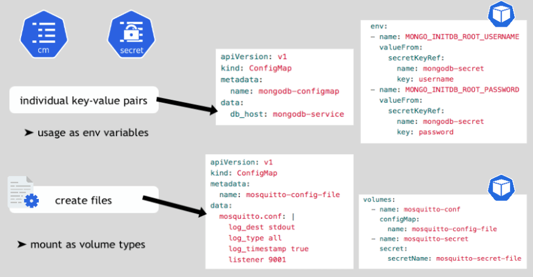


### All in One


1. Commençons par définir un manifest :

```bash +.
touch cm.yaml
```

Avec le contenu yaml suivant :

```yaml
apiVersion: v1
kind: ConfigMap
metadata:
  name: redis-config
data:
    redis-config: |
      maxmemory 2mb
      maxmemory-policy allkeys-lru

---

apiVersion: v1
kind: ConfigMap
metadata:
  name: redis-env
data:
   redis_host: "redis-svc"
   redis_port: "6349"

---

apiVersion: v1
kind: ConfigMap
metadata:
  name: env-config
data:
   log_level: "NOTICE"
---

apiVersion: v1
kind: Pod
metadata:
  name: dapi-test-pod
spec:
  containers:
    - name: test-container
      image: k8s.gcr.io/busybox
      command: [ "/bin/sh", "-c", "env" ]
      env:
        - name: REDIS_HOST
          valueFrom:
            configMapKeyRef:
              name: redis-env
              key: redis_host
        - name: LOG_LEVEL
          valueFrom:
            configMapKeyRef:
              name: env-config
              key: log_level
  restartPolicy: Never


---

apiVersion: v1
kind: Pod
metadata:
  name: dapi-test-pod-v
spec:
  containers:
    - name: test-container
      image: k8s.gcr.io/busybox
      command: [ "/bin/sh", "-c", "cat /etc/config/redis-config" ]
      volumeMounts:
      - name: redis-conf-volume
        mountPath: /etc/config
  volumes:
    - name: redis-conf-volume
      configMap:
        # Provide the name of the ConfigMap containing the files you want
        # to add to the container
        name: redis-config
  restartPolicy: Never

```


2. Appliquons ce manifest

```bash +.
kubectl apply -f cm.yaml
```


3. Vérifions que les variables d'envronnement et fichier ont bien été affectés

```bash +.
kubectl logs dapi-test-pod
kubectl logs dapi-test-pod-v
```


### Configmap à partir d'un fichier

1. Créer un fichier `valeurs.txt` avec les valeurs suivantes :

```bash +.
cle1: valeur1
cle2: valeur2
cleN: valeurN
```


2. Créer un fichier `valeurs.json` avec les valeurs suivantes :

```json
{cle1: valeur1, cle2: valeur2, cleN: valeur2}.
```


3. Créer les configmaps

```bash +.
kubectl create configmap cmjson --from-file=valeurs.json
kubectl create configmap cmtxt --from-file=valeurs.txt
```

4. Vérifier le contenu des cm

```bash +.
kubectl get cm -o yaml cmjson
kubectl get cm -o yaml cmtxt
```


5. Utilisation dans un pod

```yaml
apiVersion: v1
kind: Pod
metadata:
  name: dapi-test-pod
spec:
  containers:
    - name: test-container
      image: k8s.gcr.io/busybox
      command: [ "/bin/sh","-c","cat /etc/config/keys" ]
      volumeMounts:
      - name: config-volume
        mountPath: /etc/config
  volumes:
    - name: config-volume
      configMap:
        name: cmjson
        items:
        - key: valeurs.json
          path: keys
  restartPolicy: Never
```

<hr>

### Quizz Configmap


Quel objet est utilisé pour stocker des données de configuration non sensibles ?

[( )] Secret
[(X)] ConfigMap
[( )] PersistentVolumeClaim
[( )] ServiceAccount

Comment les données sont-elles stockées dans une ConfigMap ?

[( )] Sous forme chiffrée
[(X)] En clair
[( )] Sous forme de fichiers binaires
[( )] Sous forme de volumes persistants

Comment une ConfigMap peut-elle être utilisée dans un pod ?

[( )] Exposée en tant que variables d'environnement
[( )] Montée en tant que volume
[(X)] Les deux réponses précédentes sont correctes

Quel objet permet de référencer des données stockées dans une ConfigMap ?

[(X)] EnvVar
[( )] PersistentVolumeClaim
[( )] ServiceAccount
[( )] Volume

Quelle commande permet de créer une ConfigMap à partir d'un fichier existant ?

[( )] kubectl create configmap myconfigmap --from-file=./config.txt
[(X)] kubectl create configmap myconfigmap --from-file=config=./config.txt
[( )] kubectl apply -f configmap.yaml
[( )] kubectl expose configmap myconfigmap

Comment une ConfigMap peut-elle être mise à jour ?

[( )] En modifiant directement le fichier YAML de la ConfigMap
[(X)] En créant une nouvelle ConfigMap avec les données mises à jour
[( )] En utilisant la commande kubectl edit configmap
[( )] Impossible de mettre à jour une ConfigMap existante

Quelle est la différence entre une ConfigMap et un Secret ?

[( )] Une ConfigMap stocke des données sensibles, un Secret ne le fait pas
[(X)] Une ConfigMap stocke des données non sensibles en clair, un Secret stocke des données sensibles encodées en base64
[( )] Une ConfigMap est montée en tant que volume, un Secret est exposé en tant que variables d'environnement
[( )] Aucune différence, ils sont utilisés de la même manière

Comment une ConfigMap peut-elle être supprimée ?

[(X)] kubectl delete configmap myconfigmap
[( )] kubectl remove configmap myconfigmap
[( )] En modifiant directement le fichier YAML de la ConfigMap
[( )] Impossible de supprimer une ConfigMap existante

Quel est le meilleur endroit pour stocker une chaîne de connexion à une base de données ?

[( )] ConfigMap
[(X)] Secret
[( )] PersistentVolumeClaim
[( )] ServiceAccount

Quelle est la taille maximale des données pouvant être stockées dans une ConfigMap ?

[( )] 1 Mo
[(X)] 1 Mo (environ 1 million de paires clé-valeur)
[( )] Illimitée
[( )] Dépend de la configuration du cluster


<hr>

## Secrets

<hr>

Machine : **master**

<hr>


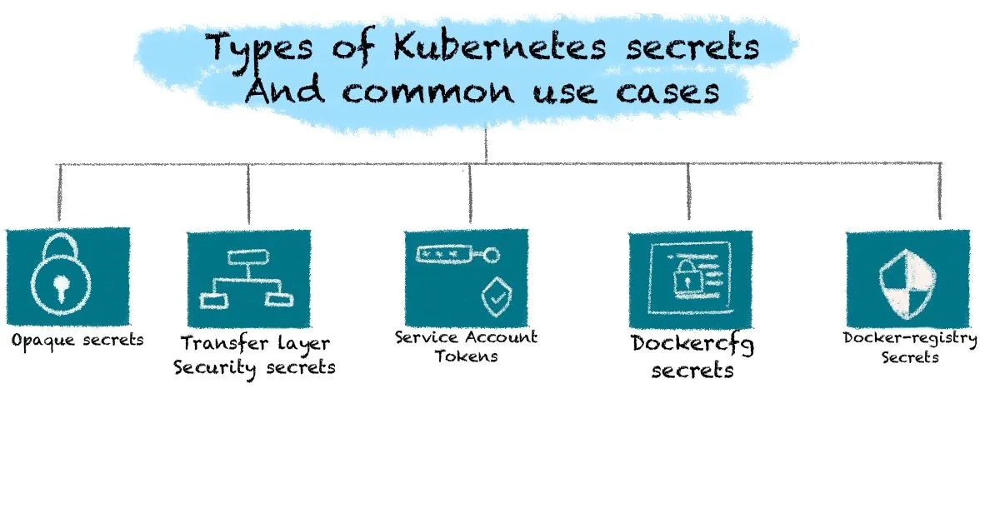


### Postgres's Password in a secret (As environment variable)


```bash +.
mkdir secrets
cd secrets
kubectl create namespace secrets
```

1. Commençons par créer un secret contenant notre mot de passe postgres dans une clé **postgres_password** :

```bash +.
kubectl create secret generic dev-db-secret -n secrets --from-literal postgres_password=password

secret/dev-db-secret created
```

2. Nous pouvons inspecter notre secret de la façon suivante :

```bash +.
kubectl describe secret -n secrets dev-db-secret
```

```bash +.

Name:         dev-db-secret
Namespace:    default
Labels:       <none>
Annotations:  <none>

Type:  Opaque

Data
====
postgres_password:  8 bytes
```

3. Définissons maintenant un pod postgres, utilisant le secret que nous avons créé ci dessus pour le mot de passe de la base de données :

```bash +.
touch pod-with-secret.yaml
```

Avec le contenu yaml suivant :

```yaml +.
apiVersion: v1
kind: Pod
metadata:
  name: pod-with-secret
  namespace: secrets
spec:
  containers:
  - name: pod-with-secret
    image: postgres
    env:
      - name: POSTGRES_PASSWORD
        valueFrom:
          secretKeyRef:
            name: dev-db-secret
            key: postgres_password
```

4. Exécutons ce pod :

```bash +.
kubectl apply -f pod-with-secret.yaml

```

*pod/pod-with-secret created*

1. Nous pouvons voir que notre pod utilise bien notre secret via un describe :

```bash +.
kubectl describe pods -n secrets pod-with-secret
```

```bash +.
...
Ready:          True
Restart Count:  0
Environment:
  POSTGRES_PASSWORD:  <set to the key 'postgres_password' in secret 'dev-db-secret'>  Optional: false
Mounts:
  /var/run/secrets/kubernetes.io/serviceaccount from default-token-4xjhx (ro)
...
```

2. Vérifions que le secret est bien utilisé dans notre pod :

```bash +.
kubectl exec -it -n secrets pod-with-secret -- printenv
```

```bash +.
...
HOSTNAME=pod-with-secret
TERM=xterm
POSTGRES_PASSWORD=password
KUBERNETES_PORT_443_TCP_ADDR=10.96.0.1
KUBERNETES_SERVICE_HOST=10.96.0.1
...
```

Notre secret se trouve bien en tant que variable d'environnement dans notre conteneur.

<hr>

### Secret file as a mount

1. Commençons par créer un secret à partir d'un fichier :

```bash +.
echo "Iamasecret" > secret.txt
```

2. On va donc créer un secret à partir de ce fichier :

```bash +.
kubectl create secret generic -n secrets secret-file --from-file=secret.txt
```

*secret/secret-file created*


3. Définissons un pod, qui va monter ce secret en tant que volume :

```bash +.
touch pod-with-volume-secret.yaml
```

Avec le contenu yaml suivant :

```yaml +.
apiVersion: v1
kind: Pod
metadata:
  name: pod-with-volume-secret
  namespace: secrets
spec:
  containers:
  - name: pod-with-volume-secret
    image: redis
    volumeMounts:
    - name: secret-mount
      mountPath: "/tmp"
      readOnly: true
  volumes:
  - name: secret-mount
    secret:
      secretName: secret-file
```

4. Création du pod :

```bash +.
kubectl apply -f pod-with-volume-secret.yaml
```

*pod/pod-with-volume-secret created*


5. Nous pouvons faire un describe sur le pod pour voir qu'il utilise bien notre secret en tant que mount :

```bash +.
kubectl describe pods -n secrets pod-with-volume-secret
```

```bash +.
...
Environment:    <none>
Mounts:
  /tmp from secret-mount (ro)
  /var/run/secrets/kubernetes.io/serviceaccount from default-token-4xjhx (ro)
...
```

1. Vérifions que le fichier a bien été monte sur le conteneur du pod :

```bash +.
kubectl exec -it -n secrets pod-with-volume-secret -- cat /tmp/secret.txt
```

*Iamasecret*

<hr>
### Kubeseal

1. Commençons par installer Kubeseal :

```bash +.
curl -Lo kubeseal https://github.com/bitnami-labs/sealed-secrets/releases/download/v0.16.0/kubeseal-linux-amd64
chmod +x kubeseal
sudo mv kubeseal /usr/local/bin/
```

2. Vérifions son installation :

```bash +.
kubeseal --version

kubeseal version: v0.16.0
```

3. Nous allons également installer l'opérateur via helm :

```bash +.
helm repo add stable https://charts.helm.sh/stable
helm repo update
helm install --namespace kube-system sealed-secrets stable/sealed-secrets
```

```bash +.

NAME: sealed-secrets
LAST DEPLOYED: Sun Nov  1 10:18:33 2020
NAMESPACE: kube-system
STATUS: deployed
REVISION: 1
TEST SUITE: None
NOTES:
You should now be able to create sealed secrets
```

4. Nous allons maintenant créer un secret :

```bash +.
kubectl create secret generic -n secrets secret-example --dry-run --from-literal=secret=value -o yaml > secret-example.yaml

cat secret-example.yaml
```

```yaml +.
apiVersion: v1
data:
  secret: dmFsdWU=
kind: Secret
metadata:
  creationTimestamp: null
  name: sealed-secret-example
```

5. Et un SealedSecret à partir de ce secret :

```bash +.
kubeseal --controller-name=sealed-secrets --controller-namespace=kube-system --format yaml <secret-example.yaml > sealed-secret-example.yaml

cat sealed-secret-example.yaml

```

```yaml +.
apiVersion: bitnami.com/v1alpha1
kind: SealedSecret
metadata:
  creationTimestamp: null
  name: secret-example
  namespace: secrets
spec:
  encryptedData:
    secret: AgBy3DUDSGCwPLFOJ+jYp1wm1Wqf9PlCFLvIdUDPMdSr0tBIniBLNBpQbdZ+bqP6Tq7zBhDuJz4hNq5qchgfHXyKb6qxhSP30BuquSBHboO+19NHMEG6GOYT1TatHJwUVFlzGtqHcIRFwwEOZpJs9FRByYMf4jSbfu1Lb9u1E1Q49I3Ycw+LprqSZG4rZXtnBL+d6R1iO9OKsx6uQ3fklSYRyYuNWCrqGPYINcX9pcShvJHa8N30H6xZT8jrTpp+UPNXQTI3iaBHxHMTcc5jQCcduOp5Wgbm4G8OEr1Pd4fiNCb7QBAuiGLQa81RhdN887cifdv6mweDLnsRJk09fWGIyTXTezgCYnpsBQv0RFk/EEFiL7pm7w6zMHjp+ldy8NwonoJ8DL6mXFM2otdstGiDayoELrr47MEMp+Y4VVvbQai2YufUKdbF0/unBeB0BRMCMHYgqkCoKG5UPaekIVaYSPjUvT69WjY6DJnFoMz8uVtTqIaCpFAZ8Lm0G3cpfko3rwUGDefmVi4E8eLmcLn3t8KSdzkY5TLP+s58LFjFeDPz+OWvxnJ+1NmOig4OgzhItC0ngtulwhY2lXbuLgNhkjTXHTqRlCF4PXu/vcYHFhq4sBp+bTCvVsJYJTBpkNNCefT51KMTIg+xqOWC73/FqFwujJ4JAue4N99Fvh+7qbEYEw5sPPv6CmwuO0oVzNv52bjBRQ==
  template:
    metadata:
      creationTimestamp: null
      name: secret-example
      namespace: secrets
```

6. Nous pouvons créer notre secret à partir de notre Sealed Secret :

```bash +.
kubectl apply -f sealed-secret-example.yaml
```

*sealedsecret.bitnami.com/secret-example created*


7. Nous pouvons voir qu'un Sealed Secret a été créé :

```bash +.
kubectl get sealedsecrets -n secrets
```

```bash +.
NAME             AGE
secret-example   25s
```

8. Ainsi qu'un Secret à partir de notre Sealed Secret :

```bash +.
kubectl get secrets -n secrets secret-example
```

```bash +.
NAME                  TYPE                                  DATA   AGE
secret-example        Opaque                                1      2m13s
```

<hr>

### Clean up

Supprimons les différents objets créés par ces exercices :

```bash +.
kubectl delete -f .
kubectl delete secret secret-file -n secrets
kubectl delete secret dev-db-secret -n secrets
```

<hr>

### Quizz secrets

Quel objet est utilisé pour stocker des données sensibles telles que des mots de passe ou des clés d'API ?

[(X)] Secret
[( )] ConfigMap
[( )] PersistentVolumeClaim
[( )] ServiceAccount

Comment les données sont-elles stockées dans un Secret ?

[(X)] Sous forme encodée en base64
[( )] En clair
[( )] Sous forme chiffrée
[( )] Sous forme de fichiers binaires

Quel est le meilleur endroit pour stocker une chaîne de connexion à une base de données ?

[(X)] Secret
[( )] ConfigMap
[( )] PersistentVolumeClaim
[( )] ServiceAccount

Comment un Secret peut-il être utilisé dans un pod ?

[( )] Monté en tant que volume
[( )] Exposé en tant que variables d'environnement
[(X)] Les deux réponses précédentes sont correctes

Les Secrets sont-ils chiffrés au repos dans l'étcd (base de données clé-valeur utilisée par Kubernetes) ?

[(X)] Oui
[( )] Non
[( )] Seulement si le cluster est configuré pour le chiffrement des données au repos
[( )] Impossible à déterminer

Quelle commande permet de créer un Secret à partir d'un fichier existant ?

[( )] kubectl create secret mysecret --from-file=./secret.txt
[(X)] kubectl create secret generic mysecret --from-file=./secret.txt
[( )] kubectl apply -f secret.yaml
[( )] kubectl expose secret mysecret

Comment un Secret peut-il être mis à jour ?

[( )] En modifiant directement le fichier YAML du Secret
[(X)] En créant un nouveau Secret avec les données mises à jour
[( )] En utilisant la commande kubectl edit secret
[( )] Impossible de mettre à jour un Secret existant

Quel type de Secret doit être utilisé pour stocker des données opaques (non interprétées par Kubernetes) ?

[(X)] Opaque
[( )] kubernetes.io/dockerconfigjson
[( )] kubernetes.io/service-account-token
[( )] kubernetes.io/basic-auth

Comment un Secret peut-il être supprimé ?

[(X)] kubectl delete secret mysecret
[( )] kubectl remove secret mysecret
[( )] En modifiant directement le fichier YAML du Secret
[( )] Impossible de supprimer un Secret existant

Quel objet permet de référencer des données stockées dans un Secret ?

[(X)] EnvVar
[( )] PersistentVolumeClaim
[( )] ServiceAccount
[( )] Volume


## Resources Handling

Machine : **master**


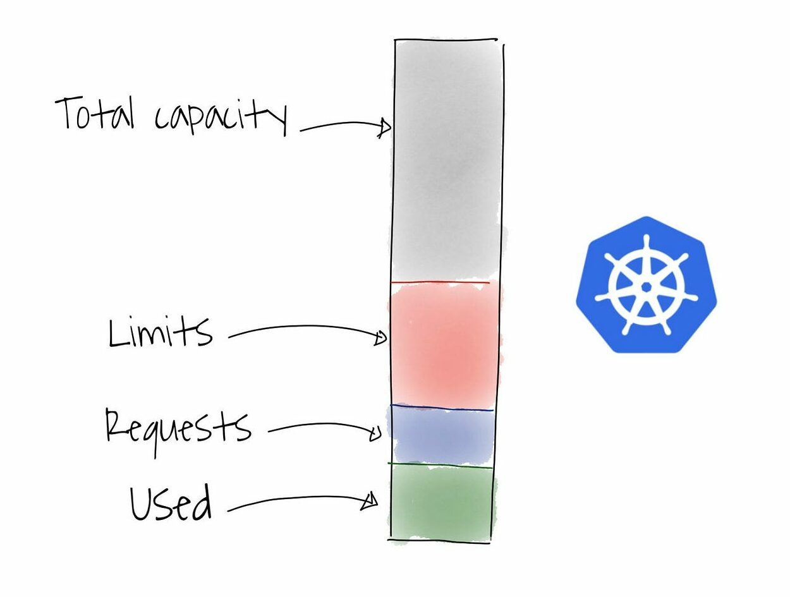

<hr>

### Limits/Requests for a pod

```bash +.
mkdir resources
cd resources
kubectl create namespace resources
```


1. Nous allons commencer par créer un pod qui réclame des ressources et qui a une limite de ressources également :

```bash +.
touch test-resources.yaml
```

Avec le contenu yaml suivant :

```yaml +.
apiVersion: v1
kind: Pod
metadata:
  name: test-resources
  namespace: resources
spec:
  containers:
  - name: app
    image: redis
    resources:
      requests:
        memory: "128Mi"
        cpu: "250m"
      limits:
        memory: "128Mi"
        cpu: "500m"
```

2. Créons donc ce pod :

```bash +.
kubectl apply -f test-resources.yaml
```
```bash +.
pod/test-resources created
```

1. Nous pouvons faire un describe sur notre pod pour voir que notre les requests/limits de ressources ont bien été prises en comptes :

```bash +.
kubectl describe pods -n resources test-resources
```
```bash +.
...
Host Port:      <none>
State:          Running
  Started:      Wed, 28 Oct 2020 13:18:59 +0000
Ready:          True
Restart Count:  0
Limits:
  cpu:     500m
  memory:  128Mi
Requests:
  cpu:        250m
  memory:     128Mi
Environment:  <none>
Mounts:
  /var/run/secrets/kubernetes.io/serviceaccount from default-token-587zl (ro)
...
```


<hr>

### Limit Ranges

<hr>

1. Nous allons donc créer une limit range définissant une limite et une request par défaut pour nos pods :

```bash +.
touch mem-limit-range.yaml
```

Avec le contenu yaml suivant :

```yaml +.
apiVersion: v1
kind: LimitRange
metadata:
  name: mem-limit-range
  namespace: resources
spec:
  limits:
  - default:
      memory: 768Mi
    defaultRequest:
      memory: 256Mi
    type: Container
```

2. Créons donc cette limitRange :

```bash +.
kubectl apply -f mem-limit-range.yaml
```
```bash +.
limitrange/mem-limit-range created
```

1. Nous pouvons consulter notre limitRange de la façon suivante :

```bash +.
kubectl describe -n resources limitrange mem-limit-range
```
```bash +.
Name:       mem-limit-range
Namespace:  resources
Type        Resource  Min  Max  Default Request  Default Limit  Max Limit/Request Ratio
----        --------  ---  ---  ---------------  -------------  -----------------------
Container   memory    -    -    256Mi            768Mi          -
```

1. Nous allons maintenant créer un pod, sans définir une request/limit de ressources :

```bash +.
touch test2-resources.yaml
```

Avec le contenu yaml suivant :

```yaml +.
apiVersion: v1
kind: Pod
metadata:
  name: test2-resources
  namespace: resources
spec:
  containers:
  - name: app
    image: redis
```

5. Créons donc ce pod :

```bash +.
kubectl apply -f test2-resources.yaml
```
```bash +.
pod/test2-resources created
```

1. Faisons maintenant un describe sur ce pod, nous voyons bien que la limite de RAM est a 768Mi et la request est de 256Mi :

```bash +.
kubectl describe pods -n resources test2-resources
```
```bash +.
...
Host Port:      <none>
State:          Running
  Started:      Wed, 28 Oct 2020 13:34:12 +0000
Ready:          True
Restart Count:  0
Limits:
  memory:  768Mi
Requests:
  memory:     256Mi
Environment:  <none>
Mounts:
  /var/run/secrets/kubernetes.io/serviceaccount from default-token-587zl (ro)
...
```

<hr>

### Resource Quota

<hr>

1. Commençons par créer une resource-quota sur note namespace de 1Gi en requests et 2Gi en limits :

```bash +.
touch resource-quota.yaml
```

Avec le contenu yaml suivant :

```yaml +.
apiVersion: v1
kind: ResourceQuota
metadata:
  name: resource-quota
  namespace: resources
spec:
  hard:
    requests.memory: 1Gi
    limits.memory: 2Gi
```

2. Créons cette resource-quota :

```bash +.
kubectl apply -f resource-quota.yaml
```
```bash +.

resourcequota/resource-quota created
```

1. Nous pouvons consulter notre Resource Quota de la façon suivante :

```bash +.
kubectl describe -n resources resourcequota
```

```bash +.
Name:            resource-quota
Namespace:       resources
Resource         Used   Hard
--------         ----   ----
limits.memory    896Mi  2Gi
requests.memory  384Mi  1Gi
```

1. Nous allons maintenant définir un pod redis avec une request de 768Mi (Sachant que nous avons déjà un pod avec 128Mi de request et un autre avec 256Mi) :

```bash +.
touch test3-resources.yaml
```

Avec le contenu yaml suivant :

```yaml +.
apiVersion: v1
kind: Pod
metadata:
  name: test3-resources
  namespace: resources
spec:
  containers:
  - name: app
    image: redis
    resources:
      requests:
        memory: "768Mi"
        cpu: "250m"
```

5. Essayons de créer ce pod :

```bash +.
kubectl apply -f test3-resources.yaml

```
```bash +.

Error from server (Forbidden): error when creating "test3-resources.yaml": pods "test3-resources" is forbidden: exceeded quota: resource-quota, requested: requests.memory=768Mi, used: requests.memory=384Mi, limited: requests.memory=1Gi
```

La création échoue puisque la request demandée, s'ajoutant aux requests des deux pods existants, est supérieur à celle définie par la ressource quota qui est de 1Gi.

### Clean up

Nous pouvons maintenant supprimer les ressources que nous avons crées dans ces exercices :

```bash +.
kubectl delete -f .
```
```bash +.
limitrange "mem-limit-range" deleted
resourcequota "resource-quota" deleted
pod "test-resources" deleted
pod "test2-resources" deleted
Error from server (NotFound): error when deleting "test3-resources.yaml": pods "test3-resources" not found
```

### Quizz Resource Handling 

Quel objet est utilisé pour limiter les ressources consommées par un pod ?

[(X)] LimitRange
[( )] ResourceQuota
[( )] HorizontalPodAutoscaler
[( )] PodDisruptionBudget

Quel objet permet de définir des quotas de ressources pour les espaces de noms ?

[( )] LimitRange
[(X)] ResourceQuota
[( )] HorizontalPodAutoscaler
[( )] VerticalPodAutoscaler

Quel objet sert à surveiller et collecter les métriques du cluster ?

[( )] LimitRange
[( )] ResourceQuota
[(X)] HorizontalPodAutoscaler
[( )] VerticalPodAutoscaler

Quel objet permet de surveiller l'état des pods ?

[( )] LimitRange
[( )] ResourceQuota
[( )] HorizontalPodAutoscaler
[(X)] PodDisruptionBudget

Quelles ressources peuvent être limitées avec un LimitRange ?

[(X)] CPU, mémoire, nombre de volumes
[( )] Mémoire, nombre de pods
[( )] CPU, nombre de nœuds
[( )] Nombre de services, nombre de pods

Qu'est-ce qu'un ResourceQuota permet de limiter ?

[( )] Le nombre de pods par nœud
[(X)] La quantité totale de ressources consommées dans un espace de noms
[( )] La quantité de ressources consommées par un seul pod
[( )] Le nombre de nœuds dans le cluster

Comment fonctionne un HorizontalPodAutoscaler ?

[( )] Il ajoute ou supprime des nœuds en fonction de la charge
[(X)] Il ajoute ou supprime des pods en fonction de l'utilisation des ressources
[( )] Il ajuste les limites de ressources des pods
[( )] Il migre les pods entre les nœuds

Quel objet permet de réduire les interruptions de service lors de la suppression de pods ?

[( )] LimitRange
[( )] ResourceQuota
[( )] HorizontalPodAutoscaler
[(X)] PodDisruptionBudget

Que se passe-t-il lorsqu'un pod dépasse les limites de ressources définies ?

[( )] Le pod est automatiquement supprimé
[(X)] Le conteneur est terminé avec un signal d'arrêt
[( )] Le nœud est redémarré
[( )] Rien, les limites n'ont aucun effet

Quel objet peut être utilisé pour ajuster automatiquement les ressources allouées aux pods ?

[( )] LimitRange
[( )] ResourceQuota
[( )] HorizontalPodAutoscaler
[(X)] VerticalPodAutoscaler


<hr>

## Liveness and Readiness probe


<hr>

Machine : **master**

<hr>

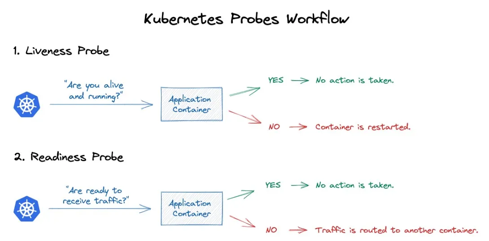


### Liveness probe, avec un fichier


```bash +.
mkdir healthchecking
cd healthchecking
kubectl create namespace healthchecking
```

1. Commençons par créer un ficher yaml décrivant un pod avec une liveness probe.

```bash +.
touch file-liveness.yaml
```

Avec le contenu yaml suivant :

```yaml +.
apiVersion: v1
kind: Pod
metadata:
  name: file-liveness
  namespace: healthchecking
spec:
  containers:
  - name: liveness
    image: busybox
    args:
    - /bin/sh
    - -c
    - touch /tmp/healthy; sleep 10; rm -rf /tmp/healthy; sleep 600
    livenessProbe:
      exec:
        command:
        - cat
        - /tmp/healthy
      initialDelaySeconds: 5
      periodSeconds: 5
```

2. Nous allons donc créer ce pod de la façon suivante :

```bash +.
kubectl apply -f file-liveness.yaml
```

*pod/file-liveness created*

3. Au bout de quelques secondes, nous pouvons faire un describe sur le pod et observer le résultat suivant :

```bash +.
kubectl describe pods -n healthchecking file-liveness

```

```bash +.
...
Events:
  Type     Reason     Age               From               Message
  ----     ------     ----              ----               -------
  Normal   Scheduled  29s               default-scheduler  Successfully assigned default/liveness-exec to worker
  Normal   Pulling    29s               kubelet            Pulling image "busybox"
  Normal   Pulled     27s               kubelet            Successfully pulled image "busybox" in 1.59651835s
  Normal   Created    27s               kubelet            Created container liveness
  Normal   Started    27s               kubelet            Started container liveness
  Warning  Unhealthy  5s (x3 over 15s)  kubelet            Liveness probe failed: cat: can't open '/tmp/healthy': No such file or directory
  Normal   Killing    5s                kubelet            Container liveness failed liveness probe, will be restarted
```

La liveness probe fini donc par échouer comme prévu, étant donne que le fichier /tmp/healthy n'existe plus. On remarque également que Kubernetes kill le conteneur a l'intérieur du pod et le recrée.

### Liveness probe, avec une requête http

Nous allons cette fois mettre en place une liveness probe mais avec une requête http exécutée périodiquement.

1. Commençons par créer un fichier http-liveness.yaml :

```bash +.
touch http-liveness.yaml
```

Avec le contenu yaml suivant :

```yaml +.
apiVersion: v1
kind: Pod
metadata:
  name: http-liveness
  namespace: healthchecking
spec:
  containers:
  - name: liveness
    image: nginx
    livenessProbe:
      httpGet:
        path: /
        port: 80
      initialDelaySeconds: 3
      periodSeconds: 3
```

Cette fois ci, la liveness probe utilise une requête http avec la méthode GET sur la racine toute les 3 secondes. La liveness probe échouera selon le code d'erreur de la requête http.

2. Créons donc ce pod :

```bash +.
kubectl apply -f http-liveness.yaml

```


*pod/http-liveness created*

3. Si nous faisons un describe sur le pod, nous devrions voir que tout se passe bien pour l'instant :

```bash +.
kubectl describe pods -n healthchecking http-liveness
```

```bash +.
...
Events:
  Type    Reason     Age   From               Message
  ----    ------     ----  ----               -------
  Normal  Scheduled  118s  default-scheduler  Successfully assigned healthchecking/http-liveness to worker
  Normal  Pulling    118s  kubelet            Pulling image "nginx"
  Normal  Pulled     114s  kubelet            Successfully pulled image "nginx" in 3.862745132s
  Normal  Created    114s  kubelet            Created container liveness
  Normal  Started    113s  kubelet            Started container liveness
```

4. Nous allons supprimer la page d'accueil de nginx dans le conteneur, ce qui entraînera un code d'erreur 400 pour la requête http de la liveness probe :

```bash +.
kubectl exec -n healthchecking http-liveness -- rm /usr/share/nginx/html/index.html
```

5. Au bout de quelques secondes, on devrait voir que la liveness probe échoue et le conteneur est recréé :

```bash +.
kubectl describe pods -n healthchecking http-liveness

Type     Reason     Age                From               Message
----     ------     ----               ----               -------
Normal   Scheduled  59s                default-scheduler  Successfully assigned healthchecking/http-liveness to worker
Normal   Pulled     57s                kubelet            Successfully pulled image "nginx" in 1.609742987s
Normal   Pulling    34s (x2 over 58s)  kubelet            Pulling image "nginx"
Warning  Unhealthy  34s (x3 over 40s)  kubelet            Liveness probe failed: HTTP probe failed with statuscode: 403
Normal   Killing    34s                kubelet            Container liveness failed liveness probe, will be restarted
Normal   Created    32s (x2 over 57s)  kubelet            Created container liveness
Normal   Started    32s (x2 over 57s)  kubelet            Started container liveness
Normal   Pulled     32s                kubelet            Successfully pulled image "nginx" in 2.031773864s
```

On voit que le conteneur a été tué par Kubernetes étant donné que la liveness probe a échoué.


<hr>

### Readiness Probe

<hr>

Nous allons maintenant voir une autre façon de faire du healthchecking sur un pod : la readiness probe. Elle permet à Kubernetes de savoir lorsque l'application se trouvant dans un pod a bel et bien démarré. Comme la liveness probe, elle fait ça a l'aide de commandes, de requêtes http/tcp, etc.

1. Commençons par créer un fichier file-readiness.yaml :

```bash +.
touch file-readiness.yaml
```

Avec le contenu yaml suivant :

```yaml +.
apiVersion: v1
kind: Pod
metadata:
  name: file-readiness
  namespace: healthchecking
spec:
  containers:
  - name: liveness
    image: busybox
    args:
    - /bin/sh
    - -c
    - sleep 60; touch /tmp/healthy; sleep 600
    readinessProbe:
      exec:
        command:
        - cat
        - /tmp/healthy
      initialDelaySeconds: 5
      periodSeconds: 5
```

Ce pod est un peu similaire à celui de file-liveness dans l'exercice 1. Cette fois ci, le pod attend 30 secondes au démarrage avant de créer un fichier /tmp/healthy. Ce pod contient également une readiness probe vérifiant l'existence de ce fichier /tmp/healthy.

2. Créons donc ce pod :

```bash +.
kubectl apply -f file-readiness.yaml
```

*pod/file-readiness created*

3. Si on fait on describe tout de suite après la création du pod, on devrait voir le pod n'est pas encore prêt :

```bash +.
kubectl describe pods -n healthchecking file-readiness  

```

```bash +.
Events:
  Type     Reason     Age               From               Message
  ----     ------     ----              ----               -------
  Normal   Scheduled  39s               default-scheduler  Successfully assigned healthchecking/file-readiness to worker
  Normal   Pulling    38s               kubelet            Pulling image "busybox"
  Normal   Pulled     37s               kubelet            Successfully pulled image "busybox" in 1.64435698s
  Normal   Created    37s               kubelet            Created container liveness
  Normal   Started    36s               kubelet            Started container liveness
  Warning  Unhealthy  1s (x7 over 31s)  kubelet            Readiness probe failed: cat: can't open '/tmp/healthy': No such file or directory
```

4. Au bout d'environ une minute, on devrait voir le pod entrant dans l'état ready (1/1) :

```bash +.
kubectl get pods -n healthchecking

```

```bash +.

NAME             READY   STATUS             RESTARTS   AGE
file-liveness    0/1     CrashLoopBackOff   7          14m
file-readiness   1/1     Running            0          105s
http-liveness    1/1     Running            1          6m3s  
```

### Clean up

Nous allons supprimer les ressources créées par cet exercice de la façon suivante :

```bash +.
kubectl delete -f .
```

<hr>


### Quizz sur les readiness, liveness, startup probes

Quel type de sonde est utilisé pour déterminer si un conteneur est prêt à recevoir du trafic ?

[( )] Liveness Probe
[(X)] Readiness Probe
[( )] Startup Probe
[( )] Health Check

Quel type de sonde est utilisé pour déterminer si un conteneur est en bonne santé ?

[(X)] Liveness Probe
[( )] Readiness Probe
[( )] Startup Probe
[( )] Health Check

Quel type de sonde est utilisé pour détecter les problèmes de démarrage d'un conteneur ?

[( )] Liveness Probe
[( )] Readiness Probe
[(X)] Startup Probe
[( )] Health Check

Quelles sont les différentes méthodes de sonde disponibles ?

[( )] HTTP GET, TCP
[( )] HTTP GET, TCP, Exec
[(X)] HTTP GET, TCP, Exec, GRPC
[( )] HTTP GET, TCP, Exec, UDP

Que se passe-t-il si une sonde Liveness échoue ?

[(X)] Le conteneur est redémarré
[( )] Le pod est redémarré
[( )] Le service est redémarré
[( )] Rien ne se passe

Que se passe-t-il si une sonde Readiness échoue ?

[( )] Le conteneur est redémarré
[(X)] Le pod est retiré du service
[( )] Le service est redémarré
[( )] Rien ne se passe

Quelle est la différence entre une sonde Liveness et une sonde Readiness ?

[( )] Aucune différence, elles font la même chose
[(X)] La sonde Liveness vérifie si le conteneur est en bonne santé, la sonde Readiness vérifie si le conteneur est prêt à recevoir du trafic
[( )] La sonde Liveness vérifie si le conteneur est prêt à recevoir du trafic, la sonde Readiness vérifie si le conteneur est en bonne santé
[( )] La sonde Liveness est utilisée pour les conteneurs web, la sonde Readiness est utilisée pour les autres types de conteneurs

Quelle est la valeur par défaut du délai d'attente (timeout) pour une sonde HTTP ?

[( )] 1 seconde
[(X)] 1 minute
[( )] 5 minutes
[( )] Aucun délai d'attente par défaut

Quelles sont les bonnes pratiques pour configurer les sondes ?

[( )] Utiliser des sondes uniquement pour les applications critiques
[(X)] Configurer des sondes pour toutes les applications, avec des valeurs de délai appropriées
[( )] Utiliser uniquement des sondes HTTP GET
[( )] Ne jamais utiliser de sondes

Comment une sonde Startup est-elle utilisée ?

[( )] Elle remplace la sonde Liveness pendant le démarrage du conteneur
[(X)] Elle est utilisée en complément de la sonde Liveness pendant le démarrage du conteneur
[( )] Elle remplace la sonde Readiness pendant le démarrage du conteneur
[( )] Elle n'est jamais utilisée en combinaison avec d'autres sondes


## Scheduling


<hr>
Machine : **master** 

<hr>


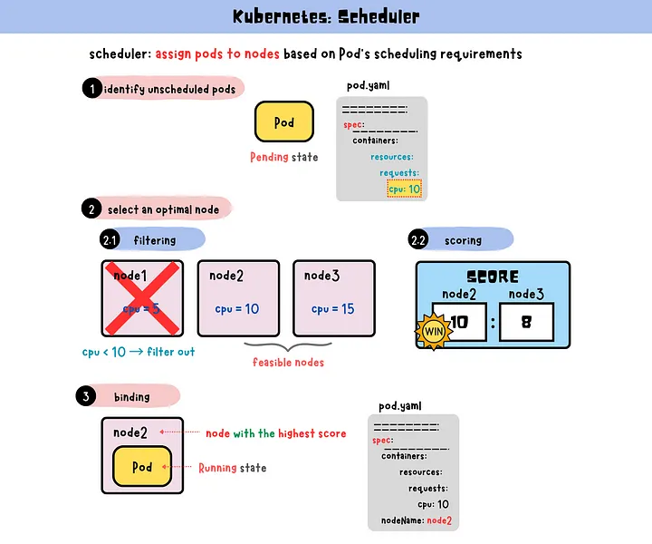


### Taints and Tolerations


```bash +.
mkdir scheduling
cd scheduling
kubectl create namespace scheduling
```


1. Nous allons commencer par mettre un **taint** sur les noeuds worker-0 et worker-1:

```bash +.
kubectl taint nodes worker-0 dedicated=experimental:NoSchedule
```

*node/worker-0 tainted*

```bash +.
kubectl taint nodes worker-1 dedicated=experimental:NoSchedule
```

*node/worker-1 tainted*


2. Nous pouvons faire un describe sur le noeud pour voir que notre taint a bien été prise en compte :

```bash +.
kubectl describe node worker-0
```

```bash +.

CreationTimestamp:  Sun, 01 Nov 2020 09:49:52 +0000
Taints:             dedicated=experimental:NoSchedule
Unschedulable:      false
```

3. Essayons de déployer un pod sans toleration :

 ```bash +.
touch pod-without-toleration.yaml
```

Avec le contenu yaml suivant :

```yaml +.
apiVersion: v1
kind: Pod
metadata:
  name: pod-without-toleration
  namespace: scheduling
spec:
  containers:
  - name: nginx
    image: nginx
```

4. Créons donc ce pod :

```bash +.
kubectl apply -f pod-without-toleration.yaml
```

*pod/pod-without-toleration created*

5. Voyons voir sur quel noeud notre pod a été schedulé :

```bash +.
kubectl get pods -n scheduling pod-without-toleration -o wide
```


```bash +.
NAME                     READY   STATUS    RESTARTS   AGE   IP       NODE     NOMINATED NODE   READINESS GATES
pod-without-toleration   0/1     Pending   0          11m   <none>   <none>   <none>           <none>
```

Notre pod n’ayant pas de toleration pour la taint que nous avons mis sur les noeuds worker-0 et worker-1, il n'a pu être déployé.

6. Définissons maintenant un pod avec un toleration avec la taint définie plus haut :

```bash +.
touch pod-toleration.yaml
```
Avec le contenu yaml suivant :

```yaml +.
apiVersion: v1
kind: Pod
metadata:
  name: pod-toleration
  namespace: scheduling
spec:
  containers:
  - name: nginx
    image: nginx
  tolerations:
  - key: "dedicated"
    value: "experimental"
    operator: "Equal"
    effect: "NoSchedule"
```
  
7. Créons ce pod :

```bash +.
kubectl apply -f pod-toleration.yaml
```


*pod/pod-toleration created*


8. Nous pouvons voir sur quel noeud notre pod a été schedulé :

```bash +.
kubectl get pods -n scheduling pod-toleration -o wide
```

```bash +.
NAME             READY   STATUS    RESTARTS   AGE   IP          NODE     NOMINATED NODE   READINESS GATES
pod-toleration   1/1     Running   0          49s   10.44.0.1   worker-0   <none>           <none>
```

Le pod peut maintenant être schedulé sur le noeud worker-0

9. Supprimons les objets créés dans cet exercice :

```bash +.
kubectl delete -f pod-toleration.yaml -f pod-without-toleration.yaml
```

*pod "pod-toleration" deleted*

*pod "pod-without-toleration" deleted*

```bash +.
kubectl taint nodes worker-0 dedicated:NoSchedule-
```

*node/worker-0 untainted*

```bash +.
kubectl taint nodes worker-1 dedicated:NoSchedule-
```

*node/worker-1 untainted*

<hr>

**NodeSelector**


1. Nous allons enlever la taint sur le master pour pouvoir scheduler des pods dessus :

```bash +.
kubectl taint nodes master node-role.kubernetes.io/master:NoSchedule-
```

*node/master untainted*


2. Nous allons commencer par mettre un label sur le noeud worker-1 “disk=ssd” :

```bash +.
kubectl label nodes worker-1 disk=ssd
```

*node/worker-1 labeled*


3. Nous pouvons faire un describe sur le noeud worker-1 pour voir que notre label a bien été pris en compte :
  
```bash +.
kubectl describe nodes worker-1
```

```bash +.
Name:               worker-1
Roles:              <none>
Labels:             beta.kubernetes.io/arch=amd64
                    beta.kubernetes.io/os=linux
                    disk=ssd
                    kubernetes.io/arch=amd64
                    kubernetes.io/hostname=worker
                    kubernetes.io/os=linux
```

4. Définissons un pod que l’on va scheduler sur le noeud worker-1 à l’aide du label défini ci-dessus :

```bash +.
touch pod-nodeselector.yaml
```

Avec le contenu yaml suivant :

```yaml +.
apiVersion: v1
kind: Pod
metadata:
  name: pod-nodeselector
  namespace: scheduling
spec:
  containers:
  - name: nginx
    image: nginx
  nodeSelector:
    disk: ssd
```

5. Créons donc ce pod :
   
   
```bash +.
kubectl apply -f pod-nodeselector.yaml
```

*pod/pod-nodeselector created*

1. Voyons voir dans quel noeud notre pod a été mis :

```bash +.
kubectl get pods -n scheduling pod-nodeselector -o wide
```

```bash +.
NAME               READY   STATUS    RESTARTS   AGE   IP          NODE     NOMINATED NODE   READINESS GATES
pod-nodeselector   1/1     Running   0          17s   10.44.0.1   worker-1   <none>           <none>
```

*Sans surprise, sur le noeud worker-1.*

7. Supprimons le pod créé dans cet exercice :

```bash +.
kubectl delete -f pod-nodeselector.yaml
```

*pod "pod-nodeselector" deleted*

<hr> 

### Node Affinity/AntiAffinity

<hr>

1. Définissons un pod, avec une nodeAffinity lui imposant d’aller dans un noeud ayant comme label “disk=ssd”, autrement dit le noeud worker-1 :

```bash +.
touch pod-nodeaffinity.yaml

```

Avec le contenu yaml suivant :

```yaml +.
apiVersion: v1
kind: Pod
metadata:
  name: pod-nodeaffinity
  namespace: scheduling
  labels:
    pod: alone
spec:
  affinity:
    nodeAffinity:
      requiredDuringSchedulingIgnoredDuringExecution:
        nodeSelectorTerms:
        - matchExpressions:
          - key: disk
            operator: In
            values:
            - ssd
  containers:
  - name: pod-nodeaffinity
    image: nginx
```

2. Créons donc ce pod :
  
```bash +.
kubectl apply -f pod-nodeaffinity.yaml
```

*pod/pod-nodeaffinity created*


3. Voyons voir dans quel noeud ce pod a été mis :

```bash +.
kubectl get pods -n scheduling pod-nodeaffinity -o wide
```


```bash +.
NAME               READY   STATUS    RESTARTS   AGE   IP          NODE     NOMINATED NODE   READINESS GATES
pod-nodeaffinity   1/1     Running   0          36s   10.44.0.1        worker-1   <none>           <none>
```

*Sans surprise, dans le noeud worker-1.*

<hr>

### Pod Affinity/AntiAffinity

<hr>

1. Définissons un pod, avec une podAntiAffinity lui imposant d’aller dans un noeud ne comportant pas le pod pod-nodeaffinity :
  
```bash +.  
touch pod-podantiaffinity.yaml
```

Avec le contenu yaml suivant :

```yaml +.
apiVersion: v1
kind: Pod
metadata:
  name: pod-podantiaffinity
  namespace: scheduling
spec:
  affinity:
    podAntiAffinity:
      requiredDuringSchedulingIgnoredDuringExecution:
        - labelSelector:
            matchExpressions:
              - key: pod
                operator: In
                values:
                - alone
          topologyKey: "kubernetes.io/hostname"
  containers:
  - name: pod-podantiaffinity
    image: nginx

```


2. Créons donc ce pod :


```bash +.
kubectl apply -f pod-podantiaffinity.yaml
```

*pod/pod-podantiaffinity created*

3. Voyons voir dans quel noeud ce pod a été mis :

```bash +.
kubectl get pods -n scheduling pod-podantiaffinity -o wide
```

```bash +.
NAME                  READY   STATUS    RESTARTS   AGE   IP          NODE     NOMINATED NODE   READINESS GATES
pod-podantiaffinity   1/1     Running   0          14s   10.32.0.4   master   <none>           <none>
```

Cette fois-ci, soit sur le noeud master ou worker-0.

<hr>

### NodeName

<hr>

1. Définissons un pod que l’on va scheduler dans le noeud master avec la propriété nodename :

```bash +.
touch pod-nodename.yaml
```

Avec le contenu yaml suivant :

```yaml +.
apiVersion: v1
kind: Pod
metadata:
  name: pod-nodename
  namespace: scheduling
spec:
  containers:
  - name: nginx
    image: nginx
  nodeName: master
```

2. Créons donc ce pod :
   
```bash +.
kubectl apply -f pod-nodename.yaml
```


*pod/pod-nodename created*

3. Regardons dans quel noeud ce pod se trouve :

```bash +.
kubectl get pods -n scheduling pod-nodename -o wide
```

```bash +.
NAME           READY   STATUS    RESTARTS   AGE   IP          NODE     NOMINATED NODE   READINESS GATES
pod-nodename   1/1     Running   0          4s    10.44.0.4       master   <none>           <none>
```

Sans surprise le noeud master. :)

### Clean Up

Nous pouvons supprimer les ressources générées par cet exercice de la façon suivante :

```bash +.
kubectl delete -f .
```

```bash +.
pod "pod-nodeaffinity" deleted
pod "pod-nodename" deleted
pod "pod-podantiaffinity" deleted
Error from server (NotFound): error when deleting "pod-nodeselector.yaml": pods "pod-nodeselector" not found
Error from server (NotFound): error when deleting "pod-toleration.yaml": pods "pod-toleration" not found
Error from server (NotFound): error when deleting "pod-without-toleration.yaml": pods "pod-without-toleration" not found
```

### Quizz Scheduling

Quel composant de Kubernetes est responsable de l'ordonnancement des pods sur les nœuds ?

[(X)] Scheduleur (kube-scheduler)
[( )] Contrôleur de réplication (replicaset)
[( )] Proxy de service (kube-proxy)
[( )] Gestionnaire de contrôle (controller-manager)

Quels sont les facteurs pris en compte par le scheduleur pour placer un pod sur un nœud ?

[( )] Contraintes de ressources (CPU, mémoire)
[( )] Contraintes d'affinité et d'anti-affinité
[( )] Politiques de tolérance aux pannes
[(X)] Tous les éléments ci-dessus

Comment l'affinité de nœud est-elle spécifiée ?

[(X)] Via des labels de nœud
[( )] Via des annotations de nœud
[( )] Via des taints de nœud
[( )] Via des tolérances de nœud

Que se passe-t-il lorsqu'un nœud devient indisponible ?

[( )] Les pods sont automatiquement redémarrés sur un autre nœud
[(X)] Les pods sont recréés sur un autre nœud par le contrôleur de réplication
[( )] Les pods restent sur le nœud indisponible
[( )] Le cluster est arrêté

Qu'est-ce qu'un taint de nœud ?

[( )] Une préférence pour certains types de charges de travail
[(X)] Un marquage qui empêche les pods de s'exécuter sur un nœud spécifique
[( )] Une limite de ressources pour un nœud spécifique
[( )] Une stratégie d'éviction de pods

Comment les tolérances de pod sont-elles spécifiées ?

[(X)] Dans la spécification du pod (spec.tolerations)
[( )] Dans la spécification du nœud (spec.tolerations)
[( )] Dans la spécification du namespace (spec.tolerations)
[( )] Dans la spécification du déploiement (spec.tolerations)

Que se passe-t-il lorsqu'un pod ne peut pas être schedulé en raison de contraintes de ressources ?

[( )] Le pod est supprimé
[(X)] Le pod reste en attente jusqu'à ce que des ressources suffisantes soient disponibles
[( )] Le pod est automatiquement redimensionné pour s'adapter aux ressources disponibles
[( )] Le cluster est redimensionné pour ajouter plus de nœuds

Quel objet Kubernetes peut être utilisé pour configurer des règles d'ordonnancement personnalisées ?

[(X)] Priorité de classe (PriorityClass)
[( )] Quota de ressources (ResourceQuota)
[( )] Limite de ressources (LimitRange)
[( )] Aucun objet n'est nécessaire, les règles sont configurées dans le fichier de configuration du scheduleur

Comment la priorité de pod est-elle déterminée ?

[( )] Par le nom du pod
[(X)] Par la priorité de classe ou les valeurs par défaut du scheduleur
[( )] Par les labels du pod
[( )] Par les annotations du pod

Que se passe-t-il lorsqu'un pod avec une priorité élevée ne peut pas être schedulé en raison d'un manque de ressources ?

[( )] Le pod est supprimé
[( )] Le pod reste en attente jusqu'à ce que des ressources suffisantes soient disponibles
[(X)] Des pods de priorité inférieure peuvent être évincés pour libérer des ressources
[( )] Le cluster est redimensionné pour ajouter plus de nœuds


<hr>


## RBAC


<hr>

Machine : **master**

<hr>


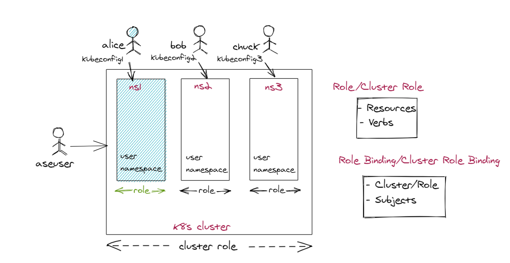


### Service Accounts


```bash +.
mkdir rbac
cd rbac
kubectl create namespace rbac
```

1. Nous allons créer 1 service accounts :

```bash +.
touch example-serviceaccount.yaml
```

Avec respectivement les contenus yaml suivants :

```yaml +.
apiVersion: v1
kind: ServiceAccount
metadata:
  name: example-serviceaccount
  namespace: rbac
```

2. Créons ce service account :

```bash +.
kubectl apply -f example-serviceaccount.yaml

serviceaccount/example-serviceaccount created
```

3. Nous pouvons voir les services accounts avec la commande suivante :

```bash +.
kubectl get serviceaccounts -n rbac

NAME                          SECRETS   AGE
example-serviceaccount        1         6s
default                       1         2m5s
```

4. Nous pouvons faire un describe sur le service account pour voir plusieurs informations à son sujet :

```bash +.
kubectl describe serviceaccounts -n rbac

Name:                default
Namespace:           rbac
Labels:              <none>
Annotations:         <none>
Image pull secrets:  <none>
Mountable secrets:   default-token-4mpqg
Tokens:              default-token-4mpqg
Events:              <none>
```

> Note : Le token utilisé par le service account est stocké dans un secret, que l'on peut voir ci-dessus

### User

0. Créer un utilisateur unix avec votre tri-gramme

```bash +.
TRIG="hel" # Remplacer avec votre trigramme par exemple
```


```bash +.
sudo useradd ${TRIG} -m -s /bin/bash
```

1. Commençons par générer une clé privée un CSR pour notre utilisateur :

```bash +.
openssl req -new -newkey rsa:4096 -nodes -keyout ${TRIG}-kubernetes.key -out ${TRIG}-kubernetes.csr -subj "/CN=${TRIG}/O=devops"
```

2. Encodons en base64 le CSR généré

```bash +.
base64 ${TRIG}-kubernetes.csr | tr -d '\n' > ${TRIG}.csr
```

3. Mettons le csr encodé dans une variable

```bash +.
REQUEST=$(cat ${TRIG}.csr)
```

4. Faisons une request de signature pour le csr généré au niveau du cluster

```bash +.
cat << EOF | kubectl apply -f -
apiVersion: certificates.k8s.io/v1
kind: CertificateSigningRequest
metadata:
  name: ${TRIG}-kubernetes-csr
spec:
  groups:
  - system:authenticated
  request: $REQUEST
  signerName: kubernetes.io/kube-apiserver-client
  usages:
  - client auth
EOF

```

5. Vérifions que la request est passée

```bash +.
kubectl get csr
# Pending
```


6. Approuvons le certificat

```bash +.
kubectl certificate approve ${TRIG}-kubernetes-csr
```

7. Vérifions que la request est signée

```bash +.
kubectl get csr
# Approved,Issued
```


8. Génération du certificat utilisateur

```bash +.
kubectl get csr ${TRIG}-kubernetes-csr -o jsonpath='{.status.certificate}' | base64 --decode > ${TRIG}-kubernetes-csr.crt
```

9. Génération de la CA du cluster k8s

```bash +.
kubectl config view -o jsonpath='{.clusters[0].cluster.certificate-authority-data}' --raw | base64 --decode - > kubernetes-ca.crt
```


10. Création du kubeconfig
 
```bash +.
kubectl config set-cluster $(kubectl config view -o jsonpath='{.clusters[0].name}') --server=$(kubectl config view -o jsonpath='{.clusters[0].cluster.server}') --certificate-authority=kubernetes-ca.crt --kubeconfig=${TRIG}-kubernetes-config --embed-certs
```

11. Mise à jour du context

```bash +.
kubectl config set-credentials ${TRIG} --client-certificate=${TRIG}-kubernetes-csr.crt --client-key=${TRIG}-kubernetes.key --embed-certs --kubeconfig=${TRIG}-kubernetes-config

```


12. Optionnellement positionnement sur un namespace

```bash +.

kubectl config set-context ${TRIG} --cluster=$(kubectl config view -o jsonpath='{.clusters[0].name}') --namespace=rbac --user=${TRIG} --kubeconfig=${TRIG}-kubernetes-config

KUBECONFIG=hel-kubernetes-config kubectx hel

```

13. Déplacements

```bash +.


sudo mkdir -p /home/${TRIG}/.kube
sudo cp ${TRIG}-kubernetes-config /home/${TRIG}/.kube/config
sudo chown -R ${TRIG}:${TRIG} /home/${TRIG}/.kube
```

6. Testons notre kubeconfig :

```bash +.
sudo su - ${TRIG}

kubectl get pods

Error from server (Forbidden): pods is forbidden: User "${TRIG}" cannot list resource "pods" in API group "" in the namespace "default"


#!!!  A faire pour repasser sur ubuntu ou utiliser un autre onglet
exit
```

### Roles/RoleBinding

1. Commençons par créer un rôle pod-reader permettant de lire les pods sur le namespace rbac. Nous allons donc créer un fichier pod-reader.yaml

```bash +.
touch pod-reader.yaml
```

Avec le contenu yaml suivant :

```yaml +.
apiVersion: rbac.authorization.k8s.io/v1
kind: Role
metadata:
  name: pod-reader
  namespace: rbac
rules:
- apiGroups: [""]
  resources: ["pods"]
  verbs: ["get", "watch", "list"]
```

2. Nous allons maintenant créer un rôle similaire, mais contenant cette fois ci des droits de création et de mise à jour, en plus des droits de lecture :

```bash +.
touch pod-creator.yaml
```

Avec le contenu yaml suivant :

```yaml +.
apiVersion: rbac.authorization.k8s.io/v1
kind: Role
metadata:
  name: pod-creator
  namespace: rbac
rules:
- apiGroups: [""]
  resources: ["pods"]
  verbs: ["get", "watch", "list", "create", "update", "patch"]
```

3. Créons donc ces rôles :

```bash +.
kubectl apply -f pod-reader.yaml -f pod-creator.yaml

role.rbac.authorization.k8s.io/pod-reader created
role.rbac.authorization.k8s.io/pod-creator created
```

4. Nous pouvons consulter ces rôles de la façon suivante :

```bash +.
kubectl describe roles -n rbac pod-reader

Name:         pod-reader
Labels:       <none>
Annotations:  <none>
PolicyRule:
  Resources  Non-Resource URLs  Resource Names  Verbs
  ---------  -----------------  --------------  -----
  pods       []                 []              [get watch list]

kubectl describe roles -n rbac pod-creator

Name:         pod-creator
Labels:       <none>
Annotations:  <none>
PolicyRule:
  Resources  Non-Resource URLs  Resource Names  Verbs
  ---------  -----------------  --------------  -----
  pods       []                 []              [get watch list create update patch]
```


5. Nous allons associer dans un premier le rôle pod reader au user ${TRIG} précédemment créé
   En ligne de commande

```bash +.
kubectl create rolebinding hel-pod-reader --role=pod-reader --user=hel -n rbac
```

6. Vérifier qu'il n'y a plus d'erreur 
  
```bash +.
# ! En tant que ubuntu 
kubectl run --image nginx nginx -n rbac

# En tant que hel
kubectl get po -n rbac

# Essayer de supprimer le pod en tant que hel
kubectl delete po nginx -n rbac  #! erreur
```

7. Refaire l'exercice avec le rôle pod-creator
  
  ...

8. Nous allons maintenant associer ces rôles aux utilisateurs reader et creator. Nous allons donc créer des rolesbindings :  

```bash +.
touch read-pods.yaml
touch create-pods.yaml
```

Avec respectivement les contenus yaml suivants :

```yaml +.
apiVersion: rbac.authorization.k8s.io/v1
kind: RoleBinding
metadata:
  name: read-pods
  namespace: rbac
subjects:
- kind: User
  name: reader
  apiGroup: rbac.authorization.k8s.io
roleRef:
  kind: Role
  name: pod-reader
  apiGroup: rbac.authorization.k8s.io
```

```yaml +.
apiVersion: rbac.authorization.k8s.io/v1
kind: RoleBinding
metadata:
  name: create-pods
  namespace: rbac
subjects:
- kind: User
  name: creator
  apiGroup: rbac.authorization.k8s.io
roleRef:
  kind: Role
  name: pod-creator
  apiGroup: rbac.authorization.k8s.io
```

9. Créons donc ces rolesbindings :

```bash +.
kubectl apply -f read-pods.yaml -f create-pods.yaml

rolebinding.rbac.authorization.k8s.io/read-pods created
rolebinding.rbac.authorization.k8s.io/create-pods created
```

10. Nous pouvons consulter ces rolebindings de la façon suivante :

```bash +.
kubectl describe rolebindings -n rbac create-pods


Name:         create-pods
Labels:       <none>
Annotations:  <none>
Role:
  Kind:  Role
  Name:  pod-creator
Subjects:
  Kind  Name     Namespace
  ----  ----     ---------
  User  creator

kubectl describe rolebindings -n rbac read-pods

Name:         read-pods
Labels:       <none>
Annotations:  <none>
Role:
  Kind:  Role
  Name:  pod-reader
Subjects:
  Kind  Name    Namespace
  ----  ----    ---------
  User  reader
```

11. Nous allons maintenant tenter de créer un pod en tant qu'utilisateur reader :

```bash +.
kubectl run --image nginx test-rbac -n rbac --as reader

Error from server (Forbidden): pods is forbidden: User "reader" cannot create resource "pods" in API group "" in the namespace "rbac"
```

12. Essayons maintenant en tant que creator :

```bash +.
kubectl run --image nginx test-rbac -n rbac --as creator

pod/nginx created
```

13. Maintenant, nous allons essayer de récupérer des informations sur ces pods en tant que unauthorized :

```bash +.
kubectl get pods test-rbac -n rbac --as unauthorized

Error from server (Forbidden): pods "test-rbac" is forbidden: User "unauthorized" cannot get resource "pods" in API group "" in the namespace "rbac"
```

14. Essayons maintenant en tant que reader :

```bash +.
kubectl get pods test-rbac -n rbac --as reader

NAME        READY   STATUS    RESTARTS   AGE
test-rbac   1/1     Running   0          58s
```

### ClusterRoles/ClusteRoleBinding

15. Commençons par créer un secret dans le namespace **default** :

```bash +.
touch secret-rbac.yaml
```

Avec le contenu yaml suivant :

```yaml +.
apiVersion: v1
kind: Secret
metadata:
  name: secret-rbac
  namespace : default
type: Opaque
stringData:
  iam: asecret
```

16. Nous allons créer un clusterrole permettant de lire les secrets, quelque soit le namespace dans lequel ils se trouvent :

```bash +.
touch secret-reader.yaml
```

Avec le contenu yaml suivant :

```yaml +.
apiVersion: rbac.authorization.k8s.io/v1
kind: ClusterRole
metadata:
  name: secret-reader
rules:
- resources: ["secrets"]
  verbs: ["get", "watch", "list"]
  apiGroups: [""]
```

17. Nous allons également créer un clusterrole permettant de récupérer des informations sur les noeuds du cluster :

```bash +.
touch node-reader.yaml
```

Avec le contenu yaml suivant :

```yaml +.
apiVersion: rbac.authorization.k8s.io/v1
kind: ClusterRole
metadata:
  name: node-reader
rules:
- resources: ["nodes"]
  verbs: ["get", "watch", "list"]
  apiGroups: [""]
```

18. Créons maintenant ces clusterroles :

```bash +.
kubectl apply -f secret-reader.yaml -f node-reader.yaml -f secret-rbac.yaml

clusterrole.rbac.authorization.k8s.io/secret-reader created
clusterrole.rbac.authorization.k8s.io/node-reader created
secret/secret-rbac created
```

19. Nous allons maintenant lier ces clusterroles à l'utilisateur reader. Nous allons donc créer des clusterrole binding :

```bash +.
touch read-secrets-global.yaml
touch read-nodes-global.yaml
```

Avec respectivement les contenus yaml suivants :

```yaml +.
apiVersion: rbac.authorization.k8s.io/v1
kind: ClusterRoleBinding
metadata:
  name: read-secrets-global
subjects:
- kind: User
  name: reader
  apiGroup: rbac.authorization.k8s.io
roleRef:
  kind: ClusterRole
  name: secret-reader
  apiGroup: rbac.authorization.k8s.io
```

```yaml +.
apiVersion: rbac.authorization.k8s.io/v1
kind: ClusterRoleBinding
metadata:
  name: read-nodes-global
subjects:
- kind: User
  name: reader
  apiGroup: rbac.authorization.k8s.io
roleRef:
  kind: ClusterRole
  name: node-reader
  apiGroup: rbac.authorization.k8s.io
```

20. Créons donc ces clusterrole bindings :

```bash +.
kubectl apply -f read-secrets-global.yaml -f read-nodes-global.yaml

clusterrolebinding.rbac.authorization.k8s.io/read-secrets-global created
clusterrolebinding.rbac.authorization.k8s.io/read-nodes-global created
```

21. Essayons maintenant de lire le secret se trouvant dans le namespace default en tant que unauthorized :

```bash +.
kubectl get secrets secret-rbac --as unauthorized

Error from server (Forbidden): secrets "secret-rbac" is forbidden: User "unauthorized" cannot get resource "secrets" in API group "" in the namespace "default"
```

22. Essayons maintenant en tant que reader :

```bash +.
kubectl get secrets secret-rbac -n default --as reader

NAME          TYPE     DATA   AGE
secret-rbac   Opaque   1      10m
```

23. De même, essayons de lister les noeuds en tant que unauthorized :

```bash +.
kubectl get nodes --as unauthorized

Error from server (Forbidden): nodes is forbidden: User "unauthorized" cannot list resource "nodes" in API group "" at the cluster scope
```

24. Essayons maintenant en tant que reader :

```bash +.
kubectl get nodes --as reader

NAME     STATUS   ROLES    AGE   VERSION
master   Ready    master   25h   v1.19.3
worker   Ready    <none>   25h   v1.19.3
```

### CleanUp

```bash +.
kubectl delete -f .

rolebinding.rbac.authorization.k8s.io "create-pods" deleted
serviceaccount "example-serviceaccount" deleted
clusterrole.rbac.authorization.k8s.io "node-reader" deleted
role.rbac.authorization.k8s.io "pod-creator" deleted
role.rbac.authorization.k8s.io "pod-reader" deleted
clusterrolebinding.rbac.authorization.k8s.io "read-nodes-global" deleted
rolebinding.rbac.authorization.k8s.io "read-pods" deleted
clusterrolebinding.rbac.authorization.k8s.io "read-secrets-global" deleted
secret "secret-rbac" deleted
clusterrole.rbac.authorization.k8s.io "secret-reader" deleted
```


### Quizz RBAC

Quel objet Kubernetes est utilisé pour définir des autorisations d'accès aux ressources du cluster ?

[( )] ServiceAccount
[(X)] Role et ClusterRole
[( )] ConfigMap
[( )] Secret

Quel objet Kubernetes lie une identité (ServiceAccount) à un ensemble de permissions (Role ou ClusterRole) ?

[(X)] RoleBinding et ClusterRoleBinding
[( )] Role et ClusterRole
[( )] ServiceAccount
[( )] Secret

Comment une Role est-elle différente d'une ClusterRole ?

[( )] Une Role définit des autorisations pour tout le cluster, une ClusterRole définit des autorisations pour un namespace spécifique
[(X)] Une Role définit des autorisations pour un namespace spécifique, une ClusterRole définit des autorisations pour tout le cluster
[( )] Une Role est utilisée pour les comptes de service, une ClusterRole est utilisée pour les utilisateurs humains
[( )] Aucune différence, elles sont utilisées de la même manière

Quel objet représente l'identité par défaut utilisée par les pods ?

[(X)] ServiceAccount
[( )] Role
[( )] ClusterRole
[( )] Secret

Comment attribuer une Role à un ServiceAccount dans un namespace spécifique ?

[( )] Créer un RoleBinding
[( )] Créer un ClusterRoleBinding
[(X)] Les deux réponses précédentes sont correctes
[( )] Modifier directement le fichier de configuration du ServiceAccount

Quelles sont les actions de base pouvant être accordées ou refusées via le RBAC ?

[( )] get, list, watch, create
[( )] get, list, watch, delete
[( )] get, list, create, delete
[(X)] get, list, watch, create, update, patch, delete

Comment spécifier les ressources auxquelles une Role ou ClusterRole s'applique ?

[(X)] Via des règles (rules) avec des apiGroups, resources et verbs
[( )] Via des labels et des annotations
[( )] Via des quotas de ressources (ResourceQuotas)
[( )] Via des limites de ressources (LimitRanges)

Quel objet peut être utilisé pour limiter les autorisations d'un utilisateur ou d'un groupe à un ensemble spécifique de nœuds ?

[( )] Role
[(X)] NodeRestriction
[( )] ClusterRole
[( )] RoleBinding

Quel est le moyen recommandé d'accorder des autorisations d'administrateur complet dans un cluster Kubernetes ?

[( )] Créer un ClusterRoleBinding liant le compte d'utilisateur à la Role cluster-admin
[(X)] Créer un ClusterRoleBinding liant le compte d'utilisateur à la ClusterRole cluster-admin
[( )] Modifier directement les fichiers de configuration du contrôleur d'admission RBAC
[( )] Accorder toutes les autorisations via des RoleBindings dans chaque namespace

Que se passe-t-il si un pod tente d'accéder à une ressource sans avoir les autorisations RBAC appropriées ?

[(X)] L'accès est refusé
[( )] Le pod est redémarré
[( )] Le pod est supprimé
[( )] Une erreur est générée dans les journaux, mais l'accès est autorisé


<hr>

## Rolling Update

<hr>

Machine : **master**
<hr>


Nous allons voir les différentes stratégie de mise à jour d'un application

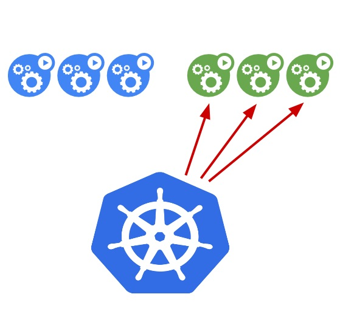


### Stratégies de déploiement

<hr>

Machine : **master**

<hr>

```bash +.
mkdir updating
cd updating
kubectl create namespace updating
```

### Mise a jour d'un deployment

1. Commençons par créer un simple deployment :

```bash +.
touch example-update.yaml
```

Avec le contenu yaml suivant :

```yaml +.
apiVersion: apps/v1
kind: Deployment
metadata:
  name: example-update
  namespace: updating
  labels:
    app: httpd
spec:
  replicas: 4
  selector:
    matchLabels:
      app: httpd
  template:
    metadata:
      labels:
        app: httpd
    spec:
      containers:
      - name: httpd
        image: httpd:2.4.43
        ports:
        - containerPort: 80
```

2. Créons donc ce deployment :

```bash +.
kubectl apply -f example-update.yaml --record

```

*deployment.apps "example-update" created*

3. Nous pouvons voir le statut du rollout de la façon suivante :

```bash +.
kubectl rollout status deployment -n updating example-update

```

*deployment "example-update" successfully rolled out*

4. Nous allons mettre à jour l'image httpd avec la version 2.4.46

```yaml +.
containers:
- name: httpd
  image: httpd:2.4.46
```

5. Mettons à jour notre deployment :

```bash +.
kubectl apply -f example-update.yaml --record

deployment.apps/example-update configured
```

6. Vérifions à nouveau le statut de notre rollout :

```bash +.
kubectl rollout status deployment -n updating example-update
```

```bash +.
Waiting for deployment "example-update" rollout to finish: 2 out of 3 new replicas have been updated...
Waiting for deployment "example-update" rollout to finish: 2 out of 3 new replicas have been updated...
Waiting for deployment "example-update" rollout to finish: 2 out of 3 new replicas have been updated...
Waiting for deployment "example-update" rollout to finish: 1 old replicas are pending termination...
Waiting for deployment "example-update" rollout to finish: 1 old replicas are pending termination...
deployment "example-update" successfully rolled out
```

7. Nous pouvons voir l'historique du rollout avec la commande suivante :

```bash +.
kubectl rollout history deployment -n updating example-update
```

```bash +.
REVISION  CHANGE-CAUSE
1         kubectl apply --filename=example-update.yaml --record=true
2         kubectl apply --filename=example-update.yaml --record=true
```

10. Nous pouvons voir les images de nos pods de la façon suivante :

```bash +.
kubectl get pods -n updating -o jsonpath='{range .items[*]}{@.spec.containers[0].image}{"\n"}'
```

```bash +.
httpd:2.4.46
httpd:2.4.46
httpd:2.4.46
httpd:2.4.46
```

11. Nous pouvons faire un rollback si nous souhaitons revenir en arrière :

```bash +.
kubectl rollout undo deployment -n updating example-update
```

*deployment.apps/example-update rolled back*


12. Re-vérifions le statut de notre rollout :

```bash +.
kubectl rollout status deployment -n updating example-update
```

```bash +.
Waiting for deployment "example-update" rollout to finish: 1 old replicas are pending termination...
Waiting for deployment "example-update" rollout to finish: 1 old replicas are pending termination...
Waiting for deployment "example-update" rollout to finish: 1 old replicas are pending termination...
Waiting for deployment "example-update" rollout to finish: 3 of 4 updated replicas are available...
deployment "example-update" successfully rolled out
```

13. Nous pouvons voir les images de nos pods de la façon suivante :

```bash +.
kubectl get pods -n updating -o jsonpath='{range .items[*]}{@.spec.containers[0].image}{"\n"}'
```

```bash +.
httpd:2.4.43
httpd:2.4.43
httpd:2.4.43
httpd:2.4.43
```

14. Si nous faisons un describe sur notre deployement, nous pouvons voir les paramètre **MaxSurge** et **MaxUnavailable** :

```bash +.
kubectl describe deployments -n updating example-update
```

```bash +.
...
StrategyType:           RollingUpdate
MinReadySeconds:        0
RollingUpdateStrategy:  25% max unavailable, 25% max surge
...
```


<hr>

### Blue/Green

1. Commençons par définir un pod "v1" :

```bash +.
touch app-v1.yaml
```

Avec le contenu yaml suivant :

```yaml +.
apiVersion: v1
kind: Pod
metadata:
  labels:
    run: blue
  name: app-v1
  namespace: updating
spec:
  containers:
  - image: nginx
    name: nginx
```

2. Que nous allons exposer avec le service suivant :

```bash +.
touch app-service.yaml
```

Avec le contenu yaml suivant :

```yaml +.
apiVersion: v1
kind: Service
metadata:
  name: app-service
  namespace: updating
spec:
  type: ClusterIP
  selector:
    run: blue
  ports:
    - protocol: TCP
      port: 80
      targetPort: 80
```

3. Déployons donc notre application :

```bash +.
kubectl apply -f app-v1.yaml -f app-service.yaml
```

*pod/app-v1 created*

*service/app-service created*

4. Nous pouvons faire un test de connexion pour voir que tout fonctionne bien :

```bash +.
kubectl get svc -n updating
```

```bash +.
NAME          TYPE        CLUSTER-IP     EXTERNAL-IP   PORT(S)   AGE
app-service   ClusterIP   10.106.61.45   <none>        80/TCP    23s
```

```bash +.
curl IP_SERVICE_APP
```

``` {.html}
<!DOCTYPE html>
<html>
<head>
<title>Welcome to nginx!</title>
<style>
    body {
        width: 35em;
        margin: 0 auto;
        font-family: Tahoma, Verdana, Arial, sans-serif;
    }
</style>
</head>
<body>
<h1>Welcome to nginx!</h1>
<p>If you see this page, the nginx web server is successfully installed and
working. Further configuration is required.</p>

<p>For online documentation and support please refer to
<a href="http://nginx.org/">nginx.org</a>.<br/>
Commercial support is available at
<a href="http://nginx.com/">nginx.com</a>.</p>

<p><em>Thank you for using nginx.</em></p>
</body>
</html>

```

1. Supposons que nous souhaitons mettre à jour notre application (dans notre cas, nous allons remplacer l'image nginx par httpd). Définissons donc un pod v2 :

```bash +.
touch app-v2.yaml
```

Avec le contenu yaml suivant :

```yaml +.
apiVersion: v1
kind: Pod
metadata:
  labels:
    run: green
  name: app-v2
  namespace: updating
spec:
  containers:
  - image: httpd
    name: httpd
```

6. Créons donc ce pod :

```bash +.
kubectl apply -f app-v2.yaml
```

*pod/app-v2 created*


7. La mise à jour de notre application consiste uniquement en la mise à jour de notre service, en changeant le selector **blue** par **green** :

```yaml +.
selector:
  run: green
```

```bash +.
kubectl apply -f app-service.yaml
```

*service/app-service configured*

8. Nous pouvons faire un test de connexion pour voir que notre service pointe désormais sur le httpd :

```bash +.
curl IP_SERVICE_APP
```

``` {.html}
<html><body><h1>It works!</h1></body></html>
```

9. Si nous souhaitons revenir en arrière, il nous suffit simplement remettre le label green a blue :

```yaml +.
selector:
  run: blue
```

```bash +.
kubectl apply -f app-service.yaml
```

*service/app-service configured*

10. Un petit test pour confirmer :

```bash +.
curl IP_SERVICE_APP
```

``` {.html}
<!DOCTYPE html>
<html>
<head>
<title>Welcome to nginx!</title>
<style>
    body {
        width: 35em;
        margin: 0 auto;
        font-family: Tahoma, Verdana, Arial, sans-serif;
    }
</style>
</head>
<body>
<h1>Welcome to nginx!</h1>
<p>If you see this page, the nginx web server is successfully installed and
working. Further configuration is required.</p>

<p>For online documentation and support please refer to
<a href="http://nginx.org/">nginx.org</a>.<br/>
Commercial support is available at
<a href="http://nginx.com/">nginx.com</a>.</p>

<p><em>Thank you for using nginx.</em></p>
</body>
</html>
```

<hr>

### Clean Up

Nous pouvons maintenant supprimer les ressources que nous avons créées dans ces exercices :

```bash +.
kubectl delete -f .

service "app-service" deleted
pod "app-v1" deleted
pod "app-v2" deleted
deployment.apps "example-update" deleted
```

### Quizz Rolling Update

Quel objet Kubernetes gère les mises à jour progressives (rolling updates) ?

[(X)] Deployment
[( )] ReplicaSet
[( )] DaemonSet
[( )] StatefulSet

Que se passe-t-il lors d'une mise à jour progressive ?

[( )] Tous les pods existants sont arrêtés, puis les nouveaux pods sont créés
[(X)] De nouveaux pods sont créés avec la nouvelle version, puis les anciens pods sont arrêtés progressivement
[( )] Tous les pods sont mis à jour simultanément
[( )] Rien ne se passe, les mises à jour doivent être effectuées manuellement

Comment spécifier la stratégie de mise à jour d'un Deployment ?

[(X)] Via la propriété strategy dans la spécification du Deployment
[( )] Via des annotations sur le Deployment
[( )] Via un objet séparé UpdateStrategy
[( )] Il n'y a pas de stratégie de mise à jour, c'est toujours une mise à jour progressive

Quelles sont les stratégies de mise à jour disponibles pour un Deployment ?

[( )] Rolling Update et Recreate
[(X)] RollingUpdate et Recreate
[( )] RollingUpdate, Recreate et BlueGreen
[( )] RollingUpdate, Recreate et Canary

Que signifie "maxUnavailable" dans la stratégie de mise à jour RollingUpdate ?

[(X)] Le nombre maximum de pods indisponibles pendant la mise à jour
[( )] Le nombre maximum de pods à créer pendant la mise à jour
[( )] Le nombre maximum de pods à conserver pendant la mise à jour
[( )] Le nombre maximum de nœuds indisponibles pendant la mise à jour

Que signifie "maxSurge" dans la stratégie de mise à jour RollingUpdate ?

[(X)] Le nombre maximum de pods supplémentaires à créer pendant la mise à jour
[( )] Le nombre maximum de pods à conserver pendant la mise à jour
[( )] Le nombre maximum de nœuds supplémentaires à utiliser pendant la mise à jour
[( )] Le nombre maximum de pods indisponibles pendant la mise à jour

Que se passe-t-il si un pod échoue pendant une mise à jour progressive ?

[( )] La mise à jour est annulée et tous les pods reviennent à l'ancienne version
[(X)] Le pod défaillant est supprimé et un nouveau pod est créé avec la nouvelle version
[( )] Le pod défaillant est conservé et la mise à jour se poursuit
[( )] La mise à jour est suspendue jusqu'à ce que le problème soit résolu manuellement

Comment surveiller la progression d'une mise à jour ?

[(X)] En examinant l'état du Deployment et des ReplicaSets associés
[( )] En examinant les journaux de chaque pod
[( )] En utilisant l'outil kubectl rollout status
[( )] En utilisant des sondes de disponibilité (readiness probes)

Que se passe-t-il si une mise à jour échoue complètement ?

[( )] Tous les pods sont supprimés et le Deployment est mis hors service
[(X)] Le Deployment revient à l'état stable précédent
[( )] Le Deployment reste dans un état de mise à jour partielle
[( )] Une alerte est déclenchée, mais le Deployment reste dans l'état actuel

Comment annuler une mise à jour en cours ?

[(X)] kubectl rollout undo deployment/mon-deployment
[( )] kubectl rollback deployment/mon-deployment
[( )] kubectl cancel deployment/mon-deployment
[( )] Il n'est pas possible d'annuler une mise à jour en cours


<hr>


## Network Policies

<hr>

Machine : **master**
<hr>


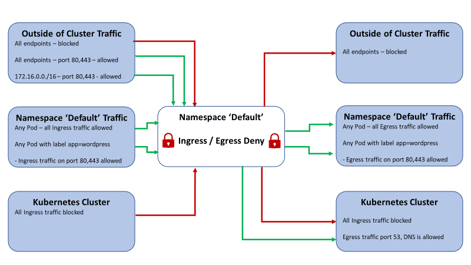


### Utilisation


```bash +.
mkdir network-policies
cd network-policies
kubectl create namespace network-policies
```

1. Nous allons commencer par créer 3 pods : 2 pods "source" et un pod "dest" :

```bash +.
touch source1-pod.yaml
touch source2-pod.yaml
touch dest-pod.yaml
```

Avec respectivement ces contenus yaml :

```yaml +.
apiVersion: v1
kind: Pod
metadata:
  name: source1-pod
  namespace: network-policies
  labels:
    role: source1
spec:
  containers:
  - name: source1
    image: nginx
```

```yaml +.
apiVersion: v1
kind: Pod
metadata:
  name: source2-pod
  namespace: network-policies
  labels:
    role: source2
spec:
  containers:
  - name: source2
    image: nginx
```

```yaml +.
apiVersion: v1
kind: Pod
metadata:
  name: dest-pod
  namespace: network-policies
  labels:
    role: dest
spec:
  containers:
  - name: dest
    image: nginx
```

2. Déployons ces 3 pods :

```bash +.
kubectl apply -f source1-pod.yaml -f source2-pod.yaml -f dest-pod.yaml

```

```bash +.
pod/dest-pod created
pod/source1-pod created
pod/source2-pod created
```

1. Nous allons également définir un service pour chacun de nos pods :

```bash +.
touch source1-service.yaml
touch source2-service.yaml
touch dest-service.yaml
```

Avec respectivement les contenus yaml suivants :

```yaml +.
apiVersion: v1
kind: Service
metadata:
  name: source1-service
  namespace: network-policies
spec:
  type: ClusterIP
  selector:
    role: source1
  ports:
    - protocol: TCP
      port: 80
      targetPort: 80
```

```yaml +.
apiVersion: v1
kind: Service
metadata:
  name: source2-service
  namespace: network-policies
spec:
  type: ClusterIP
  selector:
    role: source2
  ports:
    - protocol: TCP
      port: 80
      targetPort: 80
```

```yaml +.
apiVersion: v1
kind: Service
metadata:
  name: dest-service
  namespace: network-policies
spec:
  type: ClusterIP
  selector:
    role: dest
  ports:
    - protocol: TCP
      port: 80
      targetPort: 80
```

1. Création des services :

```bash +.
kubectl apply -f source1-service.yaml -f source2-service.yaml -f dest-service.yaml
```

```bash +.
service/dest-service created
service/source1-service created
service/source2-service created
```

3. Essayons de faire une requête depuis les pods source1 et source2 vers dest :

```bash +.
kubectl exec -n network-policies -it source1-pod -- curl dest-service
kubectl exec -n network-policies -it source2-pod -- curl dest-service
```

``` {.html}
<!DOCTYPE html>
<html>
<head>
<title>Welcome to nginx!</title>
<style>
    body {
        width: 35em;
        margin: 0 auto;
        font-family: Tahoma, Verdana, Arial, sans-serif;
    }
</style>
</head>
<body>
<h1>Welcome to nginx!</h1>
<p>If you see this page, the nginx web server is successfully installed and
working. Further configuration is required.</p>

<p>For online documentation and support please refer to
<a href="http://nginx.org/">nginx.org</a>.<br/>
Commercial support is available at
<a href="http://nginx.com/">nginx.com</a>.</p>

<p><em>Thank you for using nginx.</em></p>
</body>
</html>
```

Sans Network Policies, on remarque que les requêtes se déroulent bien.

4. Nous allons maintenant créer une Network Policy autorisant source1 à faire des requêtes sur dest, mais pas source2 (ni aucun autre pod) :


```bash +.
touch ingress-network-policy.yaml
```

Avec le contenu yaml suivant :

```yaml +.
apiVersion: networking.k8s.io/v1
kind: NetworkPolicy
metadata:
  name: ingress-network-policy
  namespace: network-policies
spec:
  podSelector:
    matchLabels:
      role: dest
  policyTypes:
  - Ingress
  ingress:
  - from:
    - podSelector:
        matchLabels:
          role: source1
    ports:
    - protocol: TCP
      port: 80
```

5. Créons cette Network Policy :

```bash +.
kubectl apply -f ingress-network-policy.yaml
```

*networkpolicy.networking.k8s.io/ingress-network-policy created*


6. Nous pouvons inspecter la network policy de la façon suivante :

```bash +.
kubectl describe networkpolicies -n network-policies ingress-network-policy
```

```bash +.
Name:         ingress-network-policy
Namespace:    network-policies
Created on:   2020-11-02 09:29:07 +0000 UTC
Labels:       <none>
Annotations:  <none>
Spec:
  PodSelector:     role=dest
  Allowing ingress traffic:
    To Port: 80/TCP
    From:
      PodSelector: role=source1
  Not affecting egress traffic
  Policy Types: Ingress
```

7. Maintenant, essayons le même test de connexion :

```bash +.
kubectl exec -n network-policies -it source1-pod -- curl dest-service
```

``` {.html}
<!DOCTYPE html>
<html>
<head>
<title>Welcome to nginx!</title>
<style>
    body {
        width: 35em;
        margin: 0 auto;
        font-family: Tahoma, Verdana, Arial, sans-serif;
    }
</style>
</head>
<body>
<h1>Welcome to nginx!</h1>
<p>If you see this page, the nginx web server is successfully installed and
working. Further configuration is required.</p>

<p>For online documentation and support please refer to
<a href="http://nginx.org/">nginx.org</a>.<br/>
Commercial support is available at
<a href="http://nginx.com/">nginx.com</a>.</p>

<p><em>Thank you for using nginx.</em></p>
</body>
</html>
```

```bash +.
kubectl exec -n network-policies -it source2-pod -- curl dest-service
```

```bash +.
curl: (7) Failed to connect to dest-service port 80: Connection timed out
command terminated with exit code 7
```

8. Nous allons maintenant définir une network policy mais en egress, autorisant dest à faire une requête à source1 mais pas à source 2 :

```bash +.
touch egress-network-policy.yaml
```

Avec le contenu yaml suivant :

```yaml +.
apiVersion: networking.k8s.io/v1
kind: NetworkPolicy
metadata:
  name: egress-network-policy
  namespace: network-policies
spec:
  podSelector:
    matchLabels:
      role: dest
  policyTypes:
  - Egress
  egress: []
```

9. Créons donc cette network policy :

```bash +.
kubectl apply -f egress-network-policy.yaml

```

*networkpolicy.networking.k8s.io/egress-network-policy created*


10. Nous pouvons maintenant essayer de faire une requête depuis dest vers source1 ou source2 :

```bash +.
kubectl exec -n network-policies -it dest-pod -- curl source2-service
```

```bash +.
curl: (6) Could not resolve host: source2-service
command terminated with exit code 6
```

11. Modifions le contenu yaml de l'egress network policy :

```yaml +.
apiVersion: networking.k8s.io/v1
kind: NetworkPolicy
metadata:
  name: egress-network-policy
  namespace: network-policies
spec:
  podSelector:
    matchLabels:
      role: dest
  policyTypes:
  - Egress
  egress:
  - to:
    ports:
    - protocol: TCP
      port: 80
    - port: 53
      protocol: UDP
    - port: 53
      protocol: TCP
```

12 Appliquons la modification :

```bash +.
kubectl apply -f egress-network-policy.yaml
```

*networkpolicy.networking.k8s.io/egress-network-policy configured*


13. Nous pouvons réessayer le test de connexion :

```bash +.
kubectl exec -n network-policies -it dest-pod -- curl source2-service
```

``` {.html}
<!DOCTYPE html>
<html>
<head>
<title>Welcome to nginx!</title>
<style>
    body {
        width: 35em;
        margin: 0 auto;
        font-family: Tahoma, Verdana, Arial, sans-serif;
    }
</style>
</head>
<body>
<h1>Welcome to nginx!</h1>
<p>If you see this page, the nginx web server is successfully installed and
working. Further configuration is required.</p>

<p>For online documentation and support please refer to
<a href="http://nginx.org/">nginx.org</a>.<br/>
Commercial support is available at
<a href="http://nginx.com/">nginx.com</a>.</p>

<p><em>Thank you for using nginx.</em></p>
</body>
</html>
```

<hr>

### Clean up

Nous allons supprimer les ressources créées par cet exercice de la façon suivante :

```bash +.
kubectl delete -f .
```

```bash +.
pod "dest-pod" deleted
service "dest-service" deleted
networkpolicy.networking.k8s.io "egress-network-policy" deleted
networkpolicy.networking.k8s.io "ingress-network-policy" deleted
pod "source1-pod" deleted
service "source1-service" deleted
pod "source2-pod" deleted
service "source2-service" deleted
```

<hr>

### Quizz Network Policy


Quel objet Kubernetes permet de définir des règles de réseau pour les pods ?

[(X)] NetworkPolicy
[( )] ServiceAccount
[( )] Secret
[( )] ConfigMap

Comment fonctionne une NetworkPolicy par défaut ?

[( )] Elle autorise tout le trafic entrant et sortant
[(X)] Elle bloque tout le trafic entrant et sortant
[( )] Elle n'a aucun effet par défaut
[( )] Elle autorise uniquement le trafic entrant

Quelles sont les sources et destinations pouvant être spécifiées dans une NetworkPolicy ?

[(X)] Pods, namespaces, adresses IP
[( )] Nodes, services, ingress
[( )] Deployments, ReplicaSets, DaemonSets
[( )] Volumes, ConfigMaps, Secrets

Quelle est la différence entre une règle d'entrée (ingress) et une règle de sortie (egress) ?

[(X)] Une règle d'entrée contrôle le trafic entrant, une règle de sortie contrôle le trafic sortant
[( )] Une règle d'entrée s'applique aux pods, une règle de sortie s'applique aux services
[( )] Une règle d'entrée est prioritaire sur une règle de sortie
[( )] Aucune différence, elles fonctionnent de la même manière

Comment spécifier les ports autorisés dans une NetworkPolicy ?

[(X)] Via la propriété ports dans les règles
[( )] Via des annotations sur le pod
[( )] Via un objet séparé NetworkPolicyPort
[( )] Impossible de spécifier des ports, seules les adresses IP sont autorisées

Que se passe-t-il lorsqu'un pod tente d'envoyer du trafic interdit par une NetworkPolicy ?

[(X)] Le trafic est bloqué par le réseau
[( )] Le pod est redémarré
[( )] Le pod est supprimé
[( )] Une erreur est générée dans les journaux, mais le trafic est autorisé

Comment une NetworkPolicy s'applique-t-elle à un pod ?

[(X)] Via les sélecteurs podSelector et namespaceSelector
[( )] Via des annotations sur le pod
[( )] Via un objet séparé NetworkPolicyBinding
[( )] Une NetworkPolicy s'applique toujours à tous les pods du cluster

Quels types de trafic peuvent être contrôlés par une NetworkPolicy ?

[(X)] TCP, UDP, SCTP
[( )] TCP, UDP
[( )] Uniquement TCP
[( )] Uniquement UDP

Dans quel ordre les NetworkPolicies sont-elles évaluées ?

[(X)] De la plus spécifique à la moins spécifique
[( )] De la moins spécifique à la plus spécifique
[( )] Dans l'ordre de création
[( )] Dans un ordre aléatoire

Que se passe-t-il si plusieurs NetworkPolicies s'appliquent à un pod et entrent en conflit ?

[(X)] La politique la plus spécifique est appliquée
[( )] Toutes les politiques sont appliquées, avec une logique "OU"
[( )] Aucune politique n'est appliquée
[( )] Une erreur est générée et le pod est supprimé

Comment désactiver complètement les NetworkPolicies pour un namespace spécifique ?

[(X)] Créer une NetworkPolicy sans aucune règle dans ce namespace
[( )] Supprimer tous les objets NetworkPolicy de ce namespace
[( )] Ajouter une annotation sur le namespace
[( )] Impossible de désactiver les NetworkPolicies pour un namespace spécifique


<hr>


## Quizz Récapitulatif


Quel objet décrit un groupe logique de nœuds de travail destinés à exécuter des pods ?

[(X)] Node
[( )] ReplicaSet
[( )] Deployment
[( )] Service

Quel objet est responsable de la mise en réseau au sein du cluster ?

[( )] Pod
[( )] Volume
[(X)] Service
[( )] Ingress

Quel objet est utilisé pour stocker des données persistantes ?

[( )] ConfigMap
[(X)] Volume
[( )] Secret
[( )] Node

Quel objet est utilisé pour exécuter des conteneurs dans un cluster ?

[( )] ReplicaSet
[(X)] Pod
[( )] Service
[( )] Ingress

Quel objet gère les mises à jour et le redéploiement des pods ?

[( )] Node
[(X)] Deployment
[( )] Service
[( )] Volume

Quel objet sert à limiter les ressources consommées par un pod ?

[(X)] LimitRange
[( )] ResourceQuota
[( )] HorizontalPodAutoscaler
[( )] PodDisruptionBudget

Quel objet est utilisé pour authentifier les utilisateurs auprès du cluster ?

[( )] Role
[(X)] ServiceAccount
[( )] Secret
[( )] ConfigMap

Quel objet permet de contrôler l'accès aux ressources du cluster ?

[( )] Role
[( )] ClusterRole
[(X)] Les deux réponses Role et ClusterRole
[( )] ServiceAccount

Quel objet gère la mise en cache des données dans un cluster ?

[( )] Volume
[( )] Secret
[(X)] ConfigMap
[( )] PersistentVolumeClaim

Quel objet est utilisé pour exposer des services à l'extérieur du cluster ?

[( )] Service
[(X)] Ingress
[( )] LoadBalancer
[( )] ExternalIP

Quel objet permet de surveiller l'état des pods ?

[(X)] PodDisruptionBudget
[( )] HorizontalPodAutoscaler
[( )] Job
[( )] DaemonSet

Quel objet est utilisé pour automatiser les tâches d'administration du cluster ?

[( )] CronJob
[( )] Job
[(X)] Les deux réponses CronJob et Job
[( )] Deployment

Quel objet permet de définir des règles de réseau pour les pods ?

[(X)] NetworkPolicy
[( )] IngressRule
[( )] EgressRule
[( )] ServicePort

Quel objet sert à provisionner automatiquement des volumes de stockage ?

[( )] PersistentVolume
[(X)] StorageClass
[( )] PersistentVolumeClaim
[( )] EmptyDir

Quel objet est utilisé pour gérer les secrets (mots de passe, clés d'API, etc.) ?

[( )] ConfigMap
[(X)] Secret
[( )] Volume
[( )] ServiceAccount

Quel objet permet de déployer des applications sur plusieurs clusters ?

[(X)] Federation
[( )] ReplicaSet
[( )] Deployment
[( )] StatefulSet

Quel objet sert à surveiller et collecter les métriques du cluster ?

[(X)] HorizontalPodAutoscaler
[( )] VerticalPodAutoscaler
[( )] PodDisruptionBudget
[( )] ResourceQuota

Quel objet est utilisé pour gérer les journaux d'événements du cluster ?

[(X)] EventSource
[( )] PodLog
[( )] ContainerLog
[( )] AuditLog

Quel objet permet de définir des quotas de ressources pour les espaces de noms ?

[( )] LimitRange
[(X)] ResourceQuota
[( )] HorizontalPodAutoscaler
[( )] VerticalPodAutoscaler

Quel objet est utilisé pour définir des règles de gestion des ressources du cluster ?

[( )] ResourceQuota
[(X)] LimitRange
[( )] HorizontalPodAutoscaler
[( )] VerticalPodAutoscaler


## Ingress

<hr>

Machine : **master**

<hr>

```bash +.
 mkdir ingress
 cd ingress
 kubectl create namespace ingress
```

### Nginx ingress controller

1. Commençons par installer l'ingress controller Nginx via Helm :


- creer un fichier values.yaml avec les valeurs suivantes :

en modifiant IP-PUB-MASTER et IP-PRIV-MASTER par vos valeurs

```yaml +.
controller:
  hostNetwork: false
  hostPort:
    enabled: true
    ports:
      http: 80
      https: 443
  service:
    enabled: true
    externalIPs:
      - IP-PUB-MASTER
      - IP-PRIV-MASTER
    type: NodePort
```

- Déployer le chart Helm

```bash +.
 kubectl create namespace ingress-nginx
 helm repo add ingress-nginx https://kubernetes.github.io/ingress-nginx
 # helm install ingress-nginx ingress-nginx/ingress-nginx --namespace ingress-nginx

 helm upgrade --install ingress-nginx ingress-nginx/ingress-nginx --namespace ingress-nginx --create-namespace -f values.yaml

```
```bash +.
NAME: ingress-nginx
LAST DEPLOYED: Tue Oct 27 13:03:35 2020
NAMESPACE: default
STATUS: deployed
REVISION: 1
TEST SUITE: None
NOTES:
The ingress-nginx controller has been installed.
It may take a few minutes for the LoadBalancer IP to be available.
You can watch the status by running 'kubectl --namespace default get services -o wide -w ingress-nginx-controller'

An example Ingress that makes use of the controller:
...
```

2. Nous allons maintenant définir deux pods : Un nginx et Un apache :

```bash +.
 touch ingress-nginx-pod.yaml
 touch ingress-httpd-pod.yaml
```

Avec respectivement les yaml suivants :

```yaml +.
apiVersion: v1
kind: Pod
metadata:
  labels:
    run: ingress-nginx-pod
  name: ingress-nginx-pod
  namespace: ingress
spec:
  containers:
  - image: nginx
    name: nginx
```

```yaml +.
apiVersion: v1
kind: Pod
metadata:
  labels:
    run: ingress-httpd-pod
  name: ingress-httpd-pod
  namespace: ingress
spec:
  containers:
  - image: httpd
    name: httpd
```

3. Créons maintenant ces pods :

```bash +.
 kubectl apply -f ingress-nginx-pod.yaml -f ingress-httpd-pod.yaml

pod/ingress-nginx-pod created
pod/ingress-httpd-pod created
```

4. Exposons ces pods :

```bash +.
 touch ingress-nginx-service.yaml
 touch ingress-httpd-service.yaml
```

Avec les yaml suivants :

```yaml +.
apiVersion: v1
kind: Service
metadata:
  name: ingress-nginx-service
  namespace: ingress
spec:
  type: ClusterIP
  selector:
    run: ingress-nginx-pod
  ports:
    - protocol: TCP
      port: 80
      targetPort: 80
```

```yaml +.
apiVersion: v1
kind: Service
metadata:
  name: ingress-httpd-service
  namespace: ingress
spec:
  type: ClusterIP
  selector:
    run: ingress-httpd-pod
  ports:
    - protocol: TCP
      port: 80
      targetPort: 80
```

5. Créons ces services :

```bash +.
 kubectl apply -f ingress-nginx-service.yaml -f ingress-httpd-service.yaml
```
```bash +.
service/ingress-nginx-service created
service/ingress-httpd-service created
```

6. Nous allons maintenant définir un ingress redirigeant vers nos deux services, selon le path dans l'URL :

```bash +.
 touch ingress-with-paths.yaml
```

Avec le contenu yaml suivant

```yaml +.
apiVersion: networking.k8s.io/v1
kind: Ingress
metadata:
  annotations:
    kubernetes.io/ingress.class: nginx
    nginx.ingress.kubernetes.io/rewrite-target: /
  name: ingress-with-paths
  namespace: ingress
spec:
  rules:
    - http:
        paths:
          - path: /nginx
            pathType: Prefix
            backend:
              service:
                name: ingress-nginx-service
                port:
                  number: 80
          - path: /httpd
            pathType: Prefix
            backend:
              service:
                 name: ingress-httpd-service
                 port:
                   number: 80
```

7. Créons maintenant cet ingress :

```bash +.
 kubectl apply -f ingress-with-paths.yaml
```

```bash +.
Warning: networking.k8s.io/v1beta1 Ingress is deprecated in v1.19+, unavailable in v1.22+; use networking.k8s.io/v1 Ingress
ingress.networking.k8s.io/ingress-with-paths created
```

8. Nous pouvons récupérer des informations sur notre ingress de la façon suivante :

```bash +.
 kubectl get ingresses -n ingress ingress-with-paths
```

```bash +.
Warning: extensions/v1beta1 Ingress is deprecated in v1.14+, unavailable in v1.22+; use networking.k8s.io/v1 Ingress
NAME                 CLASS    HOSTS   ADDRESS   PORTS   AGE
ingress-with-paths   <none>   *                 80      19s

 kubectl get svc -n ingress-nginx

NAME                                 TYPE           CLUSTER-IP      EXTERNAL-IP   PORT(S)                      AGE
ingress-nginx-controller             LoadBalancer   10.99.141.243   <pending>     80:32527/TCP,443:30666/TCP   14m
ingress-nginx-controller-admission   ClusterIP      10.97.240.239   <none>        443/TCP                      14m
```

1. Essayons tout d'abord de nous connecter via les services de nginx et de httpd :

```bash +.
 kubectl get svc -n ingress
```

```bash +.

NAME                    TYPE        CLUSTER-IP       EXTERNAL-IP   PORT(S)   AGE
ingress-httpd-service   ClusterIP   10.110.184.101   <none>        80/TCP    19m
ingress-nginx-service   ClusterIP   10.97.71.54      <none>        80/TCP    19m
```

```bash +.
 curl IP_HTTP_SERVICE
```

``` {.html}
<html><body><h1>It works!</h1></body></html>

 curl IP_NGINX_SERVICE

<!DOCTYPE html>
<html>
<head>
<title>Welcome to nginx!</title>
<style>
    body {
        width: 35em;
        margin: 0 auto;
        font-family: Tahoma, Verdana, Arial, sans-serif;
    }
</style>
</head>
<body>
<h1>Welcome to nginx!</h1>
<p>If you see this page, the nginx web server is successfully installed and
working. Further configuration is required.</p>

<p>For online documentation and support please refer to
<a href="http://nginx.org/">nginx.org</a>.<br/>
Commercial support is available at
<a href="http://nginx.com/">nginx.com</a>.</p>

<p><em>Thank you for using nginx.</em></p>
</body>
</html>
```

10. Essayons maintenant de nous connecter aux deux pods via cet ingress :

```bash +.
 curl IP_INGRESS/httpd
```

```html +.
<html><body><h1>It works!</h1></body></html>
```

```bash +.
 curl IP_INGRESS/nginx
```

```html +.
<!DOCTYPE html>
<html>
<head>
<title>Welcome to nginx!</title>
<style>
    body {
        width: 35em;
        margin: 0 auto;
        font-family: Tahoma, Verdana, Arial, sans-serif;
    }
</style>
</head>
<body>
<h1>Welcome to nginx!</h1>
<p>If you see this page, the nginx web server is successfully installed and
working. Further configuration is required.</p>

<p>For online documentation and support please refer to
<a href="http://nginx.org/">nginx.org</a>.<br/>
Commercial support is available at
<a href="http://nginx.com/">nginx.com</a>.</p>

<p><em>Thank you for using nginx.</em></p>
</body>
</html>
```

11. Nous allons maintenant définir un ingress, mais cette fois-ci, nos redirection se feront selon l'host que nous utilisons pour nous connecter :

```bash +.
 touch ingress-with-hosts.yaml
```

Avec le contenu yaml suivant :

```yaml +.
apiVersion: networking.k8s.io/v1
kind: Ingress
metadata:
  annotations:
    kubernetes.io/ingress.class: nginx
  name: ingress-with-hosts
  namespace: ingress
spec:
  rules:
    - host: nginx.example.com
      http:
        paths:
          - backend:
              service:
                name: ingress-nginx-service
                port:
                  number: 80
            path: /
            pathType: Prefix
    - host: httpd.example.com
      http:
        paths:
          - backend:
              service:
                name: ingress-httpd-service
                port:
                  number: 80
            path: /
            pathType: Prefix
```

12. Créons cet ingress :

```bash +.
 kubectl apply -f ingress-with-hosts.yaml
```


```bash +.
ingress.networking.k8s.io/ingress-with-hosts created
```

13.  Ajoutons ces deux entrées dans le fichier /etc/hosts :

```bash +.
IP_INGRESS nginx.example.com
IP_INGRESS httpd.example.com
```

14. Essayons maintenant de nous connecter à nos deux pods via l'ingress :

```bash +.
 curl httpd.example.com
```

```html +.
<html><body><h1>It works!</h1></body></html>
```

```bash +.
 curl nginx.example.com
```

```html +.
<!DOCTYPE html>
<html>
<head>
<title>Welcome to nginx!</title>
<style>
    body {
        width: 35em;
        margin: 0 auto;
        font-family: Tahoma, Verdana, Arial, sans-serif;
    }
</style>
</head>
<body>
<h1>Welcome to nginx!</h1>
<p>If you see this page, the nginx web server is successfully installed and
working. Further configuration is required.</p>

<p>For online documentation and support please refer to
<a href="http://nginx.org/">nginx.org</a>.<br/>
Commercial support is available at
<a href="http://nginx.com/">nginx.com</a>.</p>

<p><em>Thank you for using nginx.</em></p>
</body>
</html>
```

### Canary Deployment

<hr>

Machine Master

<hr>

Les déploiements Canary permettent le déploiement progressif de nouvelles versions d'applications sans aucune interruption de service. 

Le **NGINX Ingress Controller**  prend en charge les politiques de répartition du trafic basées sur les en-têtes (header) , le cookie et le poids. Alors que les politiques basées sur les en-têtes et les cookies servent à fournir une nouvelle version de service à un sous-ensemble d'utilisateurs, les politiques basées sur le poids servent à détourner un pourcentage du trafic vers une nouvelle version de service.

Le **NGINX Ingress Controller** utilise les annotations suivantes pour activer les déploiements Canary :

```yaml 

- nginx.ingress.kubernetes.io/canary-by-header

- nginx.ingress.kubernetes.io/canary-by-header-value

- nginx.ingress.kubernetes.io/canary-by-header-pattern

- nginx.ingress.kubernetes.io/canary-by-cookie

- nginx.ingress.kubernetes.io/canary-weight
```

Les règles s'appliquent dans cet ordre :

- canary-by-header 

- canary-by-cookie 

- canary-weight 

Les déploiements Canary nécessitent que vous créiez deux entrées : une pour le trafic normal et une pour le trafic alternatif. Sachez que vous ne pouvez appliquer qu'une seule entrée Canary.

Vous activez une règle de répartition du trafic particulière en définissant l'annotation Canary associée sur true dans la ressource Kubernetes Ingress, comme dans l'exemple suivant :

- `nginx.ingress.kubernetes.io/canary-by-header : "true"`


Exemple : 

1. Déployer les applications et services suivants

- Application V1 :

```yaml +.

apiVersion: v1
kind: Service
metadata:
  name: echo-v1
spec:
  type: ClusterIP
  ports:
    - port: 80
      protocol: TCP
      name: http
  selector:
    app: echo
    version: v1

---
apiVersion: apps/v1
kind: Deployment
metadata:
  name: echo-v1
spec:
  replicas: 1
  selector:
    matchLabels:
      app: echo
      version: v1
  template:
    metadata:
      labels:
        app: echo
        version: v1
    spec:
      containers:
        - name: echo
          image: "hashicorp/http-echo"
          args:
            - -listen=:80
            - --text="echo-v1"
          ports:
            - name: http
              protocol: TCP
              containerPort: 80

``` 

- Application V2 :

```yaml +.
apiVersion: v1
kind: Service
metadata:
  name: echo-v2
spec:
  type: ClusterIP
  ports:
    - port: 80
      protocol: TCP
      name: http
  selector:
    app: echo
    version: v2

---
apiVersion: apps/v1
kind: Deployment
metadata:
  name: echo-v2
spec:
  replicas: 1
  selector:
    matchLabels:
      app: echo
      version: v2
  template:
    metadata:
      labels:
        app: echo
        version: v2
    spec:
      containers:
        - name: echo
          image: "hashicorp/http-echo"
          args:
            - -listen=:80
            - --text="echo-v2"
          ports:
            - name: http
              protocol: TCP
              containerPort: 80

``` 

2. Déployer l'ingress de l'application v1

```yaml +.
apiVersion: networking.k8s.io/v1
kind: Ingress
metadata:
  annotations:
    ingress.kubernetes.io/rewrite-target: /
    kubernetes.io/ingress.class: nginx
  name: ingress-echo
spec:
  #ingressClassName: nginx
  rules:
    - host: canary.example.com
      http:
        paths:
          - path: /echo
            pathType: Exact
            backend:
              service:
                name: echo-v1
                port:
                  number: 80

``` 

3. Vérifiez qu'il fonctionne

```bash +.
curl -H "Host: canary.example.com" http://<IP_ADDRESS>:<PORT>/echo

``` 
4. Vous devriez avoir la réponse suivante

**echo-v2**

5. Test : Par Header

Deployez l'ingress suivant :

```yaml +.
apiVersion: networking.k8s.io/v1
kind: Ingress
metadata:
  annotations:
    ingress.kubernetes.io/rewrite-target: /
    nginx.ingress.kubernetes.io/canary: "true"
    nginx.ingress.kubernetes.io/canary-by-header: "Region"
    nginx.ingress.kubernetes.io/canary-by-header-pattern: "fr|us"
    kubernetes.io/ingress.class: nginx
  name: ingress-echo-canary-header
spec:
  #ingressClassName: nginx
  rules:
    - host: canary.example.com
      http:
        paths:
          - path: /echo
            pathType: Exact
            backend:
              service:
                name: echo-v2
                port:
                  number: 80

``` 

6. Faire les test suivants

```bash +.
curl   -H "Host: canary.example.com" -H "Region: us" http://<IP_ADDRESS>:<PORT>/echo
curl   -H "Host: canary.example.com" -H "Region: de" http://<IP_ADDRESS>:<PORT>/echo
curl   -H "Host: canary.example.com"                 http://<IP_ADDRESS>:<PORT>/echo
``` 

7. Résultats

**echo-v2**  

**echo-v1**  

**echo-v1**

8. Supprimer l'ingress ingress-echo-canary-header

```bash +.
kubectl delete ingress ingress-echo-canary-header
``` 

9. Test : Par cookie

Déployez l'ingress suivant :

```yaml +.
apiVersion: networking.k8s.io/v1
kind: Ingress
metadata:
  annotations:
    ingress.kubernetes.io/rewrite-target: /
    nginx.ingress.kubernetes.io/canary: "true"
    nginx.ingress.kubernetes.io/canary-by-cookie: "my-cookie"
    kubernetes.io/ingress.class: nginx
  name: ingress-echo-canary-cookie
spec:
  #ingressClassName: nginx
  rules:
    - host: canary.example.com
      http:
        paths:
          - path: /echo
            pathType: Exact
            backend:
              service:
                name: echo-v2
                port:
                  number: 80

``` 

10. Faire les test suivants

```bash +.
curl -s --cookie "my-cookie=always"  -H "Host: canary.example.com"     http://<IP_ADDRESS>:<PORT>/echo
curl -s --cookie "other-cookie=always"  -H "Host: canary.example.com"  http://<IP_ADDRESS>:<PORT>/echo
curl   -H "Host: canary.example.com"                                   http://<IP_ADDRESS>:<PORT>/echo
``` 

11. Résultats

**echo-v2**  

**echo-v1**  

**echo-v1**  


12. Supprimer l'ingress ingress-echo-canary-cookie

```bash +.
kubectl delete ingress ingress-echo-canary-cookie
``` 


13. Test : Par poids

Déployez l'ingress suivant :

```yaml +.
apiVersion: networking.k8s.io/v1
kind: Ingress
metadata:
  annotations:
    ingress.kubernetes.io/rewrite-target: /
    nginx.ingress.kubernetes.io/canary: "true"
    nginx.ingress.kubernetes.io/canary-by-header: "X-Canary"
    nginx.ingress.kubernetes.io/canary-weight: "50"
    kubernetes.io/ingress.class: nginx
  name: ingress-echo-canary-weight
spec:
  #ingressClassName: nginx
  rules:
    - host: canary.example.com
      http:
        paths:
          - path: /echo
            pathType: Exact
            backend:
              service:
                name: echo-v2
                port:
                  number: 80

``` 

14. faire les tests suivants

```bash +.

# 6 fois : 
curl   -H "Host: canary.example.com"  http://<IP_ADDRESS>:<PORT>/echo

``` 

15. Vérifiez bien que vous avez une répartition de 50% entre echo-v1 et echo-v2

16. Installer k6: https://k6.io/docs/getting-started/installation/


Utilisez en l'adaptant (url) le fichier: script.js

Modifiez `http://localhost/echo` par `http://ip-pub-loadbalancer/echo`

``` javascript

import http from 'k6/http';
import {check, sleep} from 'k6';
import {Rate} from 'k6/metrics';
import {parseHTML} from "k6/html";

const reqRate = new Rate('http_req_rate');

export const options = {
    stages: [
        {target: 20, duration: '20s'},
        {target: 20, duration: '20s'},
        {target: 0, duration: '20s'},
    ],
    thresholds: {
        'checks': ['rate>0.9'],
        'http_req_duration': ['p(95)<1000'],
        'http_req_rate{deployment:echo-v1}': ['rate>=0'],
        'http_req_rate{deployment:echo-v2}': ['rate>=0'],
    },
};

export default function () {
    const params = {
        headers: {
            'Host': 'canary.example.com',
            'Content-Type': 'text/plain',
        },
    };

    const res = http.get(`http://localhost/echo`, params);
    check(res, {
        'status code is 200': (r) => r.status === 200,
    });
   
  
    var body = res.body.replace(/[\r\n]/gm, '');

    switch (body) {
        case '"echo-v1"':
            reqRate.add(true, { deployment: 'echo-v1' });
            reqRate.add(false, { deployment: 'echo-v2' });
            break;
        case '"echo-v2"':
            reqRate.add(false, { deployment: 'echo-v1' });
            reqRate.add(true, { deployment: 'echo-v2' });
            break;
    }

    sleep(1);
}


``` 

et lancez le de la manière suivante 

`k6 run script.js`

vérifiez la répartition des requetes

### Clean Up

Nous pouvons supprimer les ressources générées par cet exercices de la façon suivante :

```bash +.
 kubectl delete -f .
```

```bash +.
pod "ingress-httpd-pod" deleted
service "ingress-httpd-service" deleted
pod "ingress-nginx-pod" deleted
service "ingress-nginx-service" deleted
Warning: networking.k8s.io/v1beta1 Ingress is deprecated in v1.19+, unavailable in v1.22+; use networking.k8s.io/v1 Ingress
ingress.networking.k8s.io "ingress-with-hosts" deleted
ingress.networking.k8s.io "ingress-with-paths" deleted
```


<hr>

## Monitoring

<hr>

Machine : **master**

<hr>

```bash +.
mkdir monitoring
cd monitoring
kubectl create namespace monitoring
```

### Metric Server

1. Nous allons essayer d'obtenir les métriques pour les noeuds de notre cluster :

```bash +.
kubectl top node
```
```bash +.
error: Metrics API not available
```

... Sans succès.

2. De même, si nous souhaitons récupérer les métriques de nos pods, nous obtenons une erreur :

```bash +.
kubectl top pod
```
```bash +.
error: Metrics API not available
```

Nous avons besoin d'installer un metrics server.

3. Nous allons créer un fichier metrics-server.yaml :

```bash +.
touch metrics-server.yaml
```

Avec le contenu yaml suivant :

```yaml +.
---
apiVersion: rbac.authorization.k8s.io/v1
kind: ClusterRole
metadata:
  name: system:aggregated-metrics-reader
  labels:
    rbac.authorization.k8s.io/aggregate-to-view: "true"
    rbac.authorization.k8s.io/aggregate-to-edit: "true"
    rbac.authorization.k8s.io/aggregate-to-admin: "true"
rules:
- apiGroups: ["metrics.k8s.io"]
  resources: ["pods", "nodes"]
  verbs: ["get", "list", "watch"]
---
apiVersion: rbac.authorization.k8s.io/v1
kind: ClusterRoleBinding
metadata:
  name: metrics-server:system:auth-delegator
roleRef:
  apiGroup: rbac.authorization.k8s.io
  kind: ClusterRole
  name: system:auth-delegator
subjects:
- kind: ServiceAccount
  name: metrics-server
  namespace: kube-system
---
apiVersion: rbac.authorization.k8s.io/v1
kind: RoleBinding
metadata:
  name: metrics-server-auth-reader
  namespace: kube-system
roleRef:
  apiGroup: rbac.authorization.k8s.io
  kind: Role
  name: extension-apiserver-authentication-reader
subjects:
- kind: ServiceAccount
  name: metrics-server
  namespace: kube-system
---
apiVersion: apiregistration.k8s.io/v1
kind: APIService
metadata:
  name: v1beta1.metrics.k8s.io
spec:
  service:
    name: metrics-server
    namespace: kube-system
  group: metrics.k8s.io
  version: v1beta1
  insecureSkipTLSVerify: true
  groupPriorityMinimum: 100
  versionPriority: 100
---
apiVersion: v1
kind: ServiceAccount
metadata:
  name: metrics-server
  namespace: kube-system
---
apiVersion: apps/v1
kind: Deployment
metadata:
  name: metrics-server
  namespace: kube-system
  labels:
    k8s-app: metrics-server
spec:
  selector:
    matchLabels:
      k8s-app: metrics-server
  template:
    metadata:
      name: metrics-server
      labels:
        k8s-app: metrics-server
    spec:
      serviceAccountName: metrics-server
      volumes:
      # mount in tmp so we can safely use from-scratch images and/or read-only containers
      - name: tmp-dir
        emptyDir: {}
      containers:
      - name: metrics-server
        image: k8s.gcr.io/metrics-server/metrics-server:v0.3.7
        imagePullPolicy: IfNotPresent
        args:
          - --cert-dir=/tmp
          - --secure-port=4443
          - --kubelet-insecure-tls
          - --kubelet-preferred-address-types=InternalIP
        ports:
        - name: main-port
          containerPort: 4443
          protocol: TCP
        securityContext:
          readOnlyRootFilesystem: true
          runAsNonRoot: true
          runAsUser: 1000
        volumeMounts:
        - name: tmp-dir
          mountPath: /tmp
      nodeSelector:
        kubernetes.io/os: linux
---
apiVersion: v1
kind: Service
metadata:
  name: metrics-server
  namespace: kube-system
  labels:
    kubernetes.io/name: "Metrics-server"
    kubernetes.io/cluster-service: "true"
spec:
  selector:
    k8s-app: metrics-server
  ports:
  - port: 443
    protocol: TCP
    targetPort: main-port
---
apiVersion: rbac.authorization.k8s.io/v1
kind: ClusterRole
metadata:
  name: system:metrics-server
rules:
- apiGroups:
  - ""
  resources:
  - pods
  - nodes
  - nodes/stats
  - namespaces
  - configmaps
  verbs:
  - get
  - list
  - watch
---
apiVersion: rbac.authorization.k8s.io/v1
kind: ClusterRoleBinding
metadata:
  name: system:metrics-server
roleRef:
  apiGroup: rbac.authorization.k8s.io
  kind: ClusterRole
  name: system:metrics-server
subjects:
- kind: ServiceAccount
  name: metrics-server
  namespace: kube-system
```

4. Nous pouvons donc déployer notre metrics-server :

```bash +.
kubectl apply -f metrics-server.yaml
```
```bash +.
clusterrole.rbac.authorization.k8s.io/system:aggregated-metrics-reader created
clusterrolebinding.rbac.authorization.k8s.io/metrics-server:system:auth-delegator created
rolebinding.rbac.authorization.k8s.io/metrics-server-auth-reader created
Warning: apiregistration.k8s.io/v1 APIService is deprecated in v1.19+, unavailable in v1.22+; use apiregistration.k8s.io/v1 APIService
apiservice.apiregistration.k8s.io/v1.metrics.k8s.io created
serviceaccount/metrics-server created
deployment.apps/metrics-server created
service/metrics-server created
clusterrole.rbac.authorization.k8s.io/system:metrics-server created
clusterrolebinding.rbac.authorization.k8s.io/system:metrics-server created
```

5. Après environ 1 minute, nous pouvons refaire notre top node :

```bash +.
kubectl top node
```
```bash +.
NAME     CPU(cores)   CPU%   MEMORY(bytes)   MEMORY%   
master   180m         9%     1249Mi          15%       
worker   47m          2%     818Mi           10%
```

6. Nous obtenons bien les consommations CPU/RAM pour chaque noeud. Voyons voir maintenant pour les consommations de ressources par nos pods :

```bash +.
kubectl top pod -A
```
```bash +.
NAMESPACE     NAME                              CPU(cores)   MEMORY(bytes)   
kube-system   coredns-f9fd979d6-9kb87           4m           12Mi            
kube-system   coredns-f9fd979d6-tl95z           3m           12Mi            
kube-system   etcd-master                       20m          41Mi            
kube-system   kube-apiserver-master             48m          294Mi           
kube-system   kube-controller-manager-master    16m          47Mi            
kube-system   kube-proxy-8dvrj                  1m           15Mi            
kube-system   kube-proxy-ll8tb                  1m           15Mi            
kube-system   kube-scheduler-master             4m           21Mi            
kube-system   metrics-server-75f98fdbd5-2lp87   1m           12Mi            
kube-system   weave-net-c4b7d                   2m           58Mi            
kube-system   weave-net-zfqt6                   2m           62Mi
```

Parfait !

<hr>

### Prometheus/Grafana

<hr>

Nous allons déployer une stack de monitoring basée sur Prometheus et Grafana via Helm.

1. Commençons par créer le fichier values.yaml pour le chart :

```bash +.
touch kube-prometheus-stack.yaml
```

Avec le contenu yaml suivant :

```yaml +.
grafana:
   adminPassword: prom-passw0rd
```

2. Nous pouvons donc installer la stack prometheus via Helm :

```bash +.
helm repo add prometheus-community https://prometheus-community.github.io/helm-charts
helm upgrade --install prometheus prometheus-community/kube-prometheus-stack --values kube-prometheus-stack.yaml --namespace monitoring --create-namespace
```


3. Nous pouvons voir les ressources créées de la façon suivante :

```bash +.
kubectl get all -n monitoring
```


4. Nous allons faire un port-forward pour se connecter à notre serveur Prometheus :

```bash +.
kubectl --namespace monitoring port-forward --address 0.0.0.0 service/prometheus-kube-prometheus-prometheus 8080:80
```
```bash +.
Forwarding from 0.0.0.0:8080 -> 9090
```

5. De même pour Grafana :

```bash +.
kubectl --namespace monitoring port-forward --address 0.0.0.0 service/prometheus-grafana 8081:80
```
```bash +.
Forwarding from 0.0.0.0:8081 -> 80
```

6. Enjoy :)


<hr>

## Helm

<hr>

Machine : **master**

<hr>

```bash +.
mkdir helm
cd helm
kubectl create namespace helm
```

### Installation d'un echo-server avec Helm

1. Commençons par l'installation de Helm :

```bash +.
curl -Lo helm.tar.gz https://get.helm.sh/helm-v3.3.4-linux-amd64.tar.gz
tar xvf helm.tar.gz
sudo mv linux-amd64/helm /usr/local/bin
rm -rf helm.tar.gz linux-amd64
```

2. Nous pouvons tester l'installation de la façon suivante :

```bash +.
helm version
```

```bash +.
version.BuildInfo{Version:"v3.3.4", GitCommit:"a61ce5633af99708171414353ed49547cf05013d", GitTreeState:"clean", GoVersion:"go1.14.9"}
```

3. Les artefacts Helm sont stockes sur des repositories. Il est nécessaire d'ajouter. Nous allons ajouter le repo **ealenn** contenant le chart **echo-server** :

```bash +.
helm repo add ealenn https://ealenn.github.io/charts
```

```bash +.

"ealenn" has been added to your repositories
```

4. Une fois notre repository ajouté, nous pouvons installer n'importe quel chart se trouvant dans ce repository. Installons donc notre echo-server :

```bash +.
helm install echo-server ealenn/echo-server
```bash +.

```bash +.
NAME: echo-server
LAST DEPLOYED: Tue Oct 27 10:21:27 2020
NAMESPACE: default
STATUS: deployed
REVISION: 1
```

5. Nous pouvons lister les charts installés de la façon suivante :

```bash +.
helm list
```

```bash +.
NAME       	NAMESPACE	REVISION	UPDATED                                	STATUS  	CHART            	APP VERSION
echo-server	default  	1       	2020-10-27 10:21:27.307028704 +0000 UTC	deployed	echo-server-0.3.0	0.4.0
```

6. Nous pouvons voir les pods générés par l'installation :

```bash +.
kubectl get pods
```

```bash +.
NAME                           READY   STATUS    RESTARTS   AGE
echo-server-79cc9789cb-hqmlt   1/1     Running   0          2m10s
```

7. Quant à la désinstallation, elle se fait de la façon suivante :

```bash +.
helm uninstall echo-server
```

```bash +.
release "echo-server" uninstalled
```

### Installation avec un fichier values.yaml

1. Commençons par créer un fichier values.yaml :

```bash +.
touch values.yaml
```

Avec le contenu yaml suivant :

```yaml +.
replicaCount: 3

image:
  tag: "0.4.1"
```

2. Nous allons cette fois ci installer notre echo-server dans le namespace **helm**, configure à l'aide du fichier values.yaml ci dessus :

```bash +.
helm install echo-server ealenn/echo-server --values values.yaml --namespace helm
```
```bash +.
NAME: echo-server
LAST DEPLOYED: Sat Oct 31 17:57:50 2020
NAMESPACE: helm
STATUS: deployed
REVISION: 1
```

3. Nous allons maintenant voir si notre chart bien génère 3 pods :

```bash +.
kubectl get pods -n helm
```
```bash +.
NAME                           READY   STATUS    RESTARTS   AGE
echo-server-66d9c454b5-8crn7   1/1     Running   0          32s
echo-server-66d9c454b5-wdr7p   1/1     Running   0          32s
echo-server-66d9c454b5-z6cwt   1/1     Running   0          32s
```

4. Nous pouvons maintenant désinstaller notre echo-server :

```bash +.
helm uninstall echo-server -n helm
```
```bash +.
release "echo-server" uninstalled
```

### Quizz Helm 


Helm est utilisé pour :

[( )] Surveiller les conteneurs en temps réel.
[(X)] Gérer les packages Kubernetes.
[( )] Automatiser le déploiement des applications.

Un Chart Helm est :

[(X)] Un ensemble de fichiers de configuration Kubernetes.
[( )] Un outil de surveillance des performances.
[( )] Une commande pour créer des conteneurs.

Pour installer un package avec Helm, on utilise la commande :

[( )] `helm create`
[(X)] `helm install`
[( )] `helm package`

Tiller était :

[(X)] Le composant côté serveur de Helm dans les versions antérieures.
[( )] Un gestionnaire de dépendances.
[( )] Une interface graphique pour Helm.

Helm 3 a introduit quel changement majeur ?

[( )] Support pour Windows.
[(X)] Suppression de Tiller.
[( )] Intégration avec Docker.

Un fichier `values.yaml` sert à :

[( )] Stocker les exécutables binaires.
[(X)] Personnaliser les configurations d'un Chart.
[( )] Définir les politiques de réseau.

La commande pour mettre à jour un Chart est :

[(X)] `helm upgrade`
[( )] `helm refresh`
[( )] `helm update`

Helm est souvent comparé à :

[( )] Docker Swarm.
[(X)] `apt` ou `yum` pour les systèmes Linux.
[( )] Kubernetes lui-même.

Un Repository Helm est :

[( )] Un cluster Kubernetes.
[(X)] Un lieu de stockage pour les Charts Helm.
[( )] Une base de données de conteneurs.

La commande pour rechercher un Chart dans un repository est :

[( )] `helm find`
[(X)] `helm search repo`
[( )] `helm look-up`


<hr>

## Kustomize

<hr>

Machine : **master**

<hr>

```bash +.
mkdir -p kustomize/k8s/base
cd kustomize/k8s/base
kubectl create namespace kustomize
```


#### Installation de kustomize

[Installation](https://kubectl.docs.kubernetes.io/installation/kustomize/)


Choisissez !

#### Structure à Créer

```bash +.
.
├── base
│   ├── deployment.yaml
│   ├── kustomization.yaml
│   └── service.yaml
└── overlays
    └── prod
        ├── custom-env.yaml
        ├── database-secret.yaml
        ├── kustomization.yaml
        └── replica-and-rollout-strategy.yaml
```


##### Deployment sl-demo-app

Contenu du fichier `base/deployment.yaml`

```yaml +.
apiVersion: apps/v1
kind: Deployment
metadata:
  name: sl-demo-app
spec:
  selector:
    matchLabels:
      app: sl-demo-app
  template:
    metadata:
      labels:
        app: sl-demo-app
    spec:
      containers:
      - name: app
        image: nginx:1.19.9
        ports:
        - name: http
          containerPort: 80
          protocol: TCP
```

##### Service sl-demo-app

Contenu du fichier `base/service.yaml`

```yaml +.
apiVersion: v1
kind: Service
metadata:
  name: sl-demo-app
spec:
  ports:
    - name: http
      port: 8080
      targetPort: 80
  selector:
    app: sl-demo-app
```


##### Kustomization

Contenu du fichier `base/kustomization.yaml`

```yaml +.
apiVersion: kustomize.config.k8s.io/v1beta1
kind: Kustomization

resources:
  - service.yaml
  - deployment.yaml
```


#### Lancement initial

```bash +.
kubectl apply -k k8s/base

kubectl get  all -l app=sl-demo-app
kubectl get deploy 
```

```bash +.
NAME                              READY   STATUS    RESTARTS   AGE
pod/sl-demo-app-bb6494cc6-sd6k7   1/1     Running   0          6m42s

NAME                          READY   UP-TO-DATE   AVAILABLE   AGE
deployment.apps/sl-demo-app   1/1     1            1           6m42s

NAME                                    DESIRED   CURRENT   READY   AGE
replicaset.apps/sl-demo-app-bb6494cc6   1         1         1       6m42s
```


#### Création de l'overlay de production (prod)

##### [prod] Deployment sl-demo-app

Contenu du fichier `overlays/prod/replica-and-rollout-strategy.yaml`

```yaml +.

apiVersion: apps/v1
kind: Deployment
metadata:
  name: sl-demo-app
spec:
  replicas: 10
  strategy:
    rollingUpdate:
      maxSurge: 1
      maxUnavailable: 1
    type: RollingUpdate
```

##### Env Var Database Password

Contenu du fichier `overlays/prod/database-secret.yaml`

```yaml +.
apiVersion: apps/v1
kind: Deployment
metadata:
  name: sl-demo-app
spec:
  template:
    spec:
      containers:
      - name: app
        env:
        - name: "DB_PASSWORD"
          valueFrom:
            secretKeyRef:
              name: sl-demo-app
              key: db-password
```


##### Env Var custom 

Contenu du fichier `overlays/prod/custom-env.yaml`

```yaml +.
apiVersion: apps/v1
kind: Deployment
metadata:
  name: sl-demo-app
spec:
  template:
    spec:
      containers:
        - name: app # (1)
          env:
            - name: CUSTOM_ENV_VARIABLE
              value: Value defined by Kustomize ❤️
```

##### kustomization

Contenu du fichier `overlays/prod/kustomization.yaml`

```yaml +.
apiVersion: kustomize.config.k8s.io/v1beta1
kind: Kustomization
commonLabels:
    caas.fr/environment: "prod"
bases:
- ../../base

patchesStrategicMerge:
- custom-env.yaml
- replica-and-rollout-strategy.yaml
- database-secret.yaml

secretGenerator:
- literals:
  - db-password=12345
  name: sl-demo-app
  type: Opaque

images:
- name: nginx
  newName: nginx
  newTag: 1.21.0
```

#### Lancement overlay prod

```bash +.
kubectl delete -k k8s/base
kubectl apply -k k8s/overlays/prod

kubectl get  all -l caas.fr/environment=prod
```


### Quizz Kustomize 


Kustomize est un outil pour :

[( )] Créer des conteneurs Docker.
[(X)] Personnaliser la configuration des ressources Kubernetes sans templates.
[( )] Surveiller les performances des applications Kubernetes.

La commande de base pour utiliser Kustomize est :

[( )] `kubectl apply`
[(X)] `kubectl kustomize`
[( )] `kustomize build`

Un fichier `kustomization.yaml` permet de :

[( )] Définir les politiques de réseau pour les applications.
[(X)] Déclarer les ressources à personnaliser et les modifications à appliquer.
[( )] Stocker les secrets de l'application de manière sécurisée.

Kustomize gère les ressources en utilisant :

[( )] Des scripts shell.
[(X)] Des overlays et des bases.
[( )] Des fichiers Dockerfile.

Les `overlays` dans Kustomize servent à :

[( )] Surveiller les déploiements.
[(X)] Adapter une configuration de base à différents environnements ou scénarios.
[( )] Créer des images de conteneurs.

Avec Kustomize, il est possible de :

[( )] Générer automatiquement des certificats TLS.
[(X)] Ajouter, modifier ou supprimer des champs dans des ressources Kubernetes.
[( )] Compiler des applications directement dans le cluster.

La commande pour ajouter un nouveau patch à une ressource est :

[( )] `kustomize edit add label`
[(X)] `kustomize edit add patch`
[( )] `kustomize edit add resource`

Kustomize peut être intégré avec :

[( )] Jenkins pour le déploiement continu.
[(X)] `kubectl` pour appliquer les configurations.
[( )] Helm pour la gestion des packages.

Pour gérer les secrets avec Kustomize, on utilise :

[( )] `kustomize secret create`
[(X)] `kustomize edit add secret`
[( )] `kustomize generate secret`

La fonctionnalité de `configMapGenerator` dans Kustomize sert à :

[( )] Générer des logs de configuration.
[(X)] Créer ou mettre à jour des ConfigMaps à partir de fichiers ou de valeurs littérales.
[( )] Configurer des limites de ressources pour les pods.


<hr>


## Logging


### Simple

<hr>

Machine : **master**

<hr>


Avec la CLI kubectl, nous pouvons d'ores et déjà récupérer plusieurs logs concernant notre cluster Kubernetes.

1. Tout d'abord, nous pouvons récupérer des informations sur le cluster, ainsi que de certains composants de ce cluster de la façon suivante :

```bash +.
kubectl cluster-info
```
```bash +.
Kubernetes master is running at https://10.156.0.3:6443
KubeDNS is running at https://10.156.0.3:6443/api/v1/namespaces/kube-system/services/kube-dns:dns/proxy
Metrics-server is running at https://10.156.0.3:6443/api/v1/namespaces/kube-system/services/https:metrics-server:/proxy

To further debug and diagnose cluster problems, use 'kubectl cluster-info dump'.
```

2. Nous pouvons également voir tout les évènements qui ont eu lieu dans le cluster. Un évènement peut désigner le rescheduling d'un pod, la mise à jour d'un deployment, la création d'un PV ou binding d'un PVC à un PV. Nous pouvons avoir toute ces infos de la façon suivante :

```bash +.
kubectl get events -A
```
```bash +.
LAST SEEN   TYPE      REASON                 OBJECT                                       MESSAGE
81s         Normal    ExternalProvisioning   persistentvolumeclaim/postgres-openebs-pvc   waiting for a volume to be created, either by external provisioner "openebs.io/provisioner-iscsi" or manually created by system administrator
89s         Normal    Provisioning           persistentvolumeclaim/postgres-openebs-pvc   External provisioner is provisioning volume for claim "default/postgres-openebs-pvc"
```

3. Nous allons maintenant voir comment récupérer les logs générés par les conteneurs d'un pod. Commençons par créer un pod avec l'image nginx à titre d'exemple :

```bash +.
kubectl run --image nginx test-logs
```
```bash +.
pod/test-logs created
```

4. Nous pouvons récupérer les logs de ce pod de la façon suivante :

```bash +.
kubectl logs test-logs
```
```bash +.
/docker-entrypoint.sh: /docker-entrypoint.d/ is not empty, will attempt to perform configuration
/docker-entrypoint.sh: Looking for shell scripts in /docker-entrypoint.d/
/docker-entrypoint.sh: Launching /docker-entrypoint.d/10-listen-on-ipv6-by-default.sh
10-listen-on-ipv6-by-default.sh: Getting the checksum of /etc/nginx/conf.d/default.conf
10-listen-on-ipv6-by-default.sh: Enabled listen on IPv6 in /etc/nginx/conf.d/default.conf
/docker-entrypoint.sh: Launching /docker-entrypoint.d/20-envsubst-on-templates.sh
/docker-entrypoint.sh: Configuration complete; ready for start up
```

5. Notez également que les pods system stockent également des logs dans les dossiers /var/log/containers et /var/log/pods, on peut donc les voir de la façon suivante :

```bash +.
sudo cat /var/log/containers/*
```


```bash +.
...
{"log":"I1027 12:51:51.629401       1 client.go:360] parsed scheme: \"passthrough\"\n","stream":"stderr","time":"2020-10-27T12:51:51.629623287Z"}
{"log":"I1027 12:51:51.629456       1 passthrough.go:48] ccResolverWrapper: sending update to cc: {[{https://127.0.0.1:2379  \u003cnil\u003e 0 \u003cnil\u003e}] \u003cnil\u003e \u003cnil\u003e}\n","stream":"stderr","time":"2020-10-27T12:51:51.629671282Z"}
{"log":"I1027 12:51:51.629471       1 clientconn.go:948] ClientConn switching balancer to \"pick_first\"\n","stream":"stderr","time":"2020-10-27T12:51:51.62968064Z"}
```

6. Enfin une dernière façon de regarder les logs des différents conteneurs peuplant notre cluster kubernetes est d'utiliser tout simplement Docker :

```bash +.
docker ps -a
docker logs ID_CONTENEUR
```

7. Voila, nous allons maintenant supprimer notre pod de test :

```bash +.
kubectl delete pod test-logs
```
```bash +.
pod "test-logs" deleted
```

<hr>

### Stack Elastic

<hr>
machine : **master**
<hr>

```bash +.
mkdir eck
cd eck
```

1. Commençons par installer les composants essentiels de ECK, notamment elastic-operator :

```bash +.

# CRDs
kubectl apply  -f https://download.elastic.co/downloads/eck/1.9.1/crds.yaml

# Operateur
kubectl apply -f https://download.elastic.co/downloads/eck/1.9.1/operator.yaml


```

2. Nous pouvons monitorer le déploiement d'elastic-operator de la façon suivante :

```bash +.
kubectl -n elastic-system logs -f statefulset.apps/elastic-operator

```


```bash +.
...
{"log.level":"info","@timestamp":"2020-11-01T17:01:06.426Z","log.logger":"controller-runtime.controller","message":"Starting workers","service.version":"1.2.1-b5316231","service.type":"eck","ecs.version":"1.4.0","controller":"enterprisesearch-controller","worker count":3}
{"log.level":"info","@timestamp":"2020-11-01T17:01:06.426Z","log.logger":"controller-runtime.controller","message":"Starting workers","service.version":"1.2.1-b5316231","service.type":"eck","ecs.version":"1.4.0","controller":"elasticsearch-controller","worker count":3}
```

3. Nous allons maintenant déployer un elasticsearch. Avec ECK, de nouvelles CustomeDefinitions sont ajoutées au cluster. L'une parmi elles permet notamment de définir un serveur Elasticsearch via yaml. Nous allons donc créer un fichier elasticsearch.yaml :

```bash +.
touch elasticsearch.yaml
```

Avec le contenu yaml suivant :

```yaml +.
apiVersion: elasticsearch.k8s.elastic.co/v1
kind: Elasticsearch
metadata:
  name: elasticsearch
spec:
  version: 7.9.3
  nodeSets:
  - name: default
    count: 1
    volumeClaimTemplates:
    - metadata:
        name: elasticsearch-data
      spec:
        accessModes:
        - ReadWriteOnce
        resources:
          requests:
            storage: 5Gi
        storageClassName: longhorn
    config:
      node.master: true
      node.data: true
      node.ingest: true
      node.store.allow_mmap: false
```

4. Nous pouvons donc créer notre serveur Elasticsearch :

```bash +.
kubectl apply -f elasticsearch.yaml
```
```bash +.
elasticsearch.elasticsearch.k8s.elastic.co/elasticsearch created
```

5. Nous pouvons voir le déroulement de son déploiement de la façon suivante :

```bash +.
kubectl get elasticsearch elasticsearch
```
```bash +.
NAME            HEALTH   NODES   VERSION   PHASE   AGE
elasticsearch   green    1       7.9.3     Ready   106s
```

6. Un service exposant notre elasticsearch est créé lors du déploiement, nous pouvons le voir de la façon suivante :

```bash +.
kubectl get service elasticsearch-es-http
```
```bash +.
NAME                    TYPE        CLUSTER-IP     EXTERNAL-IP   PORT(S)    AGE
elasticsearch-es-http   ClusterIP   10.99.41.114   <none>        9200/TCP   2m24s
```

7. Testons la connexion a notre elasticsearch :

```bash +.
PASSWORD=$(kubectl get secret elasticsearch-es-elastic-user -o go-template='{{.data.elastic | base64decode}}')
curl -u "elastic:$PASSWORD" -k "https://CLUSTER_IP_ELASTICSEARCH:9200"
```
```bash +.
{
  "name" : "elasticsearch-es-default-0",
  "cluster_name" : "elasticsearch",
  "cluster_uuid" : "76FfZR4ARxO78QBQw_kBhg",
  "version" : {
    "number" : "7.9.3",
    "build_flavor" : "default",
    "build_type" : "docker",
    "build_hash" : "c4138e51121ef06a6404866cddc601906fe5c868",
    "build_date" : "2020-10-16T10:36:16.141335Z",
    "build_snapshot" : false,
    "lucene_version" : "8.6.2",
    "minimum_wire_compatibility_version" : "6.8.0",
    "minimum_index_compatibility_version" : "6.0.0-beta1"
  },
  "tagline" : "You Know, for Search"
}
```

Parfait !

8. Nous allons maintenant passer à l'installation de Kibana. De la même manière, nous allons définir un fichier kibana.yaml permettant de déployer notre kibana :

```bash +.
touch kibana.yaml
```

Avec le contenu yaml suivant :

```yaml +.
apiVersion: kibana.k8s.elastic.co/v1
kind: Kibana
metadata:
  name: kibana
spec:
  version: 7.9.3
  count: 1
  elasticsearchRef:
    name: elasticsearch
```

9. Nous pouvons donc créer notre serveur Kibana :

```bash +.
kubectl apply -f kibana.yaml
```
```bash +.
kibana.kibana.k8s.elastic.co/kibana created
```

10. De la même manière qu'elasticsearch, nous pouvons voir l'état de notre Kibana de la façon suivante :

```bash +.
kubectl get kibana kibana
```
```bash +.
NAME     HEALTH   NODES   VERSION   AGE
kibana   green    1       7.9.3     2m23s
```

1.  De même, un service pour Kibana est créé, nous pouvons le voir de la façon suivante :

```bash +.
kubectl get service kibana-kb-http
```
```bash +.
NAME             TYPE        CLUSTER-IP      EXTERNAL-IP   PORT(S)    AGE
kibana-kb-http   ClusterIP   10.106.23.116   <none>        5601/TCP   2m45s
```

1.  Nous allons récupérer le mot de passe de Kibana :

```bash +.
kubectl get secret elasticsearch-es-elastic-user -o=jsonpath='{.data.elastic}' | base64 --decode; echo
```
```bash +.
pb809RTC51EVCd3f19i9UVW5
```

13. Nous allons faire un port-forward de notre service pour pouvoir se connecter dessus via un navigateur :

```bash +.
kubectl port-forward --address 0.0.0.0 service/kibana-kb-http 5601
```

Notre Kibana est donc installé ! Vous pouvez y'accéder à l'aide de l'URL suivante : https://MASTER_EXTERNAL_IP:5601

Page d'authentification :

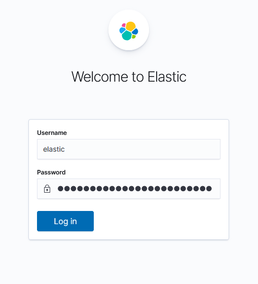

Page d'accueil :

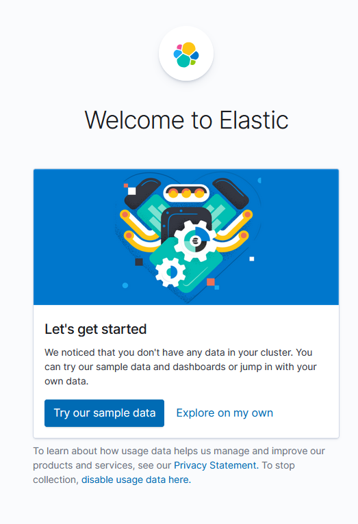

14. Nous allons maintenant collecter des logs . Nous allons installé un filebeat et récupérer les logs se trouvant dans /var/log/containers, /var/lib/docker/containers et /var/log/pods/. On va donc créer le fichier filebeat.yaml suivant :

```bash +.
touch filebeat.yaml
```

Avec le contenu yaml suivant :

```yaml +.
apiVersion: beat.k8s.elastic.co/v1beta1
kind: Beat
metadata:
  name: filebeat
spec:
  type: filebeat
  version: 7.9.3
  elasticsearchRef:
    name: elasticsearch
  config:
    filebeat.inputs:
    - type: container
      paths:
      - /var/log/containers/*.log
  daemonSet:
    podTemplate:
      spec:
        dnsPolicy: ClusterFirstWithHostNet
        hostNetwork: true
        securityContext:
          runAsUser: 0
        containers:
        - name: filebeat
          volumeMounts:
          - name: varlogcontainers
            mountPath: /var/log/containers
          - name: varlogpods
            mountPath: /var/log/pods
          - name: varlibdockercontainers
            mountPath: /var/lib/docker/containers
        volumes:
        - name: varlogcontainers
          hostPath:
            path: /var/log/containers
        - name: varlogpods
          hostPath:
            path: /var/log/pods
        - name: varlibdockercontainers
          hostPath:
            path: /var/lib/docker/containers
```

15. Nous pouvons donc créer notre filebeat :

```bash +.
kubectl apply -f filebeat.yaml
```
```bash +.
beat.beat.k8s.elastic.co/filebeat created
```

16. Nous pouvons voir l'état de notre filebeat de la façon suivante :

```bash +.
kubectl get beat
```
```bash +.
NAME       HEALTH   AVAILABLE   EXPECTED   TYPE       VERSION   AGE
filebeat   green    2           2          filebeat   7.9.2     94s
```

17. Nous pouvons créer un index pattern en allant sur Discover -> Create index pattern -> Mettre "filebeat-*" en index pattern name -> Mettre @timestamp en time field :

Création de l'index pattern :

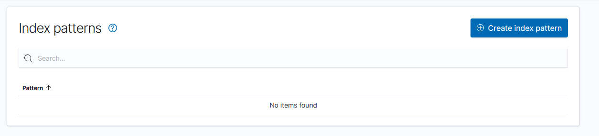

Nom de l'index pattern :

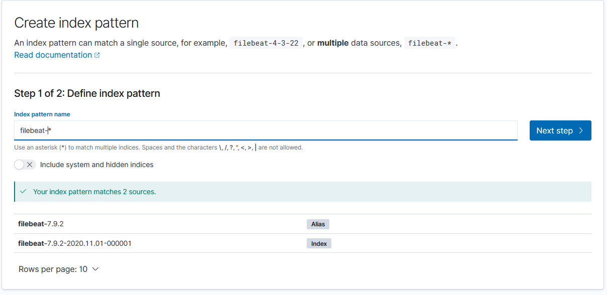

Time Field :

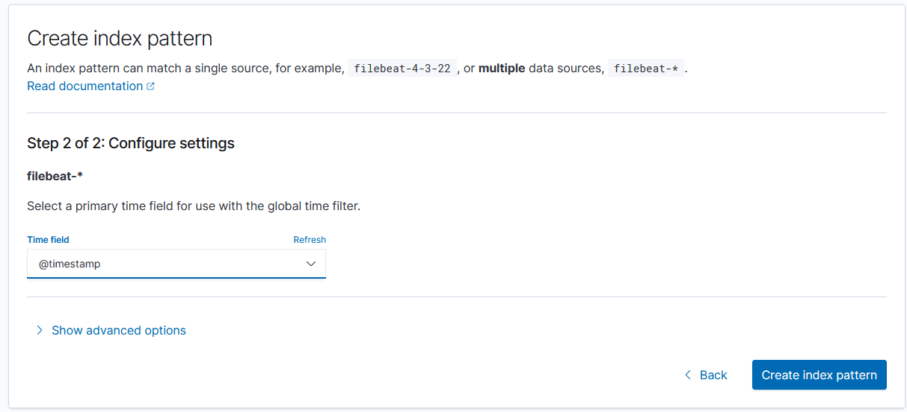

18. Nous pouvons voir les logs ou bien sur *Discover* ou bien sur *Logs* :

Discover :

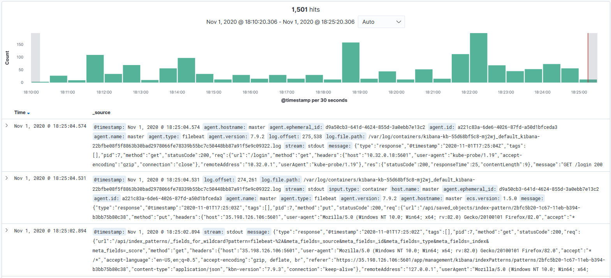

Logs :

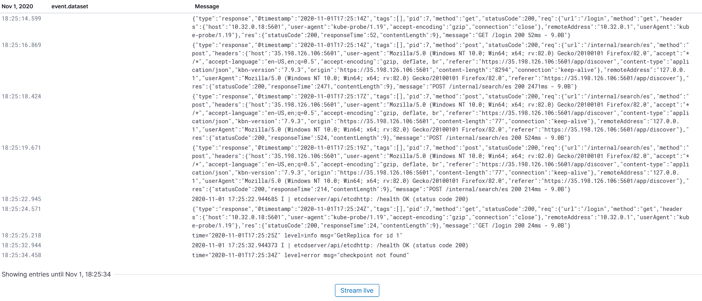

### Clean Up

Pour désinstaller notre stack ELK via ECK :

```bash +.
kubectl delete -f .
```
```bash +.
elasticsearch.elasticsearch.k8s.elastic.co "elasticsearch" deleted
beat.beat.k8s.elastic.co "filebeat" deleted
kibana.kibana.k8s.elastic.co "kibana" deleted
```


<hr>


##  Mise à jour d’un cluster

<hr>
Machine : **master**, **worker-0**, **worker-1**
<hr>


### Mise à jour kubeadm


Préparation de la mise à jour

```bash +.
curl -fsSL https://pkgs.k8s.io/core:/stable:/v1.28/deb/Release.key | sudo gpg --dearmor -o /etc/apt/keyrings/kubernetes-apt-keyring-1.28.gpg

echo 'deb [signed-by=/etc/apt/keyrings/kubernetes-apt-keyring-1.28.gpg] https://pkgs.k8s.io/core:/stable:/v1.28/deb/ /' | sudo tee -a /etc/apt/sources.list.d/kubernetes.list

sudo apt-get update
```


Pour commencer, il faut mettre à jour kubeadm :

```bash +.
sudo apt-mark unhold kubeadm
sudo apt-get install kubeadm=1.28.8-1.1
sudo apt-mark hold kubeadm
```

Vérifions la version de kubeadm :

```bash +.
kubeadm version

```

### Drain master

Nous devons maintenant drain le noeud master afin de pouvoir faire l’upgrade dessus :

```bash +.

kubectl drain master --ignore-daemonsets

```

### Upgrade Plan

Nous pouvons avoir un aperçu de l’upgrade de la façon suivante :

```bash +.
sudo kubeadm upgrade plan


[[upgrade/config] Making sure the configuration is correct:
[upgrade/config] Reading configuration from the cluster...
[upgrade/config] FYI: You can look at this config file with 'kubectl -n kube-system get cm kubeadm-config -o yaml'
[preflight] Running pre-flight checks.
[upgrade] Running cluster health checks
[upgrade] Fetching available versions to upgrade to
[upgrade/versions] Cluster version: v1.27.12
[upgrade/versions] kubeadm version: v1.28.8
I0408 06:40:22.060915    4163 version.go:256] remote version is much newer: v1.29.3; falling back to: stable-1.28
[upgrade/versions] Target version: v1.28.8
[upgrade/versions] Latest version in the v1.27 series: v1.27.12

Components that must be upgraded manually after you have upgraded the control plane with 'kubeadm upgrade apply':
COMPONENT   CURRENT       TARGET
kubelet     3 x v1.27.9   v1.28.8

Upgrade to the latest stable version:

COMPONENT                 CURRENT    TARGET
kube-apiserver            v1.27.12   v1.28.8
kube-controller-manager   v1.27.12   v1.28.8
kube-scheduler            v1.27.12   v1.28.8
kube-proxy                v1.27.12   v1.28.8
CoreDNS                   v1.10.1    v1.10.1
etcd                      3.5.9-0    3.5.12-0

You can now apply the upgrade by executing the following command:

	kubeadm upgrade apply v1.28.8

_____________________________________________________________________


The table below shows the current state of component configs as understood by this version of kubeadm.
Configs that have a "yes" mark in the "MANUAL UPGRADE REQUIRED" column require manual config upgrade or
resetting to kubeadm defaults before a successful upgrade can be performed. The version to manually
upgrade to is denoted in the "PREFERRED VERSION" column.

API GROUP                 CURRENT VERSION   PREFERRED VERSION   MANUAL UPGRADE REQUIRED
kubeproxy.config.k8s.io   v1alpha1          v1alpha1            no
kubelet.config.k8s.io     v1beta1           v1beta1             no
_____________________________________________________________________


```


### Upgrade composants

Nous pouvons maintenant upgrade les composants du cluster :


```bash +.


sudo kubeadm upgrade apply v1.28.8

```


```bash +.

[[upgrade/config] Making sure the configuration is correct:
[upgrade/config] Reading configuration from the cluster...
[upgrade/config] FYI: You can look at this config file with 'kubectl -n kube-system get cm kubeadm-config -o yaml'
[preflight] Running pre-flight checks.
[upgrade] Running cluster health checks
[upgrade/version] You have chosen to change the cluster version to "v1.28.8"
[upgrade/versions] Cluster version: v1.27.12
[upgrade/versions] kubeadm version: v1.28.8
[upgrade] Are you sure you want to proceed? [y/N]: y


[upgrade/prepull] Pulling images required for setting up a Kubernetes cluster
[upgrade/prepull] This might take a minute or two, depending on the speed of your internet connection
[upgrade/prepull] You can also perform this action in beforehand using 'kubeadm config images pull'
W0408 06:41:41.559443    4249 checks.go:835] detected that the sandbox image "registry.k8s.io/pause:3.6" of the container runtime is inconsistent with that used by kubeadm. It is recommended that using "registry.k8s.io/pause:3.9" as the CRI sandbox image.
[upgrade/apply] Upgrading your Static Pod-hosted control plane to version "v1.28.8" (timeout: 5m0s)...
[upgrade/etcd] Upgrading to TLS for etcd
[upgrade/staticpods] Preparing for "etcd" upgrade
[upgrade/staticpods] Renewing etcd-server certificate
[upgrade/staticpods] Renewing etcd-peer certificate
[upgrade/staticpods] Renewing etcd-healthcheck-client certificate
[upgrade/staticpods] Moved new manifest to "/etc/kubernetes/manifests/etcd.yaml" and backed up old manifest to "/etc/kubernetes/tmp/kubeadm-backup-manifests-2024-04-08-06-41-48/etcd.yaml"
[upgrade/staticpods] Waiting for the kubelet to restart the component
[upgrade/staticpods] This might take a minute or longer depending on the component/version gap (timeout 5m0s)
[apiclient] Found 1 Pods for label selector component=etcd
[upgrade/staticpods] Component "etcd" upgraded successfully!
[upgrade/etcd] Waiting for etcd to become available
[upgrade/staticpods] Writing new Static Pod manifests to "/etc/kubernetes/tmp/kubeadm-upgraded-manifests2343628394"
[upgrade/staticpods] Preparing for "kube-apiserver" upgrade
[upgrade/staticpods] Renewing apiserver certificate
[upgrade/staticpods] Renewing apiserver-kubelet-client certificate
[upgrade/staticpods] Renewing front-proxy-client certificate
[upgrade/staticpods] Renewing apiserver-etcd-client certificate
[upgrade/staticpods] Moved new manifest to "/etc/kubernetes/manifests/kube-apiserver.yaml" and backed up old manifest to "/etc/kubernetes/tmp/kubeadm-backup-manifests-2024-04-08-06-41-48/kube-apiserver.yaml"
[upgrade/staticpods] Waiting for the kubelet to restart the component
[upgrade/staticpods] This might take a minute or longer depending on the component/version gap (timeout 5m0s)
[apiclient] Found 1 Pods for label selector component=kube-apiserver
[upgrade/staticpods] Component "kube-apiserver" upgraded successfully!
[upgrade/staticpods] Preparing for "kube-controller-manager" upgrade
[upgrade/staticpods] Renewing controller-manager.conf certificate
[upgrade/staticpods] Moved new manifest to "/etc/kubernetes/manifests/kube-controller-manager.yaml" and backed up old manifest to "/etc/kubernetes/tmp/kubeadm-backup-manifests-2024-04-08-06-41-48/kube-controller-manager.yaml"
[upgrade/staticpods] Waiting for the kubelet to restart the component
[upgrade/staticpods] This might take a minute or longer depending on the component/version gap (timeout 5m0s)
[apiclient] Found 1 Pods for label selector component=kube-controller-manager
[upgrade/staticpods] Component "kube-controller-manager" upgraded successfully!
[upgrade/staticpods] Preparing for "kube-scheduler" upgrade
[upgrade/staticpods] Renewing scheduler.conf certificate
[upgrade/staticpods] Moved new manifest to "/etc/kubernetes/manifests/kube-scheduler.yaml" and backed up old manifest to "/etc/kubernetes/tmp/kubeadm-backup-manifests-2024-04-08-06-41-48/kube-scheduler.yaml"
[upgrade/staticpods] Waiting for the kubelet to restart the component
[upgrade/staticpods] This might take a minute or longer depending on the component/version gap (timeout 5m0s)
[apiclient] Found 1 Pods for label selector component=kube-scheduler
[upgrade/staticpods] Component "kube-scheduler" upgraded successfully!
[upload-config] Storing the configuration used in ConfigMap "kubeadm-config" in the "kube-system" Namespace
[kubelet] Creating a ConfigMap "kubelet-config" in namespace kube-system with the configuration for the kubelets in the cluster
[upgrade] Backing up kubelet config file to /etc/kubernetes/tmp/kubeadm-kubelet-config1974182237/config.yaml
[kubelet-start] Writing kubelet configuration to file "/var/lib/kubelet/config.yaml"
[bootstrap-token] Configured RBAC rules to allow Node Bootstrap tokens to get nodes
[bootstrap-token] Configured RBAC rules to allow Node Bootstrap tokens to post CSRs in order for nodes to get long term certificate credentials
[bootstrap-token] Configured RBAC rules to allow the csrapprover controller automatically approve CSRs from a Node Bootstrap Token
[bootstrap-token] Configured RBAC rules to allow certificate rotation for all node client certificates in the cluster
[addons] Applied essential addon: CoreDNS
[addons] Applied essential addon: kube-proxy

[upgrade/successful] SUCCESS! Your cluster was upgraded to "v1.28.8". Enjoy!

[upgrade/kubelet] Now that your control plane is upgraded, please proceed with upgrading your kubelets if you haven't already done so.


```

### uncordon master


Nous pouvons remettre le noeud master en marche :

```bash +.
kubectl uncordon master
```


**node/master uncordoned**


### Mise à jour kubelet

Nous devons maintenant mettre à jour la kubelet et kubectl :

```bash +.
sudo apt-mark unhold kubectl kubelet
sudo apt-get install kubectl=1.24.28-1.1 kubelet=1.28.8-1.1
sudo apt-mark hold kubectl kubelet
```

Enfin nous devons redémarrer la kubelet :

```bash +.
sudo systemctl daemon-reload
sudo systemctl restart kubelet
```


Vérification de la mise à jour du **master**

```bash +.
kubectl get nodes

NAME       STATUS                     ROLES           AGE   VERSION
master     Ready,SchedulingDisabled   control-plane   16m   v1.28.8
worker-0   Ready                      <none>          15m   v1.27.9
worker-1   Ready                      <none>          15m   v1.27.9
```


### Mise à jour worker

A faire sur les noeud **worker-0 et worker-1**


Préparation de la mise à jour

```bash +.
curl -fsSL https://pkgs.k8s.io/core:/stable:/v1.28/deb/Release.key | sudo gpg --dearmor -o /etc/apt/keyrings/kubernetes-apt-keyring-1.28.gpg

echo 'deb [signed-by=/etc/apt/keyrings/kubernetes-apt-keyring-1.28.gpg] https://pkgs.k8s.io/core:/stable:/v1.28/deb/ /' | sudo tee -a /etc/apt/sources.list.d/kubernetes.list

sudo apt-get update
```

```bash +.
sudo apt-mark unhold kubeadm
sudo apt-get install kubeadm=1.28.8-1.1
sudo apt-mark hold kubeadm
```

Comme pour le master, nous devons drain les noeuds workers :

Répéter les actions pour le noeud 2 noeud par noeud  <font color=red><b>(pas en // )</b></font>


Sur le <font color=red><b>master</b></font>


```bash +.
kubectl drain worker-0 --ignore-daemonsets
```

Nous devons maintenant mettre à jour la configuration de notre worker-0 :

```bash +.
training@worker-0$ sudo kubeadm upgrade node
```

```bash +.
[upgrade] Reading configuration from the cluster...
[upgrade] FYI: You can look at this config file with 'kubectl -n kube-system get cm kubeadm-config -oyaml'
[preflight] Running pre-flight checks
[preflight] Skipping prepull. Not a control plane node.
[upgrade] Skipping phase. Not a control plane node.
[kubelet-start] Writing kubelet configuration to file "/var/lib/kubelet/config.yaml"
[upgrade] The configuration for this node was successfully updated!
[upgrade] Now you should go ahead and upgrade the kubelet package using your package manager.
```

Enfin, comme pour le master nous devons mettre a jour la kubelet et kubectl :

```bash +.
sudo apt-mark unhold kubectl kubelet
sudo apt-get install kubectl=1.28.8-1.1 kubelet=1.28.8-1.1
sudo apt-mark hold kubectl kubelet
```

En prenant soin de redémarrer la kubelet :

```bash +.
sudo systemctl daemon-reload
sudo systemctl restart kubelet
```

Sans oublier de remettre le noeud en marche :

```bash +.
kubectl uncordon worker-0
```

Nous pouvons maintenant lister les noeuds :

```bash +.
kubectl get nodes

NAME       STATUS   ROLES           AGE   VERSION
master     Ready    control-plane   25m   v1.28.8
worker-0   Ready    <none>          19m   v1.28.8
worker-1   Ready    <none>          19m   v1.27.9

```

Passez à la mise à jour du noeud **worker-1**

Et lister les pods pour vérifier que tout est fonctionnel :

```bash +.
kubectl get pods -A

NAMESPACE     NAME                             READY   STATUS    RESTARTS   AGE
kube-system   coredns-f9fd979d6-jhcg9          1/1     Running   0          7m44s
kube-system   coredns-f9fd979d6-mjfzf          1/1     Running   0          7m44s
kube-system   etcd-master                      1/1     Running   1          11m
kube-system   kube-apiserver-master            1/1     Running   0          11m
kube-system   kube-controller-manager-master   1/1     Running   0          11m
kube-system   kube-proxy-4mvtr                 1/1     Running   0          14m
kube-system   kube-proxy-lkvxn                 1/1     Running   0          13m
kube-system   kube-scheduler-master            1/1     Running   0          11m
kube-system   weave-net-t2h8r                  2/2     Running   0          24m
kube-system   weave-net-zxg6p                  2/2     Running   1          23m
```


> Note: le CNI doit être mis à jour indépendamment


### Quizz Mise à jour kubeadm

Pour mettre à jour kubeadm à la dernière version, vous devez :

[( )] Exécuter `kubeadm upgrade apply` sans mise à jour préalable.
[(X)] Mettre à jour le paquet kubeadm via le gestionnaire de paquets de votre système.
[( )] Télécharger la dernière version de Kubernetes et la compiler.

Avant de mettre à jour un cluster, il est recommandé de :

[( )] Supprimer les données de l'etcd cluster.
[(X)] Sauvegarder l'état actuel du cluster, y compris etcd et toutes les données de configuration.
[( )] Redémarrer tous les nœuds du cluster.

La commande pour mettre à jour la version de Kubernetes sur les nœuds de contrôle est :

[( )] `kubeadm update`
[(X)] `kubeadm upgrade apply`
[( )] `kubeadm upgrade node`

Après avoir mis à jour kubeadm, vous devez également mettre à jour :

[( )] Tous les Pods en cours d'exécution.
[(X)] kubelet et kubectl sur tous les nœuds.
[( )] Les images de conteneurs utilisées par les workloads.

Lors de la mise à jour d'un cluster avec kubeadm, quel élément n'est pas automatiquement mis à jour ?

[( )] Les composants de l'API server.
[(X)] Les applications déployées sur le cluster.
[( )] Le réseau de pod CNI.

<hr>

##  Backup and Restore ETCD

### Sauvegarde de la base de données ETCD

1. Sauvegarde de la base de données ETCD:

```bash +.
ETCDCTL_API=3 etcdctl --endpoints=https://127.0.0.1:2379 \
  --cacert=<trusted-ca-file> --cert=<cert-file> --key=<key-file> \
  snapshot save <backup-file-location>
```

où trust-ca-file, cert-file et key-file peuvent être obtenus à partir de la description du Pod etcd en mettant sur le master la commande:

```bash +.
sudo cat /etc/kubernetes/manifests/etcd.yaml
```

```bash +.
ETCDCTL_API=3 etcdctl --endpoints=https://127.0.0.1:2379 \
  --cacert=/etc/kubernetes/pki/etcd/ca.crt --cert=/etc/kubernetes/pki/etcd/server.crt --key=/etc/kubernetes/pki/etcd/server.key \
  snapshot save etcd-bkp
```

Le snapshot a créé un fichier nommé: etcd-bkp. Vérifier le status du snapshot:

```bash +.
ETCDCTL_API=3 \
etcdctl --write-out=table snapshot status etcd-bkp
```

2. Créez un pod nommé after-backup avec l'image nginx

```bash +.
kubectl run after-backup --image=nginx
```

3. Restaurer maintenant la base de données ETCD: 

```bash +.
ETCDCTL_API=3 etcdctl --endpoints 10.2.0.9:2379 snapshot restore etcd-bkp
```

Remarquez que l'opération de restauration a généré un repertoire default.etcd

4. Utiliser la base de données restaurée 

Avant de remplacer l'ETCD par la nouvelle restauration:

- Arrêtons les composants du control plane en déplaçant les fichiers manifest

```bash +.
sudo mv /etc/kubernetes/manifests/*.yaml /tmp/
```

- sécurisons l'état actuel de l'ETCD

```bash +.
sudo mv /var/lib/etcd/member /var/lib/etcd/member.bak
```

- Remplaçons les données de l'ETCD par les fichiers de backup:

```bash +.
sudo mv default.etcd/member /var/lib/etcd/
```

- Redémarrons les composants du control plane:

```bash +.
sudo mv /tmp/*.yaml /etc/kubernetes/manifests/
```

5. Vérifier que la base de données a été restaurée à l'état désiré 

Le pod créé après la sauvegarde ne doit plus exister après la restauration 

```bash +.
kubectl get pods
```


<hr>


## Lab final

<hr>

### A vous de jouer !

<hr>

1. Créer un namespace nommé **kubeops**


2. Créer un pod avec les caractéristiques suivantes :

|                                     |                             |
|-------------------------------------|-----------------------------|
| Nom                                 | : webserver                 |
| Nom du conteneur                    | : webserver                 |
| Image                               | : dernière version de nginx |
| Namespace                           | : kubeops                   |


    - Sur quel nœud se trouve votre pod ?

    - Connectez-vous au conteneur du pod et vérifiez son OS avec la commande cat /etc/os-release

    - Vérifiez les logs du pod


3. Ajoutez un nouveau conteneur du nom de webwatcher au pod créé précédemment, avec une image : afakharany/watcher:latest.

    - Vérifiez que les deux conteneurs sont « running » dans le pod.

    - Connectez-vous au conteneur webwatcher et affichez le contenu du fichier /etc/hosts
 

4. Lancez un Deployment nommé « nginx-deployment » avec 2 réplicas comprenant un conteneur nommé "nginxcont" dans le namespace "kubeops" avec l'image Nginx version 1.17.10 et définissez le port 80 comme port d'exposition.


5. Augmentez le nombre de réplicas du déploiement à 4 avec la commande kubectl scale


6. Mettez à jour l’image de votre application à une nouvelle version nginx :1.9.1 avec la commande kubectl set image et observez l’évolution de la mise à jour de l’application


7. Faites un Rollback de votre mise à jour du déploiement


8. Exposez votre application avec un service de type Nodeport sur le port 30000 des workers


9. Créez un Daemonset nommé prometheus-daemonset conteneur nommé prometheus dans le namespace "kubeops" avec l'image prom/node-exporter et définissez le port 9100 comme port d'exposition.


10. Le Daemonset précédemment créé est présent sur tous les nœuds du cluster. Nous ne souhaitons plus qu’il tourne sur le nœud worker-1. Trouvez la bonne stratégie pour que prometheus-daemonset ne soit présent que sur le worker-0 et le master


11. Cet exercice vise à montrer l’utilisation d’un secret et d’un configmap.

    - Création du secret :
        - Générez un certificat en exécutant le script certs.sh. Créez un secret de type tls avec les fichiers générés avec la commande `kubectl create secret tls nginx-certs --cert=tls.crt --key=tls.key`


    - Faites un kubectl describe pour vérifier le secret créé


    - Création du configmap
        - Les ConfigMaps peuvent être créés de la même manière que les secrets. Il peut être créer à l’aide d’un fichier YAML, ou via la commande kubectl create configmap pour le créer à partir de la ligne de commande.

    - Afin de personnaliser la configuration de votre serveur nginx, créez un configmap avec le fichier de configuration nginx-custom.conf avec la commande suivante : `kubectl create configmap nginx-config --from-file nginx-custom.conf`
 
 
    - Création d’un déploiement
        - Créez un déploiement du nom de nginx d’un réplica avec une image nginx :1.9.1. Créez un volume avec le secret et un deuxième volume avec le configmap dans les spec de votre application. Définir les ports 80 et 443 comme ports d’exposition, puis montez les volumes dans le conteneur avec comme mountPath « /certs » pour le certificat et « /etc/nginx/conf.d » pour la configuration nginx

 

    - Testez votre application en l’exposant via un service

12. Nous souhaitons déployer une base de données mysql sur le cluster. Créez un déploiement « mysql-database » avec 1 réplica comprenant un conteneur nommé « database » avec la dernière version de Mysql.


    - Votre application doit afficher une erreur car il lui manque le mot de passe root de mysql.

    - Redéployez l’application en passant le mot de passe root de mysql en variable d’environnement avec les valeurs comme suit : MYSQL_ROOT_PASSWORD=test.


13. Utilisateurs et droits dans Kubernetes

    - Générez un certificat pour un utilisateur du nom de dev. Ajoutez les informations d'identification de l'utilisateur dev à notre fichier kubeconfig. Puis vérifiez si dev a le droit de lister les pods en mettant la commande : `kubectl --user=dev get pods`

    - Créez un rôle qui autorise à lister les pods puis liez le rôle à l’utilisateur dev. Vérifiez à présent si dev peut lister les pods.

    - Vous remarquerez que dev est limité au namespace dans lequel le rôle a été créé. Vous décidez de lui permettre de lister les pods de tous les namespaces. Mettez en place une solution appropriée.


14. Créez un pod statique avec une image redis. Rajoutez un request de 100Mi RAM et 100m CPU puis une limite à 200Mi RAM et 150m CPU


15. Installez le helm chart de wordress disponible sur ce lien. Modifier le type de service par défaut définit dans le fichier values.yaml en NodePort.


16. TroubleShooting : Faire en sorte que l'application fonctionne correctement et puisse afficher une page web avec le calcul de Pi. Corrigez toutes les erreurs dans le `deployment`et les `service`

```yaml

# BUT : faire fonctionner l'application sur curl http://QuelqueChose:8020 
 
---
apiVersion: apps/v1
kind: Deployment
metadata:
  name: pi-web
  labels:
    k8s.alterwaylabs.fr: troubleshooting
spec:
  replicas: 0
  selector:
    matchLabels:
      app: pi-web
  template:
    metadata:
      labels:
        app: pi-web-app
    spec:
      containers:
        - image: kiamol/ch05-pi-app
          command: ["donet", "Pi.Web.dll", "-m", "web"]
          name: web
          ports:
            - containerPort: 80
              name: http
          resources:
            limits:
              cpu: "32"
              memory: "128Gi"
          readinessProbe:
            tcpSocket:
              port: 8020
            periodSeconds: 5
          livenessProbe:
            httpGet:
              path: /healthy
              port: 80
            periodSeconds: 30
            failureThreshold: 1
 
 
---
 
apiVersion: v1
kind: Service
metadata:
  name: pi-np
  labels:
    k8s.alterwaylabs.fr: troubleshooting
spec:
  selector:
    app: pi-web-pod
  ports:
    - name: http
      port: 8020
      targetPort: app
      nodePort: 8020
  type: NodePort

---

apiVersion: v1
kind: Service
metadata:
  name: pi-lb
  labels:
    k8s.alterwaylabs.fr: troubleshooting
spec:
  selector:
    app: pi-web-pod
  ports:
    - name: http
      port: 8020
      targetPort: app
  type: ClusterIP
```

<hr>


## Solutions pour le lab
<hr>


### Solution / Tips


Troubleshooting Deployments

Fix:

**Deployments**

- Labels dans les spec du pod pour le rattachement au deploy

- Replicas à 0 >> 1

- Limits / Requests trop élévée

- Nom de l'image >> aller voir sur le hub docker

- Command au niveau de conteneur avec typo

- Readiness probe mauvais port

- Liveness /healthy >> /health


**Services**

- target port 8020 invalide

- Service pod selector invalide

- Service port name invalide


```yaml +.
apiVersion: apps/v1
kind: Deployment
metadata:
  name: pi-web
  labels:
    k8s.alterwaylabs.fr: troubleshooting
spec:
  replicas: 1
  selector:
    matchLabels:
      app: pi-web
  template:
    metadata:
      labels:
        app: pi-web
    spec:
      containers:
        - image: kiamol/ch05-pi
          command: ["dotnet", "Pi.Web.dll", "-m", "web"]
          name: web
          ports:
            - containerPort: 80
              name: http
          resources:
            limits:
              cpu: "0.5"            
              memory: "1Gi"
          readinessProbe:
            tcpSocket:
              port: 80
            periodSeconds: 5
          livenessProbe:
            httpGet:
              path: /
              port: 80
            periodSeconds: 30
            failureThreshold: 1
```

```yaml +.

apiVersion: v1
kind: Service
metadata:
  name: pi-np
  labels:
    k8s.alterwaylabs.fr: troubleshooting
spec:
  selector:
    app: pi-web
  ports:
    - name: http
      port: 8020
      targetPort: http
      nodePort: 30020
  type: NodePort
---
apiVersion: v1
kind: Service
metadata:
  name: pi-lb
  labels:
    k8s.alterwaylabs.fr: troubleshooting
spec:
  selector:
    app: pi-web
  ports:
    - name: http
      port: 8020
      targetPort: http
  type: LoadBalancer

```

### Quizz Troubleshooting


Si un pod est en état `CrashLoopBackOff`, cela signifie généralement que :

[( )] Le pod a été terminé manuellement.
[(X)] L'application dans le pod démarre, puis échoue répétitivement.
[( )] Le pod est en cours de redémarrage après une mise à jour.

Pour diagnostiquer les problèmes de réseau dans un cluster Kubernetes, vous pouvez utiliser :

[( )] La commande `kubectl exec`.
[(X)] La commande `kubectl describe pod`.
[( )] La commande `kubectl logs`.

Si une application ne peut pas être déployée, vous devriez vérifier :

[( )] La version de Kubernetes.
[(X)] Les quotas de ressources et les limites de l'espace de noms.
[( )] Les paramètres du pare-feu du nœud.

Lorsqu'un service ne dirige pas le trafic vers les pods, cela peut être dû à :

[( )] Un nombre insuffisant de réplicas de pod.
[(X)] Des sélecteurs de pod incorrects dans la spécification du service.
[( )] Une mauvaise configuration des sondes de vivacité (liveness probes).

Pour résoudre les problèmes de persistance des données, il faut s'assurer que :

[( )] Les pods sont dans le bon espace de noms.
[(X)] Les volumes persistants (PV) et les revendications de volumes persistants (PVC) sont correctement configurés.
[( )] Les services sont correctement exposés.

Si `kubectl apply` ne met pas à jour les ressources comme prévu, il faut :

[( )] Redémarrer le serveur API de Kubernetes.
[(X)] Vérifier les fichiers de configuration pour les erreurs ou les omissions.
[( )] Mettre à jour la version de `kubectl`.

Pour identifier la cause d'un pod non planifié (unscheduled), vous pouvez :

[( )] Augmenter le nombre de nœuds dans le cluster.
[(X)] Utiliser la commande `kubectl describe pod` pour voir les événements.
[( )] Supprimer et recréer le déploiement.

Si un pod reste en état `Pending`, cela peut indiquer :

[( )] Que le pod est en cours de suppression.
[(X)] Un manque de ressources disponibles ou des contraintes d'affinité non satisfaites.
[( )] Que les images de conteneur sont en cours de téléchargement.

Pour vérifier pourquoi un pod est terminé prématurément, vous devriez :

[( )] Vérifier la configuration du réseau.
[(X)] Examiner les journaux du pod et les événements associés.
[( )] Mettre à jour les images de conteneur du pod.

Quand un nœud est marqué comme `NotReady`, cela peut être dû à :

[( )] Des pods en échec sur le nœud.
[(X)] Des problèmes avec le kubelet ou la connectivité réseau du nœud.
[( )] Une mise à jour en attente pour le nœud.


## Merci et Bravo !

